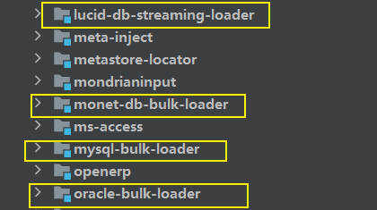

# DB-Bulk-Loader

> DB-Bulk-Loader实现了数据的批量导入。
> 
> kettle中实现了多种数据库的批量数据导入step插件。

## 一、 Create step plugins

transformation step在 ETL 数据流中实现数据处理任务。
它对数据行流进行操作。转换步骤专为输入、处理或输出而设计。

输入步骤从外部数据源（如文件或数据库）提取数据行。处理步骤处理数据行、执行字段计算和流操作，例如联接或筛选。
输出步骤将处理后的数据写回存储、文件或数据库。

将详细了解自己实现 PDI 转换步骤插件的架构和编程概念。

### 1.1 step plugin Java interfaces

step plugin通过实现四个不同的 Java 接口与 PDI 集成。每个接口代表由 PDI 步骤执行的一组职责。
每个接口都有一个基类，该基类实现接口的大部分，以简化插件开发。

所有步骤接口和相应的基类都在 org.pentaho.di.trans.step 包中。

| Java Interface      | Base Class                                  | Main Responsibilities                                                                                                                     |
|---------------------|---------------------------------------------|-------------------------------------------------------------------------------------------------------------------------------------------|
| StepMetaInterface   | BaseStepMeta                                | * 存储step设置信息  * 验证step设置信息  * 序列化step设置信息  * 提供获取step类的方法  * 执行行布局更改 |
| StepDialogInterface | org.pentaho.di.ui.trans.step.BaseStepDialog | * step属性信息配置窗口                              |
| StepInterface       | BaseStep                                    | * 处理rows                              |
| StepDataInterface   | BaseStepData                                | * 为数据处理提高数据存储 |

> 一个转换步骤插件至少需要实现如上四个接口：
> org.pentaho.di.trans.step.StepMetaInterface：元数据的处理，加载xml，校验，主要是对一个步骤的定义的基本数据。 
> org.pentaho.di.trans.step. StepDataInterface:数据处理涉及的具体数据，以及对数据的状态的设置和回收。
> org.pentaho.di.trans.step. StepInterface：负责数据处理，转换和流转。这里面主要由processRow()方法来处理。 
> org.pentaho.di.trans.step. StepDialogInterface：提供GUI/dialog，编辑步骤的元数据。

### 1.2 Maintain step settings

StepMetaInterface 是插件实现的主要 Java 接口。

| Java Interface | [org.pentaho.di.trans.step.StepMetaInterface](https://javadoc.pentaho.com/kettle530/kettle-engine-5.3.0.0-javadoc/org/pentaho/di/trans/step/StepMetaInterface.html) |
|----------------|---------------------------------------------------------------------------------------------------------------------------------------------------------------------|
| Base class     | [org.pentaho.di.trans.step.BaseStepMeta](https://javadoc.pentaho.com/kettle530/kettle-engine-5.3.0.0-javadoc/org/pentaho/di/trans/step/BaseStepMeta.html)           |

#### 跟踪步骤设置

实现类使用具有相应 get 和 set 方法的私有字段跟踪步骤设置。
实现 StepDialogInterface 的对话框类使用这些方法将用户提供的配置复制到对话框中和从对话框中复制出来。

这些接口方法还用于设置的保存。

~~~java
void setDefault()

/**
 * 每次创建新step时都会调用此方法，并将步骤配置分配或设置为合理的默认值。
 * 创建新step时，PDI 客户端 （Spoon） 将使用此处设置的值。这是确保将步骤设置初始化为非空值。在序列化和对话框填充中处理空值可能很麻烦，因此大多数 PDI 步骤实现在所有步骤设置中都坚持使用非空值。
 */
~~~

~~~java
/**
 * 在 PDI 客户端中复制step时调用此方法。它返回步骤元对象的深层副本。
 * 如果步骤配置存储在可修改的对象（如列表或自定义帮助程序对象）中，则实现类必须创建适当的深层副本。
 */
public Object clone()
~~~

#### 序列化步骤设置

该插件将其设置序列化为 XML 和 PDI 存储库。这些接口方法提供此功能。

~~~java
/**
 * 每当步骤将其设置序列化为 XML 时，PDI 都会调用此方法。在 PDI 客户端中保存转换时调用它。
 * 该方法返回包含序列化步骤设置的 XML 字符串。该字符串包含一系列 XML 标记，每个设置一个标记。
 * 帮助程序类 org.pentaho.di.core.xml.XMLHandler 构造 XML 字符串。
 */
public String getXML()
~~~

~~~java
/**
 * 每当步骤从 XML 读取其设置时，PDI 都会调用此方法。
 * 包含步骤设置的 XML 节点作为参数传入。
 * 同样，帮助程序类 org.pentaho.di.core.xml.XMLHandler 从 XML 节点读取步骤设置。
 */
public void loadXML()
~~~

~~~java
/**
 * 每当步骤将其设置保存到 PDI repository时，PDI 都会调用此方法。
 * 作为第一个参数传入的repository对象提供了一组用于序列化步骤设置的方法。
 * 在调用存储库序列化方法时，步骤将传入的transformation id 和step ID 用作标识符。
 */
public void saveRep()
~~~

~~~java
/**
 * 每当步骤从 PDI 存储库读取其配置时，PDI 都会调用此方法。
 * 参数中给出的步骤 ID 在使用存储库序列化方法时用作标识符。
 */
public void readRep()
~~~

> 开发插件时，请确保序列化代码与step dialog中可用的设置同步。在 PDI 客户端中测试step时，PDI 会在内部保存并加载转换的副本，然后再执行转换。

#### 提供其他插件类的实例

StepMetaInterface插件类是主类，与PDI架构的其余部分捆绑在一起。
它负责提供实现 StepDialogInterface、StepTInterface 和 StepDataTInterface 的其他插件类的实例。
以下方法涵盖了这些职责。每个方法实现构造相应类的新实例，将传入的参数转发给构造函数。

getDialog方法在StepMetaInterface的基类BaseStepMeat类中实现，其余两个方法都要在插件类中实现。

~~~java
/**
 * 这些方法中的每一个都返回实现 StepDialogInterface、StepTInterface 和 StepDataInterface 的插件类的新实例。
 */
public StepDialogInterface getDialog()
public StepInterface getStep()
public StepDataInterface getStepData()
~~~

#### 向行流数据提交step的更改

PDI 需要知道步骤如何影响行结构。步骤可能是添加或删除字段，以及修改字段的元数据。实现步骤插件这一方面的方法是getFields（）。

~~~java
/**
 * 给定输入行的描述，插件对其进行修改以匹配其输出字段的结构。该实现修改传入的 RowMetaInterfaceobject 以反映对行流的更改。步骤将字段添加到行结构中。
 * 这是通过创建 ValueMeta 对象（例如 ValueMetaInterface 的 PDI 默认实现）并将它们附加到 RowMetaInterface 对象来完成的。
 */
public void getFields()
~~~

对于数据库的数据导入，如果没有对row进行修改，则不用具体实现该方法。

#### 验证步骤

PDI 客户端支持Validate Transformation功能，该功能会触发所有步骤的自检。PDI 调用canvas上每个步骤的 check（） 方法，允许每个步骤验证其设置。

~~~java
/**
 * 每个步骤都有机会验证其设置并验证用户给出的配置是否合理。
 * 此外，步骤会检查它是否连接到前面或后续步骤，如果步骤的性质需要这种连接。
 * 例如，输入步骤可能期望没有前面的步骤。check 方法传入检查备注列表，该方法将其验证结果追加到该列表。
 * PDI 客户端显示从步骤中收集的备注列表，允许您在出现验证警告或错误时采取纠正措施。
 */
public void check()
~~~

该方法实现了对数据库的检查。

#### PDI插件系统的接口

实现 StepMetaInterface 的类必须使用 Step Java annotation进行注释。提供以下注释属性：

| **Attribute**       | **Description**                                                                                                                                  |
|---------------------|--------------------------------------------------------------------------------------------------------------------------------------------------|
| id                  | step的全局唯一 ID                                                                                                                                     |
| image               | step的 png 图标图像的资源位置                                                                                                                              |
| name                | step的简短标签                                                                                                                                        |
| description         | step的详细描述                                                                                                                                        |
| categoryDescription | step应显示在 PDI 步骤树中的类别。例如输入、输出、转换等。                                                                                                                |
| i18nPackageName     | 	如果在注释属性中提供了 i18nPackageName 属性，那么名称、描述和类别描述的值将解释为相对于给定包中包含的消息包的 i18n 键。可以在扩展格式 i18n： key 中提供密钥<packagename>，以指定与 i18nPackageName 属性中给出的软件包不同的包。 |

以MysqlBulkLoaderMeta为例：

~~~java
@Step( id = "MySQLBulkLoader", name = "BaseStep.TypeLongDesc.MySQLBulkLoader",
  description = "BaseStep.TypeTooltipDesc.MySQLBulkLoader",
  categoryDescription = "i18n:org.pentaho.di.trans.step:BaseStep.Category.Bulk",
  image = "BLKMYSQL.svg",
  documentationUrl = "http://wiki.pentaho.com/display/EAI/MySQL+Bulk+Loader",
  i18nPackageName = "org.pentaho.di.trans.steps.mysqlbulkloader" )
@InjectionSupported( localizationPrefix = "MySQLBulkLoader.Injection.", groups = { "FIELDS" } )
public class MySQLBulkLoaderMeta extends BaseStepMeta implements StepMetaInterface,
    ProvidesDatabaseConnectionInformation {
    
}
~~~

### 1.3 Implement the Step Settings dialog box

如何在插件中创建步骤设置对话框。

StepDialogInterface 是实现插件设置对话框的 Java 接口。

| **Java Interface** | [org.pentaho.di.trans.step.StepDialogInterface](http://javadoc.pentaho.com/kettle530/kettle-engine-5.3.0.0-javadoc/org/pentaho/di/trans/step/StepDialogInterface.html) |
|--------------------|------------------------------------------------------------------------------------------------------------------------------------------------------------------------|
| **Base class**     | [org.pentaho.di.ui.trans.step.BaseStepDialog](http://javadoc.pentaho.com/kettle530/kettle-ui-swt-5.3.0.0-javadoc/org/pentaho/di/ui/trans/step/BaseStepDialog.html)                                                                                                                        |

#### Maintain the dialog for step settings

dialog class 负责构造和打开step的设置对话框。

每当在PDI客户端（Spoon）中打开step设置时，系统都会实例化传入StepMetaInterface对象的对话框类，并在对话框上调用open（）。
SWT 是 PDI 客户端的本机窗口环境，是用于实现步骤对话框的框架。

~~~java
/**
 * 此方法仅在对话框确认或取消后返回。该方法必须符合这些规则。
 *    如果dialog已确认:
 *      StepMetaInterface 对象必须更新为新的step设置
 *      如果更改了任何步骤设置，则必须将 StepMetaInterface 对象标志的“已更改”标志设置为 true
 *      open（） 返回步骤的名称
 *    如果dialog被取消
 *      不得更改 StepMetaInterface 对象
 *      StepMetaInterface 对象的 Changed 标志必须设置为对话框打开时的值
 *      open（） 必须返回空值
 */
public String open()
~~~

StepMetaInterface 对象有一个内部的 Changed 标志，可以使用 hasChanged（） 和 setChanged（） 访问该标志。
PDI 客户端根据 Changed 标志确定转换是否具有未保存的更改，因此对话框必须正确设置标志。

~~~java
/**
 * Dialog class for the MySQL bulk loader step.
 */
@PluginDialog( id = "MySQLBulkLoader", image = "BLKMYSQL.svg", pluginType = PluginDialog.PluginType.STEP,
  documentationUrl = "http://wiki.pentaho.com/display/EAI/MySQL+Bulk+Loader" )
public class MySQLBulkLoaderDialog extends BaseStepDialog implements StepDialogInterface {}
~~~

### 1.4 Process rows

主要是实现在插件中的行处理

实现 StepInterface 的类负责转换运行时的实际行处理。

| **Java Interface** | [org.pentaho.di.trans.step.StepInterface](http://javadoc.pentaho.com/kettle530/kettle-engine-5.3.0.0-javadoc/org/pentaho/di/trans/step/StepInterface.html) |
|--------------------|------------------------------------------------------------------------------------------------------------------------------------------------------------------------|
| **Base class**     | [org.pentaho.di.trans.step.BaseStep](http://javadoc.pentaho.com/kettle530/kettle-engine-5.3.0.0-javadoc/org/pentaho/di/trans/step/BaseStep.html)                                                                                                                        |

实现类可以依赖基类，并且只有三个重要的方法来实现它自己。这三种方法在转换执行期间实现step生命周期： initialization, row processing, and clean-up。

在初始化期间，PDI 调用一次step的 init（） 方法。初始化所有step后，PDI 会反复调用 processRow（），直到step发出信号，表示它已完成处理所有行。
完成行处理后，PDI 调用 dispose（）。

方法签名有一个 StepMetaInterfaceObject 和一个 StepDataInterface 对象。这两个对象都可以安全地强制转换为该步骤的特定实现类。

除了它需要实现的方法之外，还有一个额外的非常重要的规则：类不得声明任何字段。所有变量都必须保留为实现 StepDataInterface 的类的一部分。
在实践中，这不是问题，因为实现 StepDataInterface 的对象被传递给所有相关方法，并且使用其字段而不是本地字段。
此规则的原因是需要将step变量与 StepInterface 实例分离。这使 PDI 能够实现不同的线程模型来执行转换。

~~~java
/**
 * Performs a streaming bulk load to a MySQL table.
 *
 * Based on Sven Boden's Oracle Bulk Loader step
 *
 * @author matt
 * @since 14-apr-2009
 */
public class MySQLBulkLoader extends BaseStep implements StepInterface {}
~~~

#### Step initialization

init（） 方法在转换准备开始执行时调用。

~~~java
/**
 * 每个步骤都有机会执行一次性初始化任务，例如打开文件或建立数据库连接。
 * 对于从 BaseStep 派生的任何步骤，必须调用 super.init（） 以确保行为正确。
 * 如果步骤正确初始化，该方法返回 true，如果存在初始化错误，则返回 false。
 * PDI 将中止转换的执行，以防任何步骤在初始化时返回 false。
 */
public boolean init()
~~~

#### Row processing

转换开始后，它进入一个紧密循环，在每个步骤上调用 processRow（），直到该方法返回 false。
在大多数情况下，每个步骤从输入流中读取一行，更改行结构和字段，然后将行传递到下一步。
某些步骤（如输入、分组和排序步骤）会批量读取行，或者可以保留读取行以执行其他处理，然后再将它们传递到下一步。

~~~java
/**
 * PDI 步骤通过调用 getRow（） 来查询传入的输入行，getRow（） 是一个阻塞调用，在没有更多输入的情况下返回行对象或 null。
 * 如果有输入行，该步骤将执行必要的行处理并调用 putRow（） 将该行传递到下一步。
 * 如果没有更多的行，该步骤将调用 setOutputDone（） 并返回 false。
 */
@Override
public boolean processRow( StepMetaInterface smi, StepDataInterface sdi ) throws KettleException {
  meta = (MySQLBulkLoaderMeta) smi;
  data = (MySQLBulkLoaderData) sdi;
  try {
    Object[] r = getRow(); // Get row from input rowset & set row busy!
    if ( r == null ) { // no more input to be expected...
      //告诉下一步已经完成数据
      setOutputDone();
      closeOutput();
      return false;
    }
    // 如果为 true，则正在处理的行是第一行
    if ( first ) {
      first = false;
      // Cache field indexes.
      //
      data.keynrs = new int[meta.getFieldStream().length];
      for ( int i = 0; i < data.keynrs.length; i++ ) {
        data.keynrs[i] = getInputRowMeta().indexOfValue( meta.getFieldStream()[i] );
      }
      data.bulkFormatMeta = new ValueMetaInterface[data.keynrs.length];
      for ( int i = 0; i < data.keynrs.length; i++ ) {
        ValueMetaInterface sourceMeta = getInputRowMeta().getValueMeta( data.keynrs[i] );
        if ( sourceMeta.isDate() ) {
          if ( meta.getFieldFormatType()[i] == MySQLBulkLoaderMeta.FIELD_FORMAT_TYPE_DATE ) {
            data.bulkFormatMeta[i] = data.bulkDateMeta.clone();
          } else if ( meta.getFieldFormatType()[i] == MySQLBulkLoaderMeta.FIELD_FORMAT_TYPE_TIMESTAMP ) {
            data.bulkFormatMeta[i] = data.bulkTimestampMeta.clone(); // default to timestamp
          }
        } else if ( sourceMeta.isNumeric()
            && meta.getFieldFormatType()[i] == MySQLBulkLoaderMeta.FIELD_FORMAT_TYPE_NUMBER ) {
          data.bulkFormatMeta[i] = data.bulkNumberMeta.clone();
        }
        if ( data.bulkFormatMeta[i] == null && !sourceMeta.isStorageBinaryString() ) {
          data.bulkFormatMeta[i] = sourceMeta.clone();
        }
      }
      // execute the client statement...
      //
      execute( meta );
    }
    // Every nr of rows we re-start the bulk load process to allow indexes etc to fit into the MySQL server memory
    // Performance could degrade if we don't do this.
    //每 nr 行我们重新启动批量加载过程，以允许索引等适合 MySQL 服务器内存
    //如果我们不这样做，性能可能会下降。
    if ( data.bulkSize > 0 && getLinesOutput() > 0 && ( getLinesOutput() % data.bulkSize ) == 0 ) {
      closeOutput();
      //拼接执行语句
      executeLoadCommand();
    }
    writeRowToBulk( getInputRowMeta(), r );
    putRow( getInputRowMeta(), r );
    //递增写入输出目标（数据库、文件、套接字等）的行数。
    incrementLinesOutput();
    return true;
  } catch ( Exception e ) {
    logError( BaseMessages.getString( PKG, "MySQLBulkLoader.Log.ErrorInStep" ), e );
    setErrors( 1 );
    stopAll();
    setOutputDone(); // signal end to receiver(s)
    return false;
  }
}

/**
* 执行加载命令，组合执行的Mysql语句
* @throws Exception
*/
private void executeLoadCommand() throws Exception {}

~~~

该方法必须符合这些规则:
* 如果该步骤处理完所有行，则该方法调用 setOutputDone（） 并返回 false。
* 如果该步骤未完成处理所有行，则该方法返回 true。在这种情况下，PDI 再次调用 processRow（）。

与此相反，输入步骤通常不需要来自前面步骤的任何传入行。
它们被设计为只执行一次processRow（），从外部世界获取数据，并通过反复调用putRow（）将它们放入行流中，直到完成。

行结构对象在第一次调用 processRow（） 期间用于确定步骤所操作的字段的索引。
BaseStep 类已经提供了一个方便的 First 标志来帮助在第一次调用 processRow（） 时实现特殊处理。
由于所有输入行的行结构相等，因此步骤在其 StepDataInterface 对象的变量中缓存字段索引信息。

#### Step clean-up

转换完成后，PDI 会在所有步骤中调用 dispose（）。

~~~java
/**
 * 需要采取措施来释放在 init（） 或后续行处理期间分配的资源。
 * 实现应清除 StepDataInterfaceObject 的所有字段，并确保所有打开的文件或连接都已正确关闭。
 * 对于从 BaseStep 派生的任何步骤，必须调用 super.dispose（） 以确保正确的释放。
 */
@Override
public void dispose( StepMetaInterface smi, StepDataInterface sdi ) {
  meta = (MySQLBulkLoaderMeta) smi;
  data = (MySQLBulkLoaderData) sdi;
  // Close the output streams if still needed.
  //
  try {
    if ( data.fifoStream != null ) {
      data.fifoStream.close();
    }
    // Stop the SQL execution thread
    //
    if ( data.sqlRunner != null ) {
      data.sqlRunner.join();
      data.sqlRunner = null;
    }
    // Release the database connection
    //
    if ( data.db != null ) {
      data.db.disconnect();
      data.db = null;
    }
    // remove the fifo file...
    //
    try {
      if ( data.fifoFilename != null ) {
        new File( data.fifoFilename ).delete();
      }
    } catch ( Exception e ) {
      logError( BaseMessages.getString( PKG, "MySQLBulkLoader.Message.UNABLETODELETE", data.fifoFilename ), e );
    }
  } catch ( Exception e ) {
    setErrors( 1L );
    logError( BaseMessages.getString( PKG, "MySQLBulkLoader.Message.UNEXPECTEDERRORCLOSING" ), e );
  }
  super.dispose( smi, sdi );
}
~~~

### 1.5 Store the processing state

| **Java Interface** | [org.pentaho.di.trans.step.StepDataInterface](http://javadoc.pentaho.com/kettle530/kettle-engine-5.3.0.0-javadoc/org/pentaho/di/trans/step/StepDataInterface.html) |
|--------------------|------------------------------------------------------------------------------------------------------------------------------------------------------------------------|
| **Base class**     | [org.pentaho.di.trans.step.BaseStepData](http://javadoc.pentaho.com/kettle530/kettle-engine-5.3.0.0-javadoc/org/pentaho/di/trans/step/BaseStepData.html)                                                                                                                        |

实现 StepInterface 的类不会在其任何字段中存储处理状态。
相反，实现 StepDataInterface 的附加类用于存储处理状态，包括状态标志、索引、缓存表、数据库连接、文件句柄等。
StepDataInterface 的实现声明行处理期间使用的字段并添加访问器函数。
实质上，实现 StepDataInterface 的类在行处理期间用作字段变量的位置。

PDI 在适当的时间创建实现 StepDataInterface 的类的实例，并在适当的方法调用中将其传递给 StepInterface 对象。
基类已经实现了与 PDI 的所有必要交互，无需重写任何基类方法。

~~~java
/**
 * Stores data for the MySQL bulk load step.
 * 存储 MySQL 批量加载步骤的数据。
 *
 * @author Matt
 * @since 14-apr-2009
 */
public class MySQLBulkLoaderData extends BaseStepData implements StepDataInterface {
  public Database db;

  public int[] keynrs; // nr of keylookup -value in row...

  public StreamLogger errorLogger;

  public StreamLogger outputLogger;

  public byte[] quote;
  public byte[] separator;
  public byte[] newline;

  public ValueMetaInterface bulkTimestampMeta;
  public ValueMetaInterface bulkDateMeta;
  public ValueMetaInterface bulkNumberMeta;
  protected String dbDescription;

  public String schemaTable;

  public String fifoFilename;

  public OutputStream fifoStream;

  public MySQLBulkLoader.SqlRunner sqlRunner;

  public ValueMetaInterface[] bulkFormatMeta;

  public long bulkSize;

  /**
   * Default constructor.
   */
  public MySQLBulkLoaderData() {
    super();

    db = null;
  }
}
~~~

## 二、 Relevate Class

### 2.1 Work with rows

PDI 中的行由 Java 对象数组 Object[] 表示。每个字段值都存储在行中的一个索引处。
虽然数组表示形式可以有效地传递数据，但目前还不清楚如何确定数组附带的字段名称和类型。
行数组本身不携带此元数据。此外，表示行的对象数组通常在其末尾有空槽，因此一行可以有效地容纳其他字段。
因此，行数组的长度不等于行中的字段数。以下各节说明如何安全地访问行数组中的字段。

PDI 使用实现 RowMetaInterface 的内部对象来描述和操作行结构。
在processRow（）中，一个step可以通过调用getInputRowMeta（）来检索传入行的结构，getInputRowMeta（）由BaseStep类提供。
该step克隆 RowMetaInterface 对象并将其传递给其元类的 getFields（），以反映由step本身引起的行结构的任何更改。
现在，该step具有描述输入和输出行的 RowMetaInterface 对象。这说明了如何使用 RowMetaInterface 对象来检查行结构。

有一个类似的对象，用于保存有关各个行字段的信息。
PDI 使用实现 ValueMetaInterface 的内部对象来描述和操作字段信息，例如字段名称、数据类型、格式掩码等。
ValueMetaInterface声明了Row数据中的静态变量。

step在首次执行 processRow（） 时查找相关字段的索引和类型。RowMetaInterface主要用到如下方法：

| Method                            | Purpose                          |
|-----------------------------------|----------------------------------|
| indexOfValue(String valueName)    | 给定字段名称，确定行中字段的索引。                |
| getFieldNames()                   | 返回字段名称的数组。字段名称的索引与行数组中的字段索引匹配。   |
| searchValueMeta(String valueName) | 给定字段名称，确定字段的元数据。                 |
| getValueMeta(int index)           | 给定字段索引，确定字段的元数据。                 |
| getValueMetaList()                | 返回所有字段说明的列表。字段描述的索引与行数组中的字段索引匹配。 |

如果某个步骤需要创建行的副本，请使用 RowMetaInterface 的 cloneRow（） 方法来创建正确的副本。
如果步骤需要在行数组中添加或删除字段，请使用 RowDataUtil 的静态帮助程序方法。
例如，如果某个步骤正在向行中添加字段，则调用 resizeArray（） 来添加该字段。如果阵列有足够的插槽，则按原样重新精简原始阵列。
如果阵列没有足够的插槽，则返回阵列的大小调整副本。
如果某个步骤需要从头开始创建新行，请使用 allocateRowData（），它返回一个有点过度分配的对象数组以适合所需数量的字段。

用于行处理的类和接口：

| Class/Interface        |        Purpose      |
|------------------------|--------------|
| [RowMetaInterface](http://javadoc.pentaho.com/kettle530/kettle-core-5.3.0.0-javadoc/org/pentaho/di/core/row/RowMetaInterface.html)   | 描述和操作行结构     |
| [ValueMetaInterface](http://javadoc.pentaho.com/kettle530/kettle-core-5.3.0.0-javadoc/org/pentaho/di/core/row/ValueMetaInterface.html) | 描述和操作字段类型和格式 |
| [RowDataUtil](http://javadoc.pentaho.com/kettle530/kettle-core-5.3.0.0-javadoc/org/pentaho/di/core/row/RowDataUtil.html)        | 在行数组中分配空间    |

### 2.2 Work with fields

#### Data type

ValueMetaInterface 对象用于确定行字段的特征。它们通常是从 RowMetaInterface 对象获取的，该对象是通过调用 getInputRowMeta（） 获取的。
getType（） 方法返回由 ValueMetaInterface 声明的静态常量之一，以指示 PDI 字段类型。
每个字段类型映射到实际值的相应本机 Java 类型。下表说明了最常用的字段类型的映射。

| PDI data type | Type constant  | Java data type       | Description                                                  |
|---------------|----------------|----------------------|--------------------------------------------------------------|
| String        | TYPE_STRING    | java.lang.String     | A variable unlimited length text encoded in UTF-8 (Unicode)  |
| Integer       | TYPE_INTEGER   | java.lang.Long       | A signed long 64-bit integer                                 |
| Number        | TYPE_NUMBER    | java.lang.Double     | A double precision floating point value                      |
| BigNumber     | TYPE_BIGNUMBER | java.math.BigDecimal | An arbitrary unlimited precision number                      |
| Date          | TYPE_DATE      | java.util.Date       | A date-time value with millisecond precision                 |
| Boolean       | TYPE_BOOLEAN   | java.lang.Boolean    | A boolean value true or false                                |
| Binary        | TYPE_BINARY    | java.lang.byte[]     | An array of bytes that contain any type of binary data.      |

不要假定行字段的 Java 值直接与这些数据类型匹配。这可能是也可能不是真的，具体取决于用于字段的存储类型。

#### Storage types

除了字段的数据类型外，存储类型 getStorageType（）/setStorageType（） 还用于解释行数组中的实际字段值。这些存储类型可用。

| Type constant              | Actual field data type      | Interpretation                                                        |
|----------------------------|-----------------------------|-----------------------------------------------------------------------|
| STORAGE_TYPE_NORMAL        | As listed in previous table | 行数组中的值属于上述数据类型表中列出的类型，并直接表示字段值。                                       |
| STORAGE_TYPE_BINARY_STRING | java.lang.byte[]            | 该字段是使用延迟转换功能创建的。这意味着它是从外部介质（通常是文件）读取的未更改的字节序列。                        |
| STORAGE_TYPE_INDEXED       | java.lang.Integer           | 行值是可能值的固定数组的整数索引。ValueMetaInterface 对象维护 getIndex（）/setIndex（） 中的可能值集 |

#### 访问行值

在典型的数据处理方案中，step对处理存储类型的复杂性不感兴趣。
它只需要要进行处理的实际数据值。为了安全地读取字段的值，ValueMetaInterface 对象提供了一组访问器方法来获取实际的 Java 值。
参数是对应于 ValueMetaInterface 对象的行数组中的值。无论字段存储类型如何，访问器方法始终返回正确的数据值。

* getString()
* getInteger()
* getNumber()
* getBigNumber()
* getDate()
* getBoolean()
* getBinary()

对于这些方法中的每一个，RowMetaInterface 都有相应的方法，这些方法需要行数组和字段的索引作为参数。

#### Additional field characteristics

ValueMetaInterface 表示 PDI 字段的所有方面，包括转换掩码、修剪类型等。所有这些都可以使用相应的访问器方法，例如getConversionMask（）和getTrimType（）。
有关完整的概述，请参阅 [Javadoc](http://javadoc.pentaho.com/kettle/org/pentaho/di/core/row/ValueMetaInterface.html)。

### 2.3 Handling errors

转换步骤可能会在许多级别遇到错误。他们可能会遇到意外数据或执行环境问题。
根据错误的性质，该步骤可能决定通过引发异常来停止转换，或者支持 PDI 错误处理功能，该功能允许您将坏行转移到错误处理步骤。

#### Throwing a KettleException:调用硬停止

如果step在行处理过程中遇到错误，则可能会记录错误并停止转换。
这是通过调用 setErrors（1）、stopAll（）、setOutputDone（） 并从 processRow（） 返回 false 来完成的。
或者，该步骤可以引发 KettleException，这也会导致转换停止。

当step的环境或配置出现问题时，停止转换是明智的。例如，当无法建立数据库连接、所需文件不存在或行流中没有预期字段时。
这些错误会影响整个转换的执行。另一方面，如果错误与行数据有关，则该步骤应实现对 PDI 错误处理功能的支持。

#### 实现每行错误处理

希望将坏行转移到特定的错误处理步骤。此功能称为错误处理功能。
支持此功能的步骤将覆盖 supportsErrorHandling（） 的 BaseStep 实现以返回 true。这使能够在 PDI 客户端 UI 中为坏行指定目标步骤。
在运行时，该步骤通过调用 getStepMeta（）.isDoingErrorHandling（） 来检查是否为错误行配置了目标步骤。

如果错误行被转移，该步骤会将有问题的输入行传递给 putError（），并提供有关所遇到错误的其他信息。
它不会抛出 KettleException。如果未将步骤配置为生成错误行并将其发送到另一个步骤进行处理，则该步骤将回退到调用硬停止。

### 2.4 row counters

在转换执行期间，每个 PDI 步骤都会跟踪一组step指标。这些显示在 PDI 客户端（Spoon）的“步骤指标”选项卡中。

每个步骤指标本质上都是一个行计数器。通过在 BaseStep 上调用相应的递增、递减、获取和设置方法来操作计数器。此表提供了计数器列表以及使用它们的正确方法。

| Counter Name  | Meaning             | When to Increment                                                               |
|---------------|---------------------|---------------------------------------------------------------------------------|
| linesRead     | 从前面的步骤接收的行          | 切勿手动递增。这是由getRow（）处理的。                                                          |
| linesWritten  | 传递到后续步骤的行           | 切勿手动递增。这是由 putRow（） 处理的。                                                        |
| linesInput    | 从外部源（如文件、数据库等）读取的行  | 当从外部源接收到新行时调用 incrementLinesInput（）。                                            |
| linesOutput   | 写入外部源（如文件、数据库等）的行   | 当一行写入外部系统或文件时调用 incrementLinesOutput（）。                                         |
| linesUpdated  | 在外部源（如数据库等）中更新的行    | 在外部系统或文件中更新行时调用 incrementLinesUpdate（）。                                         |
| linesSkipped  | 已跳过部分处理的行           | 当跳过一行时调用 incrementLinesSkipped（）。当步骤实现条件处理并且不满足处理行的条件时，这很重要。例如，更新步骤可能会跳过已是最新的行。 |
| linesRejected | 作为错误处理的一部分转移到错误步骤的行 | 切勿手动递增。这是由 putError（） 处理的。                                                      |

### 2.5 Logging in steps

step通过使用从 BaseStep 继承的日志记录方法与 PDI 日志记录系统交互。

这些方法用于向不同严重性级别的 PDI 日志记录系统发出日志行。
这些方法的多参数版本可用于执行一些基本的格式化，这相当于对 MessageFormat.format（message， arguments） 的调用。

* public void logMinimal()
* public void logBasic()
* public void logDetailed()
* public void logDebug()
* public void logRowlevel()
* public void logError()

这些方法查询日志记录级别。它们通常用于保护代码部分，这些代码部分只能使用提升的日志记录设置执行。

* public boolean isBasic()
* public boolean isDetailed()
* public boolean isDebug()
* public boolean isRowLevel()

Steps should log this information at specified levels.

| Log Level | Log Information Content                    |
|-----------|--------------------------------------------|
| Minimal   | 仅在非常高的级别上感兴趣的信息，例如转换开始或结束;单个步骤不会在此级别记录任何内容 |
| Basic     | 在常规 ETL 操作期间您可能感兴趣的信息                      |
| Detailed  | 准备好的SQL或其他查询语句，资源分配和初始化，如打开文件或连接           |
| Debug     | 在调试步骤操作中可能有用的任何内容                          |
| RowLevel  | 任何可能有助于在单个行和值级别调试问题的内容                     |
| Error     | 中止转换的致命错误                                  |

#### 反馈日志

转换在其设置中定义反馈大小。反馈大小定义行数，之后每个步骤记录一行报告其进度。
这是通过使用适当的行计数器作为参数调用 checkFeedback（） 来实现的，以确定是否应记录反馈。
反馈日志记录发生在基本日志级别。您可以通过多种方式实现这一点。下面是一个示例实现代码段。

~~~java
if (checkFeedback(getLinesWritten())) {
  if(isBasic()) logBasic("linenr "+getLinesWritten());
}
~~~

根据步骤的实现逻辑，使用不同的行计数器来检查反馈大小可能是有意义的。
例如，将传入行累积到单个总结行的step可能应使用 linesRead 计数器来确定反馈间隔。

### 2.6 Add metadata injection support to your step

可以通过使用特定于注入的注释标记step meta class and the step’s fields来向step添加元数据注入支持。
您可以使用@InjectionSupported批注指定step能够支持元数据注入。然后，可以使用@Injection注释来指定step中的哪些字段可以作为元数据注入，
或者对比通常的基元类型（如tring, int, float等）更复杂的字段使用@InjectionDeep注释。

#### InjectionSupported

在步骤元类中使用@InjectionSupported注释来指示它支持元数据注入。此注释具有以下参数。

| Parameter          | Description                                                                                                                                     |
|--------------------|-------------------------------------------------------------------------------------------------------------------------------------------------|
| localizationPrefix | 指示messages在 /<step_package>messages/messages_<locale>.properties 文件中的位置。当元数据注入属性显示在 PDI 中时，掩码 将从本地化文件中检索字段的说明<localization_prefix><field_name>。 |
| groups             | 指示用于排列字段的组的可选名称。当字段出现在“ETL 元数据注入步骤属性”对话框中时，它们将排列在这些组中。                                                                                          |

例如，将“FILENAME”字段的 localizationPrefix 参数设置为“Injection.”表示 /<step_package>messages/messages_Injection.FILENAME.properties 文件。
以下@InjectionSupported注释中的此前缀和“FILENAME”字段告诉系统使用键“Injection.FILENAME”检索描述以及可选的“GROUP1”和“GROUP2”组。

~~~java
@InjectionSupported(localizationPrefix="Injection.", groups = {"GROUP1","GROUP2"})
~~~

尽管继承适用于@Injection和@InjectionDeep批注指定的可注入字段，但仍需要将@InjectionSupported批注应用于从另一个step继承可注入字段的任何step。
例如，如果现有输入step已通过@Injection注释指定了可注入字段，则无需对在创建的步骤中继承的字段使用 @Injection 注释。
但是，您仍然需要在步骤元类中使用 @InjectionSupported 注释，即使该注释也已应用于现有输入步骤中。

#### Injection

要注入到步骤中的每个字段（或资源库）都应使用@Injection注释进行标记。此注释的参数是可注入字段的名称和包含此字段的组：

| Parameter | Description                                                              |
|-----------|--------------------------------------------------------------------------|
| name      | 指示字段的名称。如果在 setter 上声明注释（没有返回类型并接受单个参数的典型样式资源库），则此参数类型用于数据转换，就像在字段上声明一样。 |
| group     | 指示包含字段的组。如果未指定组，则在 ETL 元数据注入step属性对话框中显示的字段时使用 root。                     |

此注释可用于：

* 在具有简单类型（字符串、整数、浮点数等）的字段上
* 在简单类型的setter
* 在一组简单类型中
* 在java.util.List of simple types上。对于此列表用法，类型应声明为泛型。

#### Enums

您可以使用@Injection注释标记任何枚举字段。对于枚举字段，元数据注入将源TYPE_STRING值转换为同名的枚举值。
为了使您的用户能够使用任何指定的值，应在元数据注入步骤的文档中描述所有可能的值。

#### Arrays

Any @Injection annotation can be added to an array field:

~~~java
@Injection(name="FILES")
private String[] files;
~~~

~~~java
public class MyStepMeta {
  @InjectionDeep
  private OneFile[] files;
  public class OneFile {
    @Injection(name="NAME", group="FILES")
    public String name;
    @Injection(name="SIZE", group="FILES")
    public int size;
  }
}
~~~

元数据注入为注入信息流中的每一行创建对象。
对象数等于信息流中的行数。如果从不同的信息流加载不同的注入（如上面示例中的 NAME 和 SIZE），则必须确保两个流上的行号相等。

#### 数据类型转化

可以将具有 DefaultInjectionTypeConverter 类的字段从 RowSet 转换为简单类型。
当前支持的字段数据类型为字符串、布尔值、整数、长整型和枚举。
可以为某些字段定义非标准自定义转换器，方法是在注释的“converter”属性中声明@Injection这些转换器。
这些自定义对话是从 InjectionTypeConverter 类扩展而来的。

### 2.7 InjectionDeep

仅检查 step meta class（及其父类）的字段的注释，这适用于简单结构。
如果 step meta class包含更复杂的结构（基元类型之外），则可以使用带有可选前缀参数的@InjectionDeep注释来检查这些复杂（非基元）字段中的注释：

~~~java
@InjectionDeep(prefix = "MyPrefix")
~~~

使用可选的前缀参数，可以在@InjectionDeep批注中多次使用注入，并且仍保留唯一的元数据注入属性名称。
例如，MyStepMeta 有多个 Info 字段。
通过@InjectionDeep注释指定“FIRST”和“LAST”前缀，可以唯一标识“FIRST.NAME”和“LAST.NAME”的元数据注入属性结构：

~~~java
public class Info {
  @Injection(name = "NAME")
  String name;
}
public class MyStepMeta {
  @InjectionDeep(prefix = "FIRST")
  Info first;
  @InjectionDeep(prefix = "LAST")
  Info last;
}
~~~

You can use generic object types in your declared variables, arrays, or lists. 
Your step meta class must extend or implement a base which uses generics. 
For example, if you have a base class named MyBaseMeta, 
which makes use of generic types, you need to extend it within the step meta class:

~~~java
@InjectionSupported(...)
  public class MyMeta extends MyBaseMeta<String> {
}
~~~

Your base class (MyBaseMeta) could then be defined with any of the following generics:

~~~java
public abstract class MyBaseMeta<T> {
   @Injection(...)
   T name;
   
   @Injection(...)
   T[] children;
   
   @Injection(...)
   List<T> additional;
}
~~~

You can also use generics with the @InjectionDeep annotation. For example:

~~~java
public abstract class MyBaseMeta<T> {
    @InjectionDeep
    T info;

    @InjectionDeep
    T[] children;

    @InjectionDeep
    List<T> additional;
}
~~~