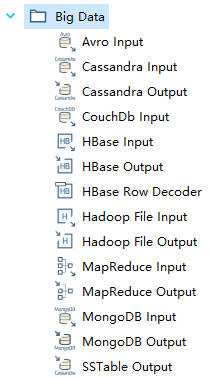
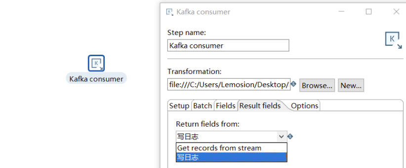
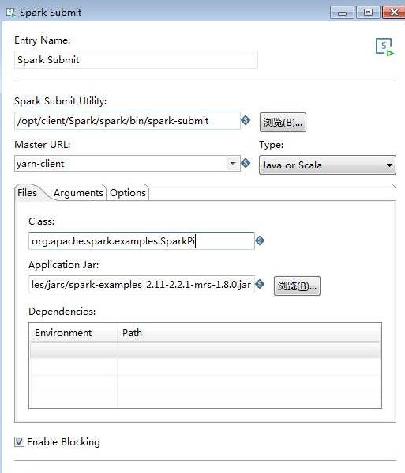

# StarRocks Connector kettle
## 一、什么是kettle？kettle的应用场景？
### 1.kettle框架介绍
> kettle-PDI:Pentaho Data Integration
> 
> Kettle是一款开源的ETL工具，全称为“Kettle ETL”。ETL是指抽取（Extract）、转换（Transform）和加载（Load），是数据仓库建设中的一个重要环节。
> Kettle提供了一套完整的ETL工作流程，包括数据抽取、数据转换和数据加载等步骤，支持多种数据源的连接和处理，如关系型数据库、NoSQL数据库、大数据存储、文件格式、Web服务等。
> 
> Kettle提供了可视化的图形界面，用户可以通过拖拽组件、配置参数等方式来构建数据处理流程，从而实现数据的抽取、清洗、转换和加载等操作。
> Kettle提供了丰富的组件库，包括输入组件、输出组件、转换组件、过滤器、连接器等，用户可以根据自己的需求来选择合适的组件进行组合。
> 
> Kettle还支持多种数据处理方式，如增量抽取、全量抽取、数据合并、数据过滤、数据转换、数据分割、数据聚合等。
> 同时，Kettle还支持任务调度和监控，用户可以通过设置定时任务或事件触发任务等方式来执行数据处理任务，并可随时查看任务执行情况和日志信息。
> 
> Kettle是一个成熟的ETL工具，具有简单易用、灵活性强、功能丰富、可扩展性好等优点，在企业级数据处理中被广泛应用。Kettle的社区活跃，提供了详细的文档、教程和示例，同时也支持多种插件和扩展，可满足各种数据处理需求。

#### 1.1 kettle特点

* 易用性： 有可视化设计器进行可视化操作，使用简单。
* 功能强大：不仅能进行数据传输，能同时进行数据清洗转换等操作。
* 支持多种源：支持各种数据库、FTP、文件、rest接口、Hadoop集群等源。
* 部署方便：独立部署，不依赖第三方产品。
* 适用场景： 数据量及增量不大，业务规则变化较快，要求可视化操作，对技术人员的技术门槛要求低。

#### 1.2 kettle数据源

Kettle是一款功能强大的ETL工具，可以连接多种数据源，包括但不限于以下类型：
1. 关系型数据库：MySQL、Oracle、SQL Server、PostgreSQL、DB2等基础数据库。
2. NoSQL数据库：MongoDB、Cassandra、HBase等。
3. 大数据存储：HDFS、Hive、Spark、Amazon S3、zookeeper等。
4. 文件格式：CSV、Excel、XML、JSON、Avro等。
5. Web服务：RESTful API、SOAP等。
6. 其他：FTP、SCP、SFTP、SMTP等。

#### 1.3 kettle集成工具

* Kettle是一个独立的产品，但它包括了ETL开发和部署阶段用到的多个工具程序，主要包括：
* Spoon：图形化工具，用于快速设计和维护复杂的ETL工作流。
* Kitchen：运行作业的命令行工具。
* Pan：运行转换的命令行工具。
* Carte：轻量级（大概1MB）Web服务器，用来远程执行转换或作业。一个运行有Carte进程的机器可以作为从服务器，从服务器是Kettle集群的一部分。

可以实现多文件的导入，有几百个文本文件，每个文件内容的格式相同，都是有固定分隔符的两列，每个文件有数千行记录。现在需要把这些文件的内容导入一个表中，除了文件内容中的两列，还要存一列记录数据对应的文件名。

### 2.kettle数据迁移应用场景

#### 2.1 数据库

1. **支持那些数据库**

kettle支持众多数据库的连接：

> * Apache Derby
> * AS/400
> * Borland Interbase
> * Calpont InfiniDB
> * Cloudera Impala
> * dBase II, IV or 5
> * Exasol 4
> * ExtenDB
> * Firebird SQL
> * Generic database
> * Greenplum
> * Gupta SQL Base
> * H2
> * Hadoop Hive
> * Hadoop Hive 2
> * Hypersonic
> * IBM DB2
> * Impala
> * Infobright
> * Informix
> * Ingres
> * Ingres VectorWise
> * Intersystems Cache
> * KingbaseES
> * LucidDB
> * MariaDB
> * MaxDB (SAP DB)
> * MonetDB
> * MS Access
> * MS SQL Server
> * MS SQL Server (Native)
> * MySQL
> * Native Mondrian
> * Neoview
> * Netezza
> * OpenERP Server
> * Oracle
> * Oracle RDB
> * Palo MOLAP Server
> * Pentaho Data Services
> * PostgreSQL
> * Redshift
> * Remedy Action Request System
> * SAP ERP System
> * SparkSQL
> * SQLite
> * Sybase
> * SybaselQ
> * Teradata
> * UniVerse database
> * Vertica
> * Vertica 5+

2. **kettle连接数据库**

**kettle通过如下实现对数据库的连接：**
* JDBC
* ODBC
* OCI
* JNDI

3. **kettle数据库之间数据迁移方式**

* 方式一：两表直接互传数据

* 方式二：通过转换json格式传输数据

* 方式三：通过Http方式传输

#### 2.2 多文件

1. **支持文件格式**

kettle支持多文件格式的输入：
> * Access
> * CSV
> * Cube
> * Excel
> * 文本文件

2. **kettle文本向数据库迁移的方式**

* 方式一：直接导入数据库
* 

* 方式二：通过json格式导入
* 

#### 2.3 Hadoop大数据处理

1. **支持大数据存储**

* HDFS
    * HDFS（Hadoop Distribute File System, Hadoop分布式文件系统），是Hadoop核心组成，是分布式存储服务。
    * 支持的文件存储格式：
      * Parquet：是Hadoop的一种列存储格式，提供了高效的编码和压缩方案。
      * SequenceFile：以二进制键值对的形式存储数据。
      * Avro：将数据定义和数据- -起存储在一条消息中， 其中数据定义以JSON格式存储，数据以二进制格式存储。
      * RCFile：以列格式保存每个行组数据。

* Cassandra(DB)
  * Apache Cassandra是一个开源的、分布式、无中心、弹性可扩展、高可用、容错、一致性可调、面向行的NoSQL数据库.
  * Cassandra以Json的格式存储数据。
* CouchDB
  * Apache CouchDB是一个开源的专门应用于web的NoSQL文档数据库
  * 通过HTTP使用web浏览器访问文档，使用JavaScript查询、合并和转换文档。
  * **JSON 的文档格式收集和存储数据**
* HBase
  * HBase是一个开源的非关系型分布式数据库，它是Apache软件基金会的Hadoop项目的一部分，运行于HDFS文件系统之上，为Hadoop提供类似于BigTable规模的服务。因此，它可以容错地存储海量稀疏的数据。
  * HBase中的所有数据文件都存储在Hadoop HDFS文件系统上，主要包括上述提出的两种文件类型：
    * HFile： HBase中KeyValue数据的存储格式，HFile是Hadoop的二进制格式文件，实际上StoreFile就是对HFile做了轻量级包装，即StoreFile底层就是HFile。
    * HLog File：HBase中WAL（Write Ahead Log） 的存储格式，物理上是Hadoop的Sequence File
* MapReduce
  * MapReduce是一种分布式计算框架 ，以一种可靠的，具有容错能力的方式并行地处理上TB级别的海量数据集。主要用于搜索领域，解决海量数据的计算问题。
  * MapReduce的数据存储在HDFS。
  * MapReduce API可以实现Mysql数据库的导入导出。
* MongoDB
  * MongoDB是一个基于分布式文件存储的NoSQL类型数据库.MongoDB是一款为web应用程序和互联网基础设施设计的数据库管理系统。
  * MongoDB提出的是文档、集合的概念，使用BSON（类JSON）作为其数据模型结构，其结构是面向对象的而不是二维表，存储一个用户在MongoDB中是这样子的。
~~~bson
{
    username:'123',
    password:'123'
}
~~~
* SSTable
  * Sorted String Table的简称，是Bigtable底层的数据存储格式。
  * SSTable 文件是用来存储一系列有序的 KeyValue 对的，Key 和 Value 都是任意长度的字节串， KeyValue 对根据固定比较规则有序地写入到文件中，文件内部分成一系列的Blocks(Block 不会太大，可自定义，默认4KB，常见的是 64KB )，同时具有必要的索引信息。
  * kettle中SSTable实现的是Cassandra SSTable，其文件类型并不是单一的文件，而是由多个文件如 Data.db、Index.db、Summary.db、Filter.db 等多个文件组成。

* Hive
  * Hive是建立在 Hadoop 上的数据仓库基础构架。它提供了一系列的工具，可以用来进行数据提取转化加载（ETL），这是一种可以存储、查询和分析存储在 Hadoop 中的大规模数据的机制。
  * Hive 查询操作过程严格遵守Hadoop MapReduce 的作业执行模型，Hive 将用户的HiveQL 语句通过解释器转换为MapReduce 作业提交到Hadoop 集群上，Hadoop 监控作业执行过程，然后返回作业执行结果给用户。
  * Hive同样可以和Spark结合，替换MapReduce，Hive on Spark的效率比on MR要高不少。
  * Hive数据会存储在HDFS。
    * kettle在向Hive导入数据时可以通过将HDFS的“Hadoop Copy Files”本地文件上传作业项稍加修改，将Destination File/Folder选择为hive表所在的HDFS目录就可将文件上传Hive。
    * Hive OCR列示存储格式。

2. **数据迁移**

> 上述数据库以及分布式计算框架都实现了Hadoop HDFS的数据接入。

**Kettle中都有上述大数据处理软件的接口实现数据的输入输出：**

**实现了对应的API：**

**以Hadoop HDFS为例实现数据的迁移：**

* 方式一：使用表输出的方式将数据迁移到数据库

* 方式二：使用HDFS带的Sqoop Export

#### 2.4 Kafka

> Kafka是Apache旗下的一款分布式流媒体平台，Kafka是一种高吞吐量、持久性、分布式的发布订阅的消息队列系统。 
> 它最初由LinkedIn(领英)公司发布，使用Scala语言编写，与2010年12月份开源，成为Apache的顶级子项目。 
> 它主要用于处理消费者规模网站中的所有动作流数据。动作指(网页浏览、搜索和其它用户行动所产生的数据)。

1. **Kafka特点**

* 高吞吐量：可以满足每秒百万级别消息的生产和消费。
* 持久性：有一套完善的消息存储机制，确保数据高效安全且持久化。
* 分布式：基于分布式的扩展；Kafka的数据都会复制到几台服务器上，当某台故障失效时，生产者和消费者转而使用其它的Kafka。

2. **Kafka传递数据类型**

Kafka可以实现**Json类型数据**传递

3. **kettle连接Kafka**

kettle 9.2.0版本集合了kafka的生产者消费者。

* Kafka producer可以接收kettle传递数据：

* Kafka Consumer读取producer产生的数据生成日志或传入下一步：

* kafka数据迁移数据库：

#### 2.5 MQTT

> MQTT（Message Queuing Telemetry Transport，消息队列遥测传输）是IBM开发的一个即时通讯协议，
> 它是一种轻量级的、基于代理的“发布/订阅”模式的消息传输协议。其具有协议简洁、小巧、可扩展性强、省流量、省电等优点，
> 而且已经有PHP，JAVA，Python，C，C#，Go等多个语言版本，基本可以使用在任何平台上，几乎可以把所有联网物品和外部连接起来，
> 所以特别适合用来当做物联网的通信协议。

1. **MQTT服务器传输数据类型**

* 实现Json数据传递

2. **kettle连接MQTT服务器**

kettle集合了MQTT数据的生产和消费：

kettle通过对MQTT连接地址进行配置连接不同MQTT服务器，实现消息的接收和分发：

#### 2.6 Spark

> Apache Spark 是一种开放源代码并行处理框架，支持使用内存中处理来提升大数据分析应用程序的性能。 
> 大数据解决方案旨在处理对传统数据库来说太大或太复杂的数据。 
> Spark 处理内存中的大量数据，这比基于磁盘的替代方法要快得多。

1. **Spark数据类型**

文件格式：
* Text
* Json：采用SparkSQL处理Json文件
* Sequence：针对key-value类型的RDD
* Object：对象文件是将对象序列化后保存的文件，采用Java的序列化机制

文件系统：
* 本地文件
* HDFS
* Mysql
* HBase

2. **Kettle连接Spark**

ketlle提供了spark-submit作业方式，实现了Spark任务的提交。

## 二、kettle connect DB

PDI使用数据库插件来进行数据库的正确连接、执行SQL，同时也考虑现有数据的各种特殊功能和不同限制。

在PDI里面，集成的数据库插件都会继承自BaseDatabaseMeta。
下面所示的方法通常都需要被重写，基类里面并没有相关的实现。
要实现的方法主要分成3大主题：连接信息、SQL语句和功能标记。

以MySQL为例要实现MySQLDatabaseMeta.java类：

1. **连接情况**

当PDI建立数据库连接时将会调用这些函数，或者数据库设置对话框里显示与语句有关的内容时也会调用。

~~~java
public String getDriverClass()

public int getDefaultDatabasePort()

public int[]getAccessTypeList()

public boolean supportsOptionsInURL()

public String getURL()
~~~

2. **SQL Generation**

构建有效的SQL数据库语句时会调用这些方法。

~~~java
public String getFieldDefinition()

public String getAddColumnStatement()

public String getSQLColumnExists()

public String getSQLQueryFields() 
~~~

3. **功能标记**

查询使用的数据库是否支持该功能。
~~~java
public boolean supportsTransactions()

public boolean releaseSavepoint()

public boolean supportsPreparedStatementMetadataRetrieval()

public boolean supportsResultSetMetadataRetrievalOnly()
~~~
## DB Connect
> 所用的数据库都extend BaseDatabaseMeta类，并实现了上述三大类的功能。
> 其中都调用了各类数据库的Driver，因此需要实现数据库的connector。

### 1. Mysql-MySQLDatabaseMeta.java类

1. **首先实现了getDriverClass()方法，返回MySQL的JDBC驱动类名。**
~~~java
@Override public String getDriverClass() {
    String driver = null;
    //当使用 ODBC 访问时，使用 sun.jdbc.odbc.JdbcOdbcDriver
    if ( getAccessType() == DatabaseMeta.TYPE_ACCESS_ODBC ) {
      driver = "sun.jdbc.odbc.JdbcOdbcDriver";
    } else {
      driver = determineDriverClass();
    }
    return driver;
  }

  private static String determineDriverClass() {
    if ( driverClass.isEmpty() ) {
      try {
        //mysql8.0
        driverClass = "com.mysql.cj.jdbc.Driver";
        //通过mysql-connector-java中的静态块加载所用驱动
        Class.forName( driverClass );
      } catch ( ClassNotFoundException e ) {
        driverClass = "org.gjt.mm.mysql.Driver";
      }
    }
    return driverClass;
  }
~~~

2. **实现了getDefaultDatabasePort()方法，返回MySQL的默认端口号。**
~~~java
@Override public int getDefaultDatabasePort() {
    // MySQL default port is 3306,通过判断DatabaseMeta的访问类型TYPE_ACCESS_NATIVE为0代表是JDBC连接
    if ( getAccessType() == DatabaseMeta.TYPE_ACCESS_NATIVE ) {
      return 3306;
    }
    return -1;
  }
~~~

3. **实现了getAccessTypeList()方法，返回MySQL支持的连接类型。**
~~~java
@Override public int[] getAccessTypeList() {
    //返回支持的访问类型，TYPE_ACCESS_NATIVE为0代表是JDBC连接，TYPE_ACCESS_ODBC为1代表是ODBC连接，TYPE_ACCESS_JNDI为4代表是JNDI连接
    return new int[] { DatabaseMeta.TYPE_ACCESS_NATIVE, DatabaseMeta.TYPE_ACCESS_ODBC, DatabaseMeta.TYPE_ACCESS_JNDI };
  }
~~~

4. **在其父类中实现supportsOptionsInURL()方法，MySQL是否支持URL中的选项，默认值为true。**
~~~java
@Override
  public boolean supportsOptionsInURL() {
    return true;
  }
~~~

5. **实现了getURL()方法，返回MySQL的URL。**
~~~java
@Override public String getURL( String hostname, String port, String databaseName ) {
    if ( getAccessType() == DatabaseMeta.TYPE_ACCESS_ODBC ) {
      return "jdbc:odbc:" + databaseName;
    } else {
      if ( Utils.isEmpty( port ) ) {
        return "jdbc:mysql://" + hostname + "/" + databaseName;
      } else {
        return "jdbc:mysql://" + hostname + ":" + port + "/" + databaseName;
      }
    }
  }
~~~

6. **实现了getFieldDefinition()方法，返回MySQL的字段定义，用于组合mysql的创建语句。**
~~~java
@Override public String getFieldDefinition( ValueMetaInterface v, String tk, String pk, boolean useAutoinc,
                                              boolean addFieldName, boolean addCr ) {
    String retval = "";

    String fieldname = v.getName();
    // 当插入值的长度等于数据库的最大长度时，将其设置为Integer.MAX_VALUE
    if ( v.getLength() == DatabaseMeta.CLOB_LENGTH ) {
      v.setLength( getMaxTextFieldLength() );
    }
    int length = v.getLength();
    //精度
    int precision = v.getPrecision();

    if ( addFieldName ) {
      retval += fieldname + " ";
    }

    int type = v.getType();
    switch ( type ) {
      //指示值包含具有纳秒精度的日期时间的值类型
      case ValueMetaInterface.TYPE_TIMESTAMP:
      case ValueMetaInterface.TYPE_DATE: //指示值包含日期的值类型
        retval += "DATETIME";
        break;
      case ValueMetaInterface.TYPE_BOOLEAN: //指示值包含布尔值的值类型
        //判断数据库是否支持Boolean类型的值，如果数据库支持布尔值、位、逻辑、...数据类型 默认值为 false：映射到字符串。
        if ( supportsBooleanDataType() ) {
          retval += "BOOLEAN";
        } else {
          //如果数据库不支持布尔值、位、逻辑、...数据类型 默认值为 false：映射到字符串。
          retval += "CHAR(1)";
        }
        break;

      case ValueMetaInterface.TYPE_NUMBER: //指示值包含浮点双精度数的值类型。
      case ValueMetaInterface.TYPE_INTEGER: //long
      case ValueMetaInterface.TYPE_BIGNUMBER: //值类型，指示该值包含具有任意精度的浮点精度数。
        if ( fieldname.equalsIgnoreCase( tk ) || // Technical key
          fieldname.equalsIgnoreCase( pk ) // Primary key
        ) {
          if ( useAutoinc ) {
            retval += "BIGINT AUTO_INCREMENT NOT NULL PRIMARY KEY";
          } else {
            retval += "BIGINT NOT NULL PRIMARY KEY";
          }
        } else {
          // Integer values...
          if ( precision == 0 ) {
            if ( length > 9 ) {
              if ( length < 19 ) {
                // can hold signed values between -9223372036854775808 and 9223372036854775807
                // 18 significant digits
                retval += "BIGINT";
              } else {
                retval += "DECIMAL(" + length + ")";
              }
            } else {
              retval += "INT";
            }
          } else {
            // Floating point values...
            if ( length > 15 ) {
              retval += "DECIMAL(" + length;
              if ( precision > 0 ) {
                retval += ", " + precision;
              }
              retval += ")";
            } else {
              // A double-precision floating-point number is accurate to approximately 15 decimal places.
              // http://mysql.mirrors-r-us.net/doc/refman/5.1/en/numeric-type-overview.html
              retval += "DOUBLE";
            }
          }
        }
        break;
      case ValueMetaInterface.TYPE_STRING: //字符串类型
        if ( length > 0 ) {
          if ( length == 1 ) {
            retval += "CHAR(1)";
          } else if ( length < 256 ) {
            retval += "VARCHAR(" + length + ")";
          } else if ( length < 65536 ) {
            retval += "TEXT";
          } else if ( length < 16777216 ) {
            retval += "MEDIUMTEXT";
          } else {
            retval += "LONGTEXT";
          }
        } else {
          retval += "TINYTEXT";
        }
        break;
      case ValueMetaInterface.TYPE_BINARY: //BLOB/CLOB类型
        retval += "LONGBLOB";
        break;
      default:
        retval += " UNKNOWN";
        break;
    }

    if ( addCr ) {
      retval += Const.CR;
    }

    return retval;
  }
~~~

7. **实现了getAddColumnStatement()方法，返回MySQL的添加字段语句，组合生成添加一列的SQL语句。**
~~~java
@Override public String getAddColumnStatement( String tablename, ValueMetaInterface v, String tk, boolean useAutoinc,
    String pk, boolean semicolon ) {
    return "ALTER TABLE " + tablename + " ADD " + getFieldDefinition( v, tk, pk, useAutoinc, true, false );
  }
~~~

8. **实现了getSQLColumnExists()方法，返回MySQL的判断列字段是否存在的SQL语句。**
~~~java
@Override public String getSQLColumnExists( String columnname, String tablename ) {
    return getSQLQueryColumnFields( columnname, tablename );
  }
  //生成Mysql的查询列字段
  public String getSQLQueryColumnFields( String columnname, String tableName ) {
    return "SELECT " + columnname + " FROM " + tableName + " LIMIT 0"; //限制检索记录行第0行
  }
~~~

9. **实现了getSQLQueryFields()方法，返回MySQL的查询表字段的SQL语句。（作用还需再看）**
~~~java
@Override public String getSQLQueryFields( String tableName ) {
    return "SELECT * FROM " + tableName + " LIMIT 0";
  }
~~~

10. **实现了supportsTransactions()方法，返回MySQL是否支持事务。**
~~~java
@Override public boolean supportsTransactions() {
    return false;
  }
~~~

11. **实现了releaseSavepoint()方法，返回MySQL是否允许释放保存点。（Mysql应该可以释放保存点吧？）**
~~~java
/**
   * Returns a false as Mysql does not allow for the releasing of savepoints.
   */
  @Override public boolean releaseSavepoint() {
    return false;
  }
~~~

12. **在BaseDatabaseMeta中已经实现了supportsPreparedStatementMetadataRetrieval()方法，返回MySQL是否支持预编译准备 SELECT 语句来检索结果元数据。**
~~~java
@Override
  public boolean supportsPreparedStatementMetadataRetrieval() {
    return true;
  }
~~~

## Deploying database plugins

> 要部署数据库插件，请执行以下步骤：
> 1. 创建一个包含插件类的 JAR 文件。
> 2. 创建一个新文件夹，为其指定一个有意义的名称，然后将 JAR 文件放在该文件夹中。
> 3. 将刚刚创建的插件文件夹放在特定位置，以便 PDI 查找。根据您使用 PDI 的方式，您需要按照以下列表将插件文件夹复制到一个或多个位置。
>    * 部署到 PDI client或 Carte：复制插件文件到design-tools/data-integration/plugins/databases，然后重新启动 PDI 客户端。重新启动 PDI 客户端后，可以从“PDI 数据库”对话框中获得新的数据库类型。
> 4. 部署数据库插件时，请确保还部署相应的 JDBC 驱动程序。

### 2.starrocks-connector-java

> 想要实现StarRocks的连接，需要实现类似Mysql-Connector-java的数据库驱动。

~~~
└─src
    ├─main
    │  ├─java
    │  │  └─org
    │  │      └─starrocks
    │  │          └─jdbc
    │  │                  Connection.java
    │  │                  DatabaseMetaData.java
    │  │                  Driver.java
    │  │
    │  └─resources
    │      └─META-INF
    │          └─services
    │                  java.sql.Driver
    │
    └─test
        └─java
~~~

#### 2.1 Mysql-connector-j:release/5.1

**以Mysql-connector为例分析数据库驱动：**

使用JDBC连接Mysql数据库常用操作：

~~~Java
// 创建mysql连接基本类
public class DBConn {
    private static final String jdbcdriver="com.mysql.jdbc.Driver";
    // origin
    private static final String jdbcurl="jdbc:mysql://localhost:3306/db1?useUnicode=true&characterEncoding=utf-8";
    private static final String username="root";
    private static final String password="root";
    private static final String driver = "com.mysql.jdbc.Driver";
    private static final Connection conn = null;
 
    /**
     * 连接数据库
     * @return
     */
    public static Connection conn() {
        Connection conn = null;
        try {
            Class.forName(driver);
            try {
                conn = DriverManager.getConnection(jdbcurl, username, password);
            } catch (SQLException e) {
                e.printStackTrace();
            }
        } catch (ClassNotFoundException e) {
            e.printStackTrace();
        }
        return conn;
    }
 
    /**
     * 关闭数据库链接
     * @return
     */
    public static void close() {
        if(conn != null) {
            try {
                conn.close();
            } catch (SQLException e) {
                e.printStackTrace();
            }
        }
    }
}
~~~

##### 2.1.1 创建连接过程分析

##### 1. Class.forName(driver)

此时的driver为com.mysql.jdbc.Driver，通过使用Class.forName装载当前类的类加载器来装载指定的class类。

当执行完Class.forName("com.mysql.jdbc.Driver")后，该Driver对象就被添加到DriverManger中

该步骤就是将mysql的Driver加载到JVM中。并且会执行Driver的static方法，源码如下：

~~~java
// com.mysql.jdbc.Driver
public class Driver extends NonRegisteringDriver implements java.sql.Driver {
  //
  // 在DriverManager中注册Driver
  //
  static {
    try {
      java.sql.DriverManager.registerDriver(new Driver());
    } catch (SQLException E) {
      throw new RuntimeException("Can't register driver!");
    }
  }

  /**
   * Construct a new driver and register it with DriverManager
   *
   * @throws SQLException
   *             if a database error occurs.
   */
  public Driver() throws SQLException {
    // Required for Class.forName().newInstance()
  }
}
~~~

Driver注册需要调用JDBC驱动中的java.sql.DriverManager中的registerDriver方法实现驱动的注册：

~~~java
//java.sql
public class DriverManager {
    //~~~~~~
    public static void registerDriver(java.sql.Driver driver)
            throws SQLException {
  
      registerDriver(driver, null);
    }
  
    public static void registerDriver(java.sql.Driver driver,
                                      DriverAction da)
            throws SQLException {
  
      //注册驱动程序（如果尚未添加到列表中）
      // CopyOnWriteArrayList<DriverInfo> registeredDrivers = new CopyOnWriteArrayList<>()
      // 直接将Driver包装成DriverInfo添加到DriverManger中
      if (driver != null) {
        registeredDrivers.addIfAbsent(new DriverInfo(driver, da));
      } else {
        // This is for compatibility with the original DriverManager
        throw new NullPointerException();
      }
      println("registerDriver: " + driver);
  
    }
}
~~~

##### 2. getConnection

建立连接主要通过JDBC中的DriverManager.getConnection(jdbcurl, username, password)来实现不同数据库的连接

* DriverManager.getConnection(String url,String user, String password)

~~~java
//java.sql
public class DriverManager{
    //~~~~
  public static Connection getConnection(String url, java.util.Properties info) throws SQLException {

    return (getConnection(url, info, Reflection.getCallerClass()));
  }
  
  @CallerSensitive
  public static Connection getConnection(String url, String user, String password) throws SQLException {
    java.util.Properties info = new java.util.Properties();
    //拼装用户名和密码到info中
    if (user != null) {
      info.put("user", user);
    }
    if (password != null) {
      info.put("password", password);
    }

    return (getConnection(url, info, Reflection.getCallerClass()));
  }
  @CallerSensitive
  public static Connection getConnection(String url)
          throws SQLException {

    java.util.Properties info = new java.util.Properties();
    return (getConnection(url, info, Reflection.getCallerClass()));
  }
}
~~~

* 实际调用的getConnection(url, info, Reflection.getCallerClass()方法

~~~java
//java.sql
public class DriverManager{
    //~~~~
    private static Connection getConnection(String url, java.util.Properties info, Class<?> caller) throws SQLException {
      ClassLoader callerCL = caller != null ? caller.getClassLoader() : null;
      if (callerCL == null) {
        callerCL = Thread.currentThread().getContextClassLoader();
      }

      if (url == null) {
        throw new SQLException("The url cannot be null", "08001");
      }

      println("DriverManager.getConnection(\"" + url + "\")");

      ensureDriversInitialized();
      SQLException reason = null;
      for (DriverInfo aDriver : registeredDrivers) {
        // If the caller does not have permission to load the driver then
        // skip it.
        if (isDriverAllowed(aDriver.driver, callerCL)) {
          try {
            println("    trying " + aDriver.driver.getClass().getName());
            
            // 主要就是这一句在创建连接
            // 本质上还是调用了具体使用的Driver的connect方法
            // 所以就是调用NonRegisteringDriver.connect(String url, Properties info)实现
            Connection con = aDriver.driver.connect(url, info);
            
            if (con != null) {
              // Success!
              println("getConnection returning " + aDriver.driver.getClass().getName());
              return (con);
            }
          } catch (SQLException ex) {
            if (reason == null) {
              reason = ex;
            }
          }

        } else {
          println("    skipping: " + aDriver.getClass().getName());
        }

      }
}
~~~

* NonRegisteringDriver类implements java.sql.Driver接口，并被com.mysql.jdbc.Driver继承

~~~java
//com.mysql.jdbc
public class NonRegisteringDriver implements java.sql.Driver {
  /**
   * 尝试与给定 URL 建立数据库连接。如果驱动程序意识到连接到给定的驱动程序类型错误，则驱动程序应返回“null”网址。
   * 这很常见，因为当 JDBC 驱动程序管理器被要求连接到给定的 URL 时，它会依次将 URL 传递给每个加载的驱动程序。
   * jdbc:mysql://host:port/database
   * @param url 需要连接的数据库URL
   * @param info 作为连接参数的任意标记/值对的列表
   * @return a connection to the URL or null if it isn't us
   */
  public java.sql.Connection connect(String url, Properties info) throws SQLException {
    ...
    if (url == null) {
      throw SQLError.createSQLException(Messages.getString("NonRegisteringDriver.1"), SQLError.SQL_STATE_UNABLE_TO_CONNECT_TO_DATASOURCE, null);
    }

    if (StringUtils.startsWithIgnoreCase(url, LOADBALANCE_URL_PREFIX)) {
      return connectLoadBalanced(url, info);
    } else if (StringUtils.startsWithIgnoreCase(url, REPLICATION_URL_PREFIX)) {
      return connectReplicationConnection(url, info);
    }

    Properties props = null;

    if ((props = parseURL(url, info)) == null) {
      return null;
    }

    if (!"1".equals(props.getProperty(NUM_HOSTS_PROPERTY_KEY))) {
      return connectFailover(url, info);
    }

    try {
        //主要的连接建立
      Connection newConn = com.mysql.jdbc.ConnectionImpl.getInstance(host(props), port(props), props, database(props), url);

      return newConn;
    } catch (SQLException sqlEx) {
      // Don't wrap SQLExceptions, throw
      // them un-changed.
      throw sqlEx;
    } catch (Exception ex) {
      SQLException sqlEx = SQLError.createSQLException(
              Messages.getString("NonRegisteringDriver.17") + ex.toString() + Messages.getString("NonRegisteringDriver.18"),
              SQLError.SQL_STATE_UNABLE_TO_CONNECT_TO_DATASOURCE, null);

      sqlEx.initCause(ex);

      throw sqlEx;
    }
  }
}
~~~

* com.mysql.jdbc.ConnectionImpl.getInstance

~~~java
//com.mysql.jdbc
//MySQLConnection继承了com.mysql.jdbc.Connection,com.mysql.jdbc.Connection又继承了java.sql.Connection
public class ConnectionImpl extends ConnectionPropertiesImpl implements MySQLConnection {
  ...

  /**
   * 创建连接实例 -- 我们需要提供工厂样式的方法
   * 在此以JDBC4为例
   */
  protected static Connection getInstance(String hostToConnectTo, int portToConnectTo, Properties info, String databaseToConnectTo, String url)
          throws SQLException {
    if (!Util.isJdbc4()) {
      return new ConnectionImpl(hostToConnectTo, portToConnectTo, info, databaseToConnectTo, url);
    }
    //使用com.mysql.jdbc.JDBC4Connection来连接
    //JDBC_4_CONNECTION_CTOR = Class.forName("com.mysql.jdbc.JDBC4Connection").getConstructor(new Class[] { String.class, Integer.TYPE, Properties.class, String.class, String.class });
    return (Connection) Util.handleNewInstance(JDBC_4_CONNECTION_CTOR,
            new Object[] { hostToConnectTo, Integer.valueOf(portToConnectTo), info, databaseToConnectTo, url }, null);
  }
}
~~~

* 调用com.mysql.jdbc.JDBC4Connection实例创建

~~~java
//com.mysql.jdbc
public class JDBC4Connection extends ConnectionImpl implements JDBC4MySQLConnection{
    // JDBC4Connection中的构造方法直接使用ConnectionImplement的构造方法
}
~~~

* com.mysql.jdbc.ConnectionImpl构造方法

~~~java
//com.mysql.jdbc
public class ConnectionImpl extends ConnectionPropertiesImpl implements MySQLConnection {
  ...
  /**
   * Creates a connection to a MySQL Server.
   */
  public ConnectionImpl(String hostToConnectTo, int portToConnectTo, Properties info, String databaseToConnectTo, String url) throws SQLException {

    this.connectionCreationTimeMillis = System.currentTimeMillis();

    if (databaseToConnectTo == null) {
      databaseToConnectTo = "";
    }
    // 存储起来供以后使用，用于为 Statement.cancel 和 Statement.setQueryTimeout（） 克隆此连接。
    this.origHostToConnectTo = hostToConnectTo;
    this.origPortToConnectTo = portToConnectTo;
    this.origDatabaseToConnectTo = databaseToConnectTo;

    try {
      Blob.class.getMethod("truncate", new Class[]{Long.TYPE});

      this.isRunningOnJDK13 = false;
    } catch (NoSuchMethodException nsme) {
      this.isRunningOnJDK13 = true;
    }

    this.sessionCalendar = new GregorianCalendar();
    this.utcCalendar = new GregorianCalendar();
    this.utcCalendar.setTimeZone(TimeZone.getTimeZone("GMT"));

    //
    // Normally, this code would be in initializeDriverProperties, but we need to do this as early as possible, so we can start logging to the 'correct'
    // place as early as possible...this.log points to 'NullLogger' for every connection at startup to avoid NPEs and the overhead of checking for NULL at
    // every logging call.
    //
    // We will reset this to the configured logger during properties initialization.
    //
    this.log = LogFactory.getLogger(getLogger(), LOGGER_INSTANCE_NAME, getExceptionInterceptor());

    if (NonRegisteringDriver.isHostPropertiesList(hostToConnectTo)) {
      Properties hostSpecificProps = NonRegisteringDriver.expandHostKeyValues(hostToConnectTo);

      Enumeration<?> propertyNames = hostSpecificProps.propertyNames();

      while (propertyNames.hasMoreElements()) {
        String propertyName = propertyNames.nextElement().toString();
        String propertyValue = hostSpecificProps.getProperty(propertyName);

        info.setProperty(propertyName, propertyValue);
      }
    } else {

      if (hostToConnectTo == null) {
        this.host = "localhost";
        this.hostPortPair = this.host + ":" + portToConnectTo;
      } else {
        this.host = hostToConnectTo;

        if (hostToConnectTo.indexOf(":") == -1) {
          this.hostPortPair = this.host + ":" + portToConnectTo;
        } else {
          this.hostPortPair = this.host;
        }
      }
    }
    //主要的连接信息
    this.port = portToConnectTo;

    this.database = databaseToConnectTo;
    this.myURL = url;
    this.user = info.getProperty(NonRegisteringDriver.USER_PROPERTY_KEY);
    this.password = info.getProperty(NonRegisteringDriver.PASSWORD_PROPERTY_KEY);

    if ((this.user == null) || this.user.equals("")) {
      this.user = "";
    }

    if (this.password == null) {
      this.password = "";
    }

    this.props = info;

    initializeDriverProperties(info);

    // We store this per-connection, due to static synchronization issues in Java's built-in TimeZone class...
    this.defaultTimeZone = TimeUtil.getDefaultTimeZone(getCacheDefaultTimezone());

    this.isClientTzUTC = !this.defaultTimeZone.useDaylightTime() && this.defaultTimeZone.getRawOffset() == 0;
    // 与数据库建立连接
    try {
      this.dbmd = getMetaData(false, false);
      initializeSafeStatementInterceptors();
      // 该函数主要用于创建socket连接
      createNewIO(false);
      unSafeStatementInterceptors();
    } catch (SQLException ex) {
      cleanup(ex);

      // don't clobber SQL exceptions
      throw ex;
    } catch (Exception ex) {
      cleanup(ex);

      StringBuilder mesg = new StringBuilder(128);

      if (!getParanoid()) {
        mesg.append("Cannot connect to MySQL server on ");
        mesg.append(this.host);
        mesg.append(":");
        mesg.append(this.port);
        mesg.append(".\n\n");
        mesg.append("Make sure that there is a MySQL server ");
        mesg.append("running on the machine/port you are trying ");
        mesg.append("to connect to and that the machine this software is running on ");
        mesg.append("is able to connect to this host/port (i.e. not firewalled). ");
        mesg.append("Also make sure that the server has not been started with the --skip-networking ");
        mesg.append("flag.\n\n");
      } else {
        mesg.append("Unable to connect to database.");
      }

      SQLException sqlEx = SQLError.createSQLException(mesg.toString(), SQLError.SQL_STATE_COMMUNICATION_LINK_FAILURE, getExceptionInterceptor());

      sqlEx.initCause(ex);

      throw sqlEx;
    }

    AbandonedConnectionCleanupThread.trackConnection(this, this.io.getNetworkResources());
  }
}
~~~

* ConnectionImpl.createNewIO创建socket的连接

~~~java
//com.mysql.jdbc
public class ConnectionImpl extends ConnectionPropertiesImpl implements MySQLConnection {
  ...
  /**
   * Creates an IO channel to the server
   */
  public void createNewIO(boolean isForReconnect) throws SQLException {
    synchronized (getConnectionMutex()) {
      // *new*连接不需要同步，但对于通过故障转移的连接肯定需要同步，因为我们可能会建立新连接
      // 并运行*engough*开始将缓存或仍然打开的服务器端准备语句发送到后端，然后我们有机会
      // 重新准备它们...

      Properties mergedProps = exposeAsProperties(this.props);
      // 是否高可用，如果配置了高可用，针对不可用时会重试多次，分析一次连接即可
      if (!getHighAvailability()) {
        connectOneTryOnly(isForReconnect, mergedProps);
        return;
      }
      connectWithRetries(isForReconnect, mergedProps);
    }
  }
}
~~~

* ConnectionImpl.connectOneTryOnly一次连接方法

~~~java
//com.mysql.jdbc
public class ConnectionImpl extends ConnectionPropertiesImpl implements MySQLConnection {
  ...
  private void connectOneTryOnly(boolean isForReconnect, Properties mergedProps) throws SQLException {
    Exception connectionNotEstablishedBecause = null;
    try {
        //核心连接方法
      coreConnect(mergedProps);
      // 赋值其他参数
      this.connectionId = this.io.getThreadId();
      this.isClosed = false;
      // save state from old connection
      boolean oldAutoCommit = getAutoCommit();
      int oldIsolationLevel = this.isolationLevel;
      boolean oldReadOnly = isReadOnly(false);
      String oldCatalog = getCatalog();

      this.io.setStatementInterceptors(this.statementInterceptors);

      // Server properties might be different from previous connection, so initialize again...
      initializePropsFromServer();

      if (isForReconnect) {
        // Restore state from old connection
        setAutoCommit(oldAutoCommit);

        if (this.hasIsolationLevels) {
          setTransactionIsolation(oldIsolationLevel);
        }

        setCatalog(oldCatalog);

        setReadOnly(oldReadOnly);
      }
      return;

    } catch (Exception EEE) {

      if (EEE instanceof SQLException && ((SQLException) EEE).getErrorCode() == MysqlErrorNumbers.ER_MUST_CHANGE_PASSWORD
              && !getDisconnectOnExpiredPasswords()) {
        return;
      }

      if (this.io != null) {
        this.io.forceClose();
      }

      connectionNotEstablishedBecause = EEE;

      if (EEE instanceof SQLException) {
        throw (SQLException) EEE;
      }

      SQLException chainedEx = SQLError.createSQLException(Messages.getString("Connection.UnableToConnect"),
              SQLError.SQL_STATE_UNABLE_TO_CONNECT_TO_DATASOURCE, getExceptionInterceptor());
      chainedEx.initCause(connectionNotEstablishedBecause);

      throw chainedEx;
    }
  }
}
~~~

* ConnectionImpl.coreConnect(Properties mergedProps)核心数据连接

~~~java
//com.mysql.jdbc
public class ConnectionImpl extends ConnectionPropertiesImpl implements MySQLConnection {
  ...
  private void coreConnect(Properties mergedProps) throws SQLException, IOException {
    int newPort = 3306;
    String newHost = "localhost";

    String protocol = mergedProps.getProperty(NonRegisteringDriver.PROTOCOL_PROPERTY_KEY);

    if (protocol != null) {
      // "new" style URL
      if ("tcp".equalsIgnoreCase(protocol)) {
        newHost = normalizeHost(mergedProps.getProperty(NonRegisteringDriver.HOST_PROPERTY_KEY));
        newPort = parsePortNumber(mergedProps.getProperty(NonRegisteringDriver.PORT_PROPERTY_KEY, "3306"));
      } else if ("pipe".equalsIgnoreCase(protocol)) {
        setSocketFactoryClassName(NamedPipeSocketFactory.class.getName());

        String path = mergedProps.getProperty(NonRegisteringDriver.PATH_PROPERTY_KEY);

        if (path != null) {
          mergedProps.setProperty(NamedPipeSocketFactory.NAMED_PIPE_PROP_NAME, path);
        }
      } else {
        // normalize for all unknown protocols
        newHost = normalizeHost(mergedProps.getProperty(NonRegisteringDriver.HOST_PROPERTY_KEY));
        newPort = parsePortNumber(mergedProps.getProperty(NonRegisteringDriver.PORT_PROPERTY_KEY, "3306"));
      }
    } else {

      String[] parsedHostPortPair = NonRegisteringDriver.parseHostPortPair(this.hostPortPair);
      newHost = parsedHostPortPair[NonRegisteringDriver.HOST_NAME_INDEX];

      newHost = normalizeHost(newHost);

      if (parsedHostPortPair[NonRegisteringDriver.PORT_NUMBER_INDEX] != null) {
        newPort = parsePortNumber(parsedHostPortPair[NonRegisteringDriver.PORT_NUMBER_INDEX]);
      }
    }
    this.port = newPort;
    this.host = newHost;
    // reset max-rows to default value
    this.sessionMaxRows = -1;
    // preconfigure some server variables which are consulted before their initialization from server
    this.serverVariables = new HashMap<String, String>();
    this.serverVariables.put("character_set_server", "utf8");
    
    // 创建长连接
    this.io = new MysqlIO(newHost, newPort, mergedProps, getSocketFactoryClassName(), getProxy(), getSocketTimeout(),
            this.largeRowSizeThreshold.getValueAsInt());
    // 三次握手完成后，进行信息交换，完成用户名密码验证
    this.io.doHandshake(this.user, this.password, this.database);
    if (versionMeetsMinimum(5, 5, 0)) {
      // error messages are returned according to character_set_results which, at this point, is set from the response packet
      this.errorMessageEncoding = this.io.getEncodingForHandshake();
    }
  }
}
~~~

##### 3. MySQLIO

> 从2中可以看出最后的Mysql的长连接是通过MySQLIO类实现

~~~java
//com.mysql.jdbc
public class MysqlIO {
  /**
   * Constructor: Connect to the MySQL server and setup a stream connection.
   */
  public MysqlIO(String host, int port, Properties props, String socketFactoryClassName, MySQLConnection conn, int socketTimeout,
                 int useBufferRowSizeThreshold) throws IOException, SQLException {
    this.connection = conn;

    if (this.connection.getEnablePacketDebug()) {
      this.packetDebugRingBuffer = new LinkedList<StringBuilder>();
    }
    this.traceProtocol = this.connection.getTraceProtocol();

    this.useAutoSlowLog = this.connection.getAutoSlowLog();

    this.useBufferRowSizeThreshold = useBufferRowSizeThreshold;
    this.useDirectRowUnpack = this.connection.getUseDirectRowUnpack();

    this.logSlowQueries = this.connection.getLogSlowQueries();

    this.reusablePacket = new Buffer(INITIAL_PACKET_SIZE);
    this.sendPacket = new Buffer(INITIAL_PACKET_SIZE);
    // 基本参数全部赋予MysqlIO
    this.port = port;
    this.host = host;
    this.socketFactoryClassName = socketFactoryClassName;
    this.socketFactory = createSocketFactory();
    this.exceptionInterceptor = this.connection.getExceptionInterceptor();

    try {
      // 通过socketFactory.connect来创建长连接
      this.mysqlConnection = this.socketFactory.connect(this.host, this.port, props);

      if (socketTimeout != 0) {
        try {
          this.mysqlConnection.setSoTimeout(socketTimeout);
        } catch (Exception ex) {
          /* Ignore if the platform does not support it */
        }
      }

      this.mysqlConnection = this.socketFactory.beforeHandshake();
      // 创建输入输出流
      if (this.connection.getUseReadAheadInput()) {
        this.mysqlInput = new ReadAheadInputStream(this.mysqlConnection.getInputStream(), 16384, this.connection.getTraceProtocol(),
                this.connection.getLog());
      } else if (this.connection.useUnbufferedInput()) {
        this.mysqlInput = this.mysqlConnection.getInputStream();
      } else {
        this.mysqlInput = new BufferedInputStream(this.mysqlConnection.getInputStream(), 16384);
      }

      this.mysqlOutput = new BufferedOutputStream(this.mysqlConnection.getOutputStream(), 16384);

      this.isInteractiveClient = this.connection.getInteractiveClient();
      this.profileSql = this.connection.getProfileSql();
      this.autoGenerateTestcaseScript = this.connection.getAutoGenerateTestcaseScript();

      this.needToGrabQueryFromPacket = (this.profileSql || this.logSlowQueries || this.autoGenerateTestcaseScript);

      this.useNanosForElapsedTime = this.connection.getUseNanosForElapsedTime() && TimeUtil.nanoTimeAvailable();
      this.queryTimingUnits = this.useNanosForElapsedTime ? Messages.getString("Nanoseconds") : Messages.getString("Milliseconds");

      if (this.connection.getLogSlowQueries()) {
        calculateSlowQueryThreshold();
      }
    } catch (IOException ioEx) {
      throw SQLError.createCommunicationsException(this.connection, 0, 0, ioEx, getExceptionInterceptor());
    }
  }
}
~~~

* StandardSocketFactory.connect创建长连接,StandardSocketFactory类继承了SocketFactory接口

~~~java
//com.mysql.jdbc
public interface SocketFactory {

  Socket afterHandshake() throws SocketException, IOException;

  Socket beforeHandshake() throws SocketException, IOException;

  Socket connect(String host, int portNumber, Properties props) throws SocketException, IOException;
}
//com.mysql.jdbc
//Socket factory for vanilla TCP/IP sockets (the standard)
public class StandardSocketFactory implements SocketFactory, SocketMetadata {
  ...
  public Socket connect(String hostname, int portNumber, Properties props) throws SocketException, IOException {

    if (props != null) {
      this.host = hostname;

      this.port = portNumber;

      String localSocketHostname = props.getProperty("localSocketAddress");
      InetSocketAddress localSockAddr = null;
      if (localSocketHostname != null && localSocketHostname.length() > 0) {
        localSockAddr = new InetSocketAddress(InetAddress.getByName(localSocketHostname), 0);
      }

      String connectTimeoutStr = props.getProperty("connectTimeout");

      int connectTimeout = 0;

      if (connectTimeoutStr != null) {
        try {
          connectTimeout = Integer.parseInt(connectTimeoutStr);
        } catch (NumberFormatException nfe) {
          throw new SocketException("Illegal value '" + connectTimeoutStr + "' for connectTimeout");
        }
      }

      if (this.host != null) {
        InetAddress[] possibleAddresses = InetAddress.getAllByName(this.host);

        if (possibleAddresses.length == 0) {
          throw new SocketException("No addresses for host");
        }

        // save last exception to propagate to caller if connection fails
        SocketException lastException = null;

        // 需要遍历所有可能的地址。名称查找可能会返回多个地址，包括 IPv4 和 IPv6 地址。某些版本的
        // MySQL不侦听IPv6地址，所以我们尝试所有地址。
        for (int i = 0; i < possibleAddresses.length; i++) {
          try {
            // 如下函数所示直接调用new Socket();创建原生的Socket
            this.rawSocket = createSocket(props);
            configureSocket(this.rawSocket, props);
            InetSocketAddress sockAddr = new InetSocketAddress(possibleAddresses[i], this.port);
            // bind to the local port if not using the ephemeral port
            if (localSockAddr != null) {
              this.rawSocket.bind(localSockAddr);
            }
            // 使用原生的socket连接到mysql-server
            this.rawSocket.connect(sockAddr, getRealTimeout(connectTimeout));

            break;
          } catch (SocketException ex) {
            lastException = ex;
            resetLoginTimeCountdown();
            this.rawSocket = null;
          }
        }

        if (this.rawSocket == null && lastException != null) {
          throw lastException;
        }

        resetLoginTimeCountdown();

        return this.rawSocket;
      }
    }

    throw new SocketException("Unable to create socket");
  }
  protected Socket createSocket(Properties props) {
    return new Socket();
  }
}
~~~

##### 4. MysqlIO.doHandshark()

> 相比较常规的client-server连接而言，mysql的连接创建，在三次握手之后，还需要执行一个doHandshark()方法，该方法本质上是来验证客户端输入的对应库的用户名密码等信息。
> 
> **整个过程可以分为三个阶段：**
> * mysql-server发送handshark信息，里面包括mysql的基本信息，加密seed等
> * client根据seed信息对password进行加密，将用户名密码等信息发送给mysql-server
> *  mysql-server对接收到的加密密码进行密码比对，匹配后则返回okay包

###### 1) mysql-server发送handshark信息

* Mycat中的中HandsharkPacket.java发送服务消息

~~~java
// HandsharkPacket.write()
public class HandsharkPacket {
  public void write(FrontendConnection c) {
    ByteBuffer buffer = c.allocate();
    BufferUtil.writeUB3(buffer, calcPacketSize());
    buffer.put(packetId);
    buffer.put(protocolVersion);
    BufferUtil.writeWithNull(buffer, serverVersion);
    BufferUtil.writeUB4(buffer, threadId);
    BufferUtil.writeWithNull(buffer, seed);
    BufferUtil.writeUB2(buffer, serverCapabilities);
    buffer.put(serverCharsetIndex);
    BufferUtil.writeUB2(buffer, serverStatus);
    buffer.put(FILLER_13);
    //        buffer.position(buffer.position() + 13);
    BufferUtil.writeWithNull(buffer, restOfScrambleBuff);
    c.write(buffer);
  }
}
~~~

###### 2) client解析handshark信息

* 解析上面mysql-server发送的HandsharkPacket包信息

~~~java
// com.mysql.jdbc;
/**
 * This class is used by Connection for communicating with the MySQL server.
 */
public class MysqlIO {
  // MysqlIO.doHandshake
  void doHandshake(String user, String password, String database) throws SQLException {
    this.checkPacketSequence = false;
    this.readPacketSequence = 0;
    // 在这里获取server发送来的hardshark包信息
    Buffer buf = this.readPacket();
    this.protocolVersion = buf.readByte();
 
    ...
    // 读取包字段 serverVersion threadId  seed ... 
    this.serverVersion = buf.readString("ASCII", this.getExceptionInterceptor());
    this.threadId = buf.readLong();
    this.seed = buf.readString("ASCII", this.getExceptionInterceptor());
    ...
  }

  // MysqlIO.readPacket

  /**
   * 从 MySQL 服务器读取一个数据包
   */
  protected final Buffer readPacket() throws SQLException {
    try {
        ...
      // 获取包长度（占用3byte）
      int packetLength = (this.packetHeaderBuf[0] & 255) + ((this.packetHeaderBuf[1] & 255) << 8) + ((this.packetHeaderBuf[2] & 255) << 16);
		...
      // 获取sequenceId信息（占用1byte）
      byte multiPacketSeq = this.packetHeaderBuf[3];
        ...
      // 包体信息读取到buffer中
      byte[] buffer = new byte[packetLength + 1];
      int numBytesRead = this.readFully(this.mysqlInput, buffer, 0, packetLength);
 
        ...
    }
  }
}
~~~

###### 3) client根据seed信息加密password后，发送包信息给server

~~~java
// com.mysql.jdbc;
public class MysqlIO {
  // MysqlIO.proceedHandshakeWithPluggableAuthentication
  private void proceedHandshakeWithPluggableAuthentication(String user, String password, String database, Buffer challenge) throws SQLException {
    if (this.authenticationPlugins == null) {
      this.loadAuthenticationPlugins();
    }

    int passwordLength = 16;
    int userLength = user != null ? user.length() : 0;
    int databaseLength = database != null ? database.length() : 0;
 
    ...
    while(0 < counter--) {
      String enc;
      // client发送验证包信息时，done为null
      if (!done) {
        if (challenge != null) {
                    ...
          plugin = this.getAuthenticationPlugin(enc);
          if (plugin == null) {
            plugin = this.getAuthenticationPlugin(this.defaultAuthenticationPluginProtocolName);
          }

          // 拼装参数
          this.checkConfidentiality(plugin);
          fromServer = new Buffer(StringUtils.getBytes(this.seed));
        }
      }else {
             ...
      }
        ...

      try {
        // 进行password加密操作，默认使用MysqlNativePasswordPlugin执行
        // Security.scramble411(pwd, fromServer.readString(), this.connection.getPasswordCharacterEncoding())
        plugin.setAuthenticationParameters(user, password);
        done = plugin.nextAuthenticationStep(fromServer, toServer);
      } catch (SQLException var19) {
        throw SQLError.createSQLException(var19.getMessage(), var19.getSQLState(), var19, this.getExceptionInterceptor());
      }

      if (toServer.size() > 0) {
        if (challenge == null) {
             ...
        } else if (challenge.isAuthMethodSwitchRequestPacket()) {
             ...
        } else if (!challenge.isRawPacket() && !old_raw_challenge) {
          enc = this.getEncodingForHandshake();
          last_sent = new Buffer(packLength);
          last_sent.writeLong(this.clientParam);
          last_sent.writeLong((long)this.maxThreeBytes);
          this.appendCharsetByteForHandshake(last_sent, enc);
          last_sent.writeBytesNoNull(new byte[23]);
          last_sent.writeString(user, enc, this.connection);
             ...
          // client发送用户名密码等相关信息到server端
          this.send(last_sent, last_sent.getPosition());
        }
}
~~~

###### 4) mysql-server验证用户名密码成功后，返回OK包至client，client解析响应包

~~~java
// com.mysql.jdbc;
public class MysqlIO {
  // MysqlIO.proceedHandshakeWithPluggableAuthentication
  private void proceedHandshakeWithPluggableAuthentication(String user, String password, String database, Buffer challenge) throws SQLException {
    if (this.authenticationPlugins == null) {
      this.loadAuthenticationPlugins();
    }
 
    ...
    while(0 < counter--) {
      String enc;
      // 此时done=true，执行else逻辑
      if (done == null) {
                ...
      }else {
        // 解析回执包之后，
        challenge = this.checkErrorPacket();
        old_raw_challenge = false;
        ++this.packetSequence;
        ++this.compressedPacketSequence;
        // 验证是否OK包，正确的话，client与mysql-server的连接完成
        if (challenge.isOKPacket()) {
          if (!done) {
            throw SQLError.createSQLException(Messages.getString("Connection.UnexpectedAuthenticationApproval", new Object[]{plugin.getProtocolPluginName()}), this.getExceptionInterceptor());
          }

          plugin.destroy();
          break;
        }
      }
    }

// MysqlIO.checkErrorPacket
    private Buffer checkErrorPacket(int command) throws SQLException {
      Buffer resultPacket = null;
      this.serverStatus = 0;

      try {
        // 解析回执包
        resultPacket = this.reuseAndReadPacket(this.reusablePacket);
      } catch (SQLException var4) {
        throw var4;
      } catch (Exception var5) {
        throw SQLError.createCommunicationsException(this.connection, this.lastPacketSentTimeMs, this.lastPacketReceivedTimeMs, var5, this.getExceptionInterceptor());
      }

      this.checkErrorPacket(resultPacket);
      return resultPacket;
    }
}
~~~

**client与mysql-server的连接，除了常规的Socket连接三次握手之外，还多了一步，验证client的用户名密码正确性，只有输入正确的用户名密码，当前连接才算建立完成。**

##### 2.1.2 查询过程分析

> 以查询过程为例对代码进行分析，使用JDBC进行查询的示例

~~~java
public class mysqlTest {
  public static void query() {
    // 使用DBConn中提供的创建连接的方法
    conn = DBConn.conn();
    String sql = "select * from student";

    ResultSet res = null;
    try {
      // 执行查询
      res = conn.createStatement().executeQuery(sql);
      ResultSetMetaData meta = res.getMetaData();
      String str = "";
      for (int i = 1; i <= meta.getColumnCount(); i++) {
        str += meta.getColumnName(i) + "   ";
      }
      System.out.println("\t" + str);
      str = "";
      // 遍及结果集
      while (res.next()) {
        for (int i = 1; i <= meta.getColumnCount(); i++) {
          str += res.getString(i) + "   ";
        }
        System.out.println("\t" + str);
        str = "";
      }
    } catch (SQLException e) {
      e.printStackTrace();
    }
  }
}
~~~

###### 1) client发送查询包至mysql-server

* 调用StatementImpl中的executeQuery方法，执行查询，StatementImpl继承了Statement接口，实现了Statement接口中的executeQuery方法。

~~~java
// com.mysql.jdbc;
/**
 * 此接口包含的方法被认为是 JDBC API 的“供应商扩展”，用于 MySQL 的 java.sql.Statement 实现。
 * 对于那些进一步研究驱动程序实现的人来说，它不是一个用于驱动程序内部实现可插拔性的 API。
 *（这就是为什么在整个代码中仍然有对 StatementImpl 的引用）。
 */
public interface Statement extends java.sql.Statement, Wrapper {
  public abstract void enableStreamingResults() throws SQLException;
  public abstract void disableStreamingResults() throws SQLException;
  public abstract void setLocalInfileInputStream(InputStream stream);
  public abstract InputStream getLocalInfileInputStream();
  public void setPingTarget(PingTarget pingTarget);
  public ExceptionInterceptor getExceptionInterceptor();
  public abstract void removeOpenResultSet(ResultSetInternalMethods rs);
  public abstract int getOpenResultSetCount();
  public void setHoldResultsOpenOverClose(boolean holdResultsOpenOverClose);
  int getId();
}
/**
 * 语句对象用于执行静态 SQL 语句并获取它产生的结果。
 * 在任何时间点，每个语句只能打开一个结果集。因此，如果一个结果集的读取与另一个结果集的读取交错，
 * 每个语句都必须由不同的语句生成。如果存在打开的结果集，则所有语句执行方法都会隐式关闭语句的当前 ResultSet。
 */
public class StatementImpl implements Statement {

  // 1.StatementImpl.executeQuery()
  public ResultSet executeQuery(String sql) throws SQLException {
    synchronized(this.checkClosed().getConnectionMutex()) {
      //调用实现了MySQLConnection接口的ConnectionImpl类
      MySQLConnection locallyScopedConn = this.connection;
            ...
      locallyScopedConn.setSessionMaxRows(this.maxRows);
      this.statementBegins();
      // 执行SQL
      //ConnectionImpl.execSQL()
      this.results = locallyScopedConn.execSQL(this, sql, this.maxRows, (Buffer)null, this.resultSetType, this.resultSetConcurrency, doStreaming, this.currentCatalog, cachedFields);
            ...
    }
  }
  
}
~~~

* 调用com.jdbc.mysql.ConnectionImpl中的execSQL方法，执行SQL

~~~java
public class ConnectionImpl extends ConnectionPropertiesImpl implements MySQLConnection {
  ...
  public ResultSetInternalMethods execSQL(StatementImpl callingStatement, String sql, int maxRows, Buffer packet, int resultSetType, int resultSetConcurrency, boolean streamResults, String catalog, Field[] cachedMetadata, boolean isBatch) throws SQLException {
    synchronized(getConnectionMutex()) {
      long queryStartTime = getGatherPerformanceMetrics() ? System.currentTimeMillis() : 0;
            ...
      try {
          // 调用MysqlIO中的sqlQueryDirect方法
        return packet == null
                ? this.io.sqlQueryDirect(callingStatement, sql, getUseUnicode() ? getEncoding() : null, null, maxRows, resultSetType,
                resultSetConcurrency, streamResults, catalog, cachedMetadata)
                : this.io.sqlQueryDirect(callingStatement, null, null, packet, maxRows, resultSetType, resultSetConcurrency, streamResults, catalog,
                cachedMetadata);

      } catch (java.sql.SQLException sqlE) {
        ...
      }
    }
  }
  
}
~~~

* 调用com.jdbc.mysql.MysqlIO中的sqlQueryDirect方法

~~~java
// com.mysql.jdbc;
public class MysqlIO {
    ...
  
    /**
     * 将存储在数据包中的查询直接发送到服务器。
     */
    // MysqlIO.sqlQueryDirect()
    final ResultSetInternalMethods sqlQueryDirect(StatementImpl callingStatement, String query, String characterEncoding, Buffer queryPacket, int maxRows, int resultSetType, int resultSetConcurrency, boolean streamResults, String catalog, Field[] cachedMetadata) throws Exception {
      ++this.statementExecutionDepth;
      if (characterEncoding != null) {
        if (this.platformDbCharsetMatches) {
          this.sendPacket.writeStringNoNull(query, characterEncoding, this.connection.getServerCharset(), this.connection.parserKnowsUnicode(), this.connection);
        } else if (StringUtils.startsWithIgnoreCaseAndWs(query, "LOAD DATA")) {
          this.sendPacket.writeBytesNoNull(StringUtils.getBytes(query));
        } else {
          // 拼装发送包信息
          this.sendPacket.writeStringNoNull(query, characterEncoding, this.connection.getServerCharset(), this.connection.parserKnowsUnicode(), this.connection);
        }
      } else {
        this.sendPacket.writeStringNoNull(query);
      }
          ...
      // 执行发送
      Buffer resultPacket = this.sendCommand(3, (String)null, queryPacket, false, (String)null, 0);
          ...
    }
    /**
     * 向 MySQL 服务器发送命令 如果要使用命令发送数据，它应该放在额外的数据中。
     */
    // 4.MysqlIO.sendCommand()
    final Buffer sendCommand(int command, String extraData, Buffer queryPacket, boolean skipCheck, String extraDataCharEncoding, int timeoutMillis) throws SQLException {
      ...
      this.packetSequence = -1;
      this.compressedPacketSequence = -1;
      // 调用send方法进行最终发送
      send(this.sendPacket, this.sendPacket.getPosition());
    }
  // 5.MysqlIO.send()
    private final void send(Buffer packet, int packetLen) throws SQLException {
        ...
      Buffer packetToSend = packet;
      packet.setPosition(0);
      packet.writeLongInt(packetLen - 4);
      packet.writeByte(this.packetSequence);
    ...
      // 最终使用mysql连接中的outputStream进行write操作，将包发送出去
      this.mysqlOutput.write(packetToSend.getByteBuffer(), 0, packetLen);
      this.mysqlOutput.flush();
    }
    
}
~~~

###### 2) 客户端解析服务端返回结果集

> 在client发送完请求协议之后，服务端处理完成之后，将结果集返回给client。

~~~java
// MysqlIO.sendCommand()
final Buffer sendCommand(int command, String extraData, Buffer queryPacket, boolean skipCheck, String extraDataCharEncoding, int timeoutMillis) throws SQLException {
	...
    // 2.1中分析的发送请求代码
    this.send(queryPacket, queryPacket.getPosition()); 
    
    // 接收响应结果集
    Buffer returnPacket = null;
    if (!skipCheck) {
        if (command == 23 || command == 26) {
            this.readPacketSequence = 0;
            this.packetSequenceReset = true;
        }
 
        // 在这里解析
        returnPacket = this.checkErrorPacket(command);
    }
}
 
// 2.MysqlIO.checkErrorPacket()
private Buffer checkErrorPacket(int command) throws SQLException {
 	// 读取结果
    resultPacket = this.reuseAndReadPacket(this.reusablePacket);
    
    // 检查包异常信息
    this.checkErrorPacket(resultPacket);
}
 
// 3.MysqlIO.reuseAndReadPacket
private final Buffer reuseAndReadPacket(Buffer reuse, int existingPacketLength) throws SQLException {
 	// 先读取包头信息，
    int lengthRead = this.readFully(this.mysqlInput, this.packetHeaderBuf, 0, 4);
    if (lengthRead < 4) {
        this.forceClose();
        throw new IOException(Messages.getString("MysqlIO.43"));
    }
 
    // 获取整包的长度
    packetLength = (this.packetHeaderBuf[0] & 255) + ((this.packetHeaderBuf[1] & 255) << 8) + ((this.packetHeaderBuf[2] & 255) << 16);
	...
    // 根据获取到的包长度，读取对应长度的字节，并读入到Buffer中
    int numBytesRead = this.readFully(this.mysqlInput, reuse.getByteBuffer(), 0, packetLength);
    ...        
}
 
// sendCommand()整个方法主要返回的就是Buffer，里面是响应集字节，下面继续回到sendComand的上层方法
// 4.MysqlIO.sqlQueryDirect
final ResultSetInternalMethods sqlQueryDirect(StatementImpl callingStatement, String query, String characterEncoding, Buffer queryPacket, int maxRows, int resultSetType, int resultSetConcurrency, boolean streamResults, String catalog, Field[] cachedMetadata) throws Exception {
 	...
    Buffer resultPacket = this.sendCommand(3, (String)null, queryPacket, false, (String)null, 0);
    ...        
    // 在这里将结果集解析成result
    ResultSetInternalMethods rs = this.readAllResults(callingStatement, maxRows, resultSetType, resultSetConcurrency, streamResults, catalog, resultPacket, false, -1L, cachedMetadata);
            
}
 
// 5.MysqlIO.readAllResults
protected final ResultSetImpl readResultsForQueryOrUpdate(StatementImpl callingStatement, int maxRows, int resultSetType, int resultSetConcurrency, boolean streamResults, String catalog, Buffer resultPacket, boolean isBinaryEncoded, long preSentColumnCount, Field[] metadataFromCache) throws SQLException {
    // 获取返回的column数    
    long columnCount = resultPacket.readFieldLength();
 
    // 解析结果
    ResultSetImpl results = this.getResultSet(callingStatement, columnCount, maxRows, resultSetType, resultSetConcurrency, streamResults, catalog, isBinaryEncoded, metadataFromCache);  
}
 
// 6.MysqlIO.getResultSet
protected ResultSetImpl getResultSet(StatementImpl callingStatement, long columnCount, int maxRows, int resultSetType, int resultSetConcurrency, boolean streamResults, String catalog, boolean isBinaryEncoded, Field[] metadataFromCache) throws SQLException {
    Field[] fields = null;
    // 先解析field包信息
    for(i = 0; (long)i < columnCount; ++i) {
        Buffer fieldPacket = null;
        fieldPacket = this.readPacket();
        fields[i] = this.unpackField(fieldPacket, false);
    }
    
    // 解析具体内容包
    Buffer packet = this.reuseAndReadPacket(this.reusablePacket);
    this.readServerStatusForResultSets(packet);
    ...
        
    prepStmt = null;
    Object rowData;
    if (!streamResults) {
        rowData = this.readSingleRowSet(columnCount, maxRows, resultSetConcurrency, isBinaryEncoded, metadataFromCache == null ? fields : metadataFromCache);
    } else {
        rowData = new RowDataDynamic(this, (int)columnCount, metadataFromCache == null ? fields : metadataFromCache, isBinaryEncoded);
        this.streamingData = (RowData)rowData;
    }
    // 将解析到的内容包信息封装到JDBC4ResultSet.rowData中
    ResultSetImpl rs = this.buildResultSetWithRows(callingStatement, catalog, metadataFromCache == null ? fields : metadataFromCache, (RowData)rowData, resultSetType, resultSetConcurrency, isBinaryEncoded);
    return rs;
}
~~~