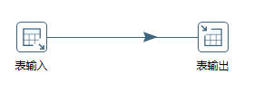

# 支持StarRocks Kettle Connector

## 一、项目介绍


| **项目名称**   | 支持 StarRocks Kettle Connector                              |
| -------------- | ------------------------------------------------------------ |
| **项目导师**   | **李鹏飞**                                                   |
| **导师邮箱**   | lipengfei@starrocks.com                                      |
| **技术领域**   | **Database、Java**                                           |
| **开源协议**   | **Apache License 2.0**                                       |
| **项目简述**   | **Kettle 是一款开源的 ETL 工具，采用 Java 编写，可以在 Windows、Linux、Unix上 运行，支持低代码、拖拽方式开发 ETL 数据管道，可对接包括传统数据库、文件、大数据平台、接口、流数据等数据源。** |
| **项目要求**   | **本项目为 StarRocks 支持 Kettle connector，支持通过 Kettle 将数据写入到 StarRocks。** |
| **技术要求**   | **熟悉 Java 语言，了解数据库基本操作**                       |
| **项目成果库** | https://github.com/StarRocks/starrocks                       |


## 二、项目背景

### 2.1 StarRocks

#### 2.1.1 StarRocks简介

StarRocks 是新一代极速全场景 MPP (Massively Parallel Processing) 数据库。StarRocks 的愿景是能够让用户的数据分析变得更加简单和敏捷。用户无需经过复杂的预处理，就可以用 StarRocks 来支持多种数据分析场景的极速分析。StarRocks 架构简洁，采用了全面向量化引擎，并配备全新设计的 CBO (Cost Based Optimizer) 优化器。StarRocks 能很好地支持实时数据分析，并能实现对实时更新数据的高效查询。StarRocks 兼容 MySQL 协议，支持标准 SQL 语法，易于对接使用，全系统无外部依赖，高可用，易于运维管理。

本项目为了满足更多用户的数据处理需求，需要实现更多种类数据的导入。Kettle融合了众多数据源正好满足项目需求，因此尝试实现Kettle连接StarRocks并将数据导入StarRocks中。

#### 2.1.2 数据导入

数据导入是指将原始数据按照业务需求进行清洗、转换、并加载到 StarRocks 中的过程，从而可以在 StarRocks 系统中进行极速统一的数据分析。

StarRocks 支持导入所有数据类型。个别数据类型的导入可能会存在一些限制，具体请参见[数据类型](https://docs.starrocks.io/zh-cn/latest/sql-reference/sql-statements/data-types/TINYINT)。

##### 导入模式

StarRocks 支持两种导入模式：同步导入和异步导入。

* 同步导入：同步导入是指创建导入作业以后，StarRocks 同步执行作业，并在作业执行完成以后返回导入结果。
* 异步导入：异步导入是指创建导入作业以后，StarRocks 直接返回作业创建结果。
  * 如果导入作业创建成功，StarRocks 会异步执行导入作业。但作业创建成功并不代表数据导入已经成功。需要通过语句或命令来查看导入作业的状态，并且根据导入作业的状态来判断数据导入是否成功。
  * 如果导入作业创建失败，可以根据失败信息，判断是否需要重试。

##### 导入方式

| 导入方式           | 协议  | 业务场景                                                     | 数据量（单作业）     | 数据源                                              | 数据格式                                                | 同步模式 |
| ------------------ | ----- | ------------------------------------------------------------ | -------------------- | --------------------------------------------------- | ------------------------------------------------------- | -------- |
| Stream Load        | HTTP  | 通过 HTTP 协议导入本地文件、或通过程序导入数据流。           | 10 GB 以内           | 本地文件，流式数据                                  | CSV，JSON                                               | 同步     |
| Broker Load        | MySQL | 从 HDFS 或外部云存储系统导入数据。                           | 数十到数百 GB        | HDFS，Amazon ，S3Google GCS，阿里云 OSS，腾讯云 COS | CSV，Parquet，ORC                                       | 异步     |
| Routine Load       | MySQL | 从 Apache Kafka® 实时地导入数据流。                          | 微批导入 MB 到 GB 级 | Kafka                                               | CSV，JSON                                               | 异步     |
| Spark Load         | MySQL | 通过 Apache Spark™ 集群初次从 HDFS 或 Hive 迁移导入大量数据。需要做全局数据字典来精确去重。 | 数十 GB 到 TB级别    | HDFS，Hive                                          | CSVORC（2.0 版本之后支持），Parquet（2.0 版本之后支持） | 异步     |
| INSERT INTO SELECT | MySQL | 外表导入。StarRocks 数据表之间的数据导入。                   | 跟内存相关           | StarRocks 表，外部表                                | StarRocks 表                                            | 同步     |
| INSERT INTO VALUES | MySQL | 单条批量小数据量插入。通过 JDBC 等接口导入。                 | 简单测试用           | 程序，ETL 工具                                      | SQL                                                     | 同步     |

### 2.2 Kettle

#### 2.2.1 Kettle简介

> **kettle-PDI**:Pentaho Data Integration

Kettle是一款开源的ETL工具，全称为“Kettle ETL”。ETL是指抽取（Extract）、转换（Transform）和加载（Load），是数据仓库建设中的一个重要环节。 Kettle提供了一套完整的ETL工作流程，包括数据抽取、数据转换和数据加载等步骤，支持多种数据源的连接和处理，如关系型数据库、NoSQL数据库、大数据存储、文件格式、Web服务等。

Kettle提供了可视化的图形界面，用户可以通过拖拽组件、配置参数等方式来构建数据处理流程，从而实现数据的抽取、清洗、转换和加载等操作。 Kettle提供了丰富的组件库，包括输入组件、输出组件、转换组件、过滤器、连接器等，用户可以根据自己的需求来选择合适的组件进行组合。

Kettle还支持多种数据处理方式，如增量抽取、全量抽取、数据合并、数据过滤、数据转换、数据分割、数据聚合等。 同时，Kettle还支持任务调度和监控，用户可以通过设置定时任务或事件触发任务等方式来执行数据处理任务，并可随时查看任务执行情况和日志信息。

##### Kettle特点

* 易用性： 有可视化设计器进行可视化操作，使用简单。
* 功能强大：不仅能进行数据传输，能同时进行数据清洗转换等操作。
* 支持多种源：支持各种数据库、FTP、文件、rest接口、Hadoop集群等源。
* 部署方便：独立部署，不依赖第三方产品。
* 适用场景： 数据量及增量不大，业务规则变化较快，要求可视化操作，对技术人员的技术门槛要求低。

#### 2.2.2 Kettle基本概念


##### **Kettle组成**

* Spoon：图形化工具，用于快速设计和维护复杂的ETL工作流。
* Kitchen：运行作业的命令行工具。
* Pan：运行转换的命令行工具。
* Carte：轻量级（大概1MB）Web服务器，用来远程执行转换或作业。一个运行有Carte进程的机器可以作为从服务器，从服务器是Kettle集群的一部分。

##### 功能概念

*  **Transformation：**Transformation（转换）是由一系列被称之为step（步骤）的逻辑工作的网络。转换本质上是数据流。
  * 转换的两个相关的主要组成部分是step（步骤）和hops（节点连接）。
  * 转换文件的扩展名是.ktr。
* **Steps：**　Steps（步骤）是转换的建筑模块，比如一个文本文件输入或者一个表输出就是一个步骤。在PDI中有140多个步骤，它们按不同功能进行分类，比如输入类、输出类、脚本类等。
* **Hops：**　Hops（节点连接）是数据的通道，用于连接两个步骤，使得元数据从一个步骤传递到另一个步骤。
* **Jobs：**Jobs（工作）是基于工作流模型的，协调数据源、执行过程和相关依赖性的ETL活动。
  * 工作由工作节点连接、工作实体和工作设置组成。
  * 工作文件的扩展名是.kjb。

#### 2.2.3 Kettle支持的数据源

##### 数据库

Kettle可以通过**JDBC、ODBC、OCI、JNDI**这四种方式连接众多数据库。

* Apache Derby
* AS/400
* Borland Interbase
* Calpont InfiniDB
* Cloudera Impala
* dBase II, IV or 5
* Exasol 4
* ExtenDB
* Firebird SQL
* Generic database
* Greenplum
* Gupta SQL Base
* H2
* Hadoop Hive
* Hadoop Hive 2
* Hypersonic
* IBM DB2
* Impala
* Infobright
* Informix
* Ingres
* Ingres VectorWise
* Intersystems Cache
* KingbaseES
* LucidDB
* MariaDB
* MaxDB (SAP DB)
* MonetDB
* MS Access
* MS SQL Server
* MS SQL Server (Native)
* MySQL
* Native Mondrian
* Neoview
* Netezza
* OpenERP Server
* Oracle
* Oracle RDB
* Palo MOLAP Server
* Pentaho Data Services
* PostgreSQL
* Redshift
* Remedy Action Request System
* SAP ERP System
* SparkSQL
* SQLite
* Sybase
* SybaselQ
* Teradata
* UniVerse database
* Vertica
* Vertica 5+

这些数据库可以通过表输入输出的方式导入和导出数据，如下图所示。



##### 文件

kettle支持如下文件格式的读出和写入：

* Access
* CSV
* Cube
* Excel
* 文本文件

##### Hadoop大数据处理

* HDFS
  - HDFS（Hadoop Distribute File System, Hadoop分布式文件系统），是Hadoop核心组成，是分布式存储服务。
  - 支持的文件存储格式：
    - Parquet：是Hadoop的一种列存储格式，提供了高效的编码和压缩方案。
    - SequenceFile：以二进制键值对的形式存储数据。
    - Avro：将数据定义和数据- -起存储在一条消息中， 其中数据定义以JSON格式存储，数据以二进制格式存储。
    - RCFile：以列格式保存每个行组数据。

- Cassandra(DB)
  - Apache Cassandra是一个开源的、分布式、无中心、弹性可扩展、高可用、容错、一致性可调、面向行的NoSQL数据库.
  - Cassandra以Json的格式存储数据。
- CouchDB
  - Apache CouchDB是一个开源的专门应用于web的NoSQL文档数据库
  - 通过HTTP使用web浏览器访问文档，使用JavaScript查询、合并和转换文档。
  - JSON 的文档格式收集和存储数据
- HBase
  - HBase是一个开源的非关系型分布式数据库，它是Apache软件基金会的Hadoop项目的一部分，运行于HDFS文件系统之上，为Hadoop提供类似于BigTable规模的服务。因此，它可以容错地存储海量稀疏的数据。
  - HBase中的所有数据文件都存储在Hadoop HDFS文件系统上，主要包括上述提出的两种文件类型：
    - HFile： HBase中KeyValue数据的存储格式，HFile是Hadoop的二进制格式文件，实际上StoreFile就是对HFile做了轻量级包装，即StoreFile底层就是HFile。
    - HLog File：HBase中WAL（Write Ahead Log） 的存储格式，物理上是Hadoop的Sequence File
- MapReduce
  - MapReduce是一种分布式计算框架 ，以一种可靠的，具有容错能力的方式并行地处理上TB级别的海量数据集。主要用于搜索领域，解决海量数据的计算问题。
  - MapReduce的数据存储在HDFS。
  - MapReduce API可以实现Mysql数据库的导入导出。
- MongoDB
  - MongoDB是一个基于分布式文件存储的NoSQL类型数据库.MongoDB是一款为web应用程序和互联网基础设施设计的数据库管理系统。
  - MongoDB提出的是文档、集合的概念，使用BSON（类JSON）作为其数据模型结构，其结构是面向对象的而不是二维表，存储一个用户在MongoDB中是这样子的。

* SSTable
  - Sorted String Table的简称，是Bigtable底层的数据存储格式。
  - SSTable 文件是用来存储一系列有序的 KeyValue 对的，Key 和 Value 都是任意长度的字节串， KeyValue 对根据固定比较规则有序地写入到文件中，文件内部分成一系列的Blocks(Block 不会太大，可自定义，默认4KB，常见的是 64KB )，同时具有必要的索引信息。
  - kettle中SSTable实现的是Cassandra SSTable，其文件类型并不是单一的文件，而是由多个文件如 Data.db、Index.db、Summary.db、Filter.db 等多个文件组成。
* Hive
  - Hive是建立在 Hadoop 上的数据仓库基础构架。它提供了一系列的工具，可以用来进行数据提取转化加载（ETL），这是一种可以存储、查询和分析存储在 Hadoop 中的大规模数据的机制。
  - Hive 查询操作过程严格遵守Hadoop MapReduce 的作业执行模型，Hive 将用户的HiveQL 语句通过解释器转换为MapReduce 作业提交到Hadoop 集群上，Hadoop 监控作业执行过程，然后返回作业执行结果给用户。
  - Hive同样可以和Spark结合，替换MapReduce，Hive on Spark的效率比on MR要高不少。
  - Hive数据会存储在HDFS。
    - kettle在向Hive导入数据时可以通过将HDFS的“Hadoop Copy Files”本地文件上传作业项稍加修改，将Destination File/Folder选择为hive表所在的HDFS目录就可将文件上传Hive。
    - Hive OCR列示存储格式。

Kettle中实现了上述库的接口和API的调用实现数据的迁移。


##### Kafka

Kafka是Apache旗下的一款分布式流媒体平台，Kafka是一种高吞吐量、持久性、分布式的发布订阅的消息队列系统。 它最初由LinkedIn(领英)公司发布，使用Scala语言编写，与2010年12月份开源，成为Apache的顶级子项目。 它主要用于处理消费者规模网站中的所有动作流数据。动作指(网页浏览、搜索和其它用户行动所产生的数据)。

- 高吞吐量：可以满足每秒百万级别消息的生产和消费。
- 持久性：有一套完善的消息存储机制，确保数据高效安全且持久化。
- 分布式：基于分布式的扩展；Kafka的数据都会复制到几台服务器上，当某台故障失效时，生产者和消费者转而使用其它的Kafka。

Kettle9.2.0版本后结合了Kafka数据的导入导出：

* **Kafka producer**：用于接受Kettle中传输的数据


* **Kafka consumer**：读取producer产生的数据生成日志或传入下一步


##### MQTT

MQTT（Message Queuing Telemetry Transport，消息队列遥测传输）是IBM开发的一个即时通讯协议， 它是一种轻量级的、基于代理的“发布/订阅”模式的消息传输协议。其具有协议简洁、小巧、可扩展性强、省流量、省电等优点， 而且已经有PHP，JAVA，Python，C，C#，Go等多个语言版本，基本可以使用在任何平台上，几乎可以把所有联网物品和外部连接起来， 所以特别适合用来当做物联网的通信协议。

Kettle同样实现了MQTT的生产者消费者，通过改变连接地址配置可以实现不同MQTT服务器的连接，实现消息的接受和分发。


##### Spark

Apache Spark 是一种开放源代码并行处理框架，支持使用内存中处理来提升大数据分析应用程序的性能。 大数据解决方案旨在处理对传统数据库来说太大或太复杂的数据。 Spark 处理内存中的大量数据，这比基于磁盘的替代方法要快得多。

Spark数据类型

* 文件格式
  * Text
  * JSON：采用SparkSQL处理Json文件
  * Sequence：针对key-value类型的RDD
  * Object：对象文件是将对象序列化后保存的文件，采用Java的序列化机制
* 文件系统
  * 本地文件
  * HDFS
  * MySQL
  * HBase

Kettle提供了spark-submit作业方式，实现了Spark任务的提交。


## 三、项目方案

### 3.1 StarRocks导入方式的选择

为了实现更为高效的数据导入，我们需要根据Kettle传输数据的方式以及数据的格式，来找到一种适合的StarRocks的数据导入方式。

#### 3.1.1 Kettle数据的传输

在Kettle中数据的流动是以每一个Step为节点，Step节点实现的是各种数据的输入、输出和处理。Kettle中实现的每一个Step都扩展了BaseStep类和StepInterface接口，这两个类会在实现细节中详细介绍。

~~~java
public class MySQLBulkLoader extends BaseStep implements StepInterface 
~~~

通过阅读BaseStep类的源码可以发现，Kettle中两个Step中的数据是每行每行的进行传输。可以通过调用BaseStep类中的putRow()和getRow()两方法实现Step中数据的输入和输出。

~~~java	
@Override
public void putRow( RowMetaInterface rowMeta, Object[] row ) throws KettleStepException {
  //对row元数据进行检查
  if ( rowMeta != null ) {
    if ( !allowEmptyFieldNamesAndTypes ) {
      for ( ValueMetaInterface vmi : rowMeta.getValueMetaList() ) {
        if ( StringUtils.isBlank( vmi.getName() ) ) {
          throw new KettleStepException( "Please set a field name for all field(s) that have 'null'." );
        }
        if ( vmi.getType() <= 0 ) {
          throw new KettleStepException( "Please set a value for the missing field(s) type." );
        }
      }
    }
  }
  //真正实现数据的传递
  getRowHandler().putRow( rowMeta, row );
}

@Override
public Object[] getRow() throws KettleException {
  //获取上Step传来的Row数据
  return getRowHandler().getRow();
}
~~~

通过getRow方法获得的是Object[]类型的数据，可以通过自己的需要将每行的数据组合成需要的数据格式。在写入数据时我们可以使用自主定义的分隔符来进行数据分割，最普遍的是以CSV数据格式进行传输。

~~~java
Object[] r = getRow();
// 对要写入的行数据进行整理，写入CSV类型数据
for ( int i = 0; i < data.keynrs.length; i++ ) {
  if ( i > 0 ) {
    // Write a separator
    // 写入分隔符
    data.fifoStream.write( data.separator );
  }
  int index = data.keynrs[i];
  //要填数据的类型元数据
  ValueMetaInterface valueMeta = rowMeta.getValueMeta( index );
  //valueData行中要填的数据
  Object valueData = r[index];
  if ( valueData == null ) {
    data.fifoStream.write( "NULL".getBytes() );
  } else {
    // 对不同类型的数据进行不同的处理
    switch ( valueMeta.getType() ) {
      case ValueMetaInterface.TYPE_STRING:
        data.fifoStream.write( data.quote );
        if ( valueMeta.isStorageBinaryString() //检查是否存储为二进制字符串
            && meta.getFieldFormatType()[i] == MySQLBulkLoaderM
          // We had a string, just dump it back.
          data.fifoStream.write( (byte[]) valueData );
        } else {
          String string = valueMeta.getString( valueData );
          if ( string != null ) {
            if ( meta.getFieldFormatType()[i] == MySQLBulkLoade
              string = Const.replace( string, meta.getEscapeCha
              string = Const.replace( string, meta.getEnclosure
            }
            data.fifoStream.write( string.getBytes() );
          }
        }
        data.fifoStream.write( data.quote );
        break;
      case ...
      ...
  }
}
~~~

#### 3.1.2 StarRocks数据导入

**通过上面的总结，可以尝试采取StarRocks中Stream Load的方式进行数据导入。我们可以采取在Kettle中将多行数据组合成一个文件，再通过Stream Load的方式实现数据的导入。这是一种较为高效的方式实现。**

~~~shell
curl -H "label:<label_name>" -H "db:<database_name>" -H "table:<table_name>"
    -T /path/to/data.csv
    -XPUT http://<fe_host>:<fe_http_port>/api/transaction/load
~~~

也可以采用INSERT语句进行数据的每行的导入，效率低。其需要像Kettle中其他数据库一样扩展BaseDatabaseMeta和接口类DatabasesInterface，实现数据库的基本sql协议的连接。

~~~mysql
INSERT INTO source_wiki_edit
WITH LABEL insert_load_wikipedia
VALUES
    ("2015-09-12 00:00:00","#en.wikipedia","AustinFF",0,0,0,0,0,21,5,0),
    ("2015-09-12 00:00:00","#ca.wikipedia","helloSR",0,1,0,1,0,3,23,0);
~~~

### 3.2 StarRocks-Bulk-Loader

Kettle是一种插件体系结构，Kettle分为了Kettle平台和各类插件。Kettle中提供了各类插件的扩展点包括step插件、job entry插件、Database插件、Partioner插件、debugging插件。在此我们主要实现的是Kettle 的Step插件。我们通过自己实现一个Step插件，用于从Kettle向StarRocks中导入数据，具体实现细节将在第四章详述。

Kettle中实现了众多数据库批量导入的插件，用于向数据库批量导入数据。


通过详细阅读源码发现可以对照这些数据库的实现方式，实现StarRocks的数据批量导入模块**StarRocks-Bulk-Loader**。

**StarRocks-Bulk-Loader**实现原理如下：

1. 根据3.1节的结论，选取Stream Load的方式进行数据的导入。Stream Load导入是使用curl进行网络传输，相较于其他数据库的批量导入减少了初始数据库客户端建立连接的过程。**StarRocks-Bulk-Loader主要是通过执行组合好的curl语句进行数据的导入**。
2. Kettle中数据是以行为单位在Step之间传输，因此为了提高数据导入的效率采用批量传输的方法。不急于将Step获得的行数据立马导入StarRocks中，我们会将接收到的数据存储在一个文件中，当存储到一定行数时就会将文件中数据一次性导入到StarRocks中。考虑到数据传输的性能问题，如果数据量过大不能将所有数据一次性放入文件中，我们规定文件中每存储nr行数据，就需将文件数据进行导入并开启新的文件进行下一论数据导入。
3. 对于文件的存储数据格式，需要在获得每行数据后进行数据的组合，组合之后将其写入文件中。最方便的数据组织格式为CSV，同样也可以实现Json格式。

### 3.3 StarRocks Connector

Kettle中传统的数据库连接都使用了数据库插件来进行数据库的正确连接、执行SQL语句，同时也考虑现有数据的各种特殊功能和不同限制。与 MySQL 等数据库系统类似，StarRocks 支持通过 INSERT 语句导入数据。例如可以使用 INSERT INTO VALUES 语句直接向表中插入数据。

我们可以采用Kettle中“表输入”的方式使用组合INSERT语句方法进行数据的导入，实现StarRocks Connector方法。

**StarRocks Connector**方法实现原理：

1. StarRocks的INSERT使用的是MySQL协议进行数据传输，需要实现与mysql-connector-j类似的JDBC Driver来进行Kettle与StarRocks数据库的连接。通过数据库的连接来传输SQL语句进行数据的导入。因为本项目中StarRocks使用的是Mysql数据库，因此尝试使用MySQL的JDBC Driver进行连接。
2. Kettle中需要继承BaseDatabaseMeta类，实现对StarRocks数据库的特殊设定，需要重写实现BaseDatabaseMeta类中的连接信息、SQL语句和功能标记等方法。

StarRocks Connector方法使用INSERT语句进行数据的导入相对上一种方式效率会更低。**StarRocks Connector方式具有更强的扩展性，可以加入更多的SQL语句实现，可以实现更多的Kettle对于StarRocks数据库的操作。**

如果时间充裕可以尝试StarRocks-Bulk-Loader和StarRocks Connector将这两种方式全部实现，这两种方式对于StarRocks的实现部分都可以参考DataX中的StarRocks Writer 插件。

## 四、项目实现细节

### 4.1 StarRocks-Bulk-Loader

StarRocks-Bulk-Loader方法需要我们实现一个Step插件。step在 Kettle数据流中实现数据处理任务， 它对数据行流进行操作。Step专为输入、处理或输出而设计。输入步骤从外部数据源（如文件或数据库）提取数据行。处理步骤处理数据行、执行字段计算和流操作，例如联接或筛选。 输出步骤将处理后的数据写回存储、文件或数据库。

以MySQL为例介绍具体实现细节。


#### 4.1.1 Step plugins实现

step plugin通过实现四个不同的 Java 接口与 Kettle 集成。每个接口代表由Kettle Step执行的一组职责。 每个接口都有一个基类，该基类实现接口的大部分，以简化插件开发。

所有步骤接口和相应的基类都在 org.pentaho.di.trans.step 包中。

| Java Interface      | Base Class                                  | Main Responsibilities                                        |
| ------------------- | ------------------------------------------- | ------------------------------------------------------------ |
| StepMetaInterface   | BaseStepMeta                                | * 存储step设置信息<br/>* 验证step设置信息<br/>* 序列化step设置信息<br/>* 提供获取step类的方法<br/>* 执行行布局更改 |
| StepDialogInterface | org.pentaho.di.ui.trans.step.BaseStepDialog | * step属性信息配置窗口                                       |
| StepInterface       | BaseStep                                    | * initialization<br>* row processing<br>* clean-up           |
| StepDataInterface   | BaseStepData                                | * 为数据处理提高数据存储                                     |

一个Step plugins至少需要实现如上四个接口:

* org.pentaho.di.trans.step.StepMetaInterface：元数据的处理，加载存储设置的xml，校验，主要是对一个Step的定义的基本数据。 

* org.pentaho.di.trans.step. StepDataInterface:数据处理涉及的具体数据，以及对数据的状态的设置和回收。 

* org.pentaho.di.trans.step. StepInterface：负责数据处理，转换和流转。这里面主要由processRow()方法来处理。 

* org.pentaho.di.trans.step. StepDialogInterface：提供GUI/dialog，编辑Step的元数据。

#### 4.1.2 StarRocks-Bulk-Loader实现

以MySQLBulkLoader为例详细介绍StarRocksBulkLoader中行数据的组合、传输文件的写入以及数据加载的过程。

~~~java
public class MySQLBulkLoader extends BaseStep implements StepInterface 
~~~

MySQLBulkLoader类中主要继承了如下两类。

| **Java Interface** | [org.pentaho.di.trans.step.StepInterface](http://javadoc.pentaho.com/kettle530/kettle-engine-5.3.0.0-javadoc/org/pentaho/di/trans/step/StepInterface.html) |
| ------------------ | ------------------------------------------------------------ |
| **Base class**     | [org.pentaho.di.trans.step.BaseStep](http://javadoc.pentaho.com/kettle530/kettle-engine-5.3.0.0-javadoc/org/pentaho/di/trans/step/BaseStep.html) |

实现类可以依赖基类，并且只有三个重要的方法来实现它自己。这三种方法在转换执行期间实现step生命周期： initialization, row processing, and clean-up。


在初始化期间，Kettle调用一次Step的 init()方法。初始化所有Step后，Kettle会反复调用 processRow（），直到step发出信号，表示它已完成处理所有行。完成行处理后，Kettle调用 dispose()。

##### Step Initialization

init（） 方法在转换准备开始执行时调用。

~~~java
/**
 * 每个Step都有机会执行一次性初始化任务，例如打开文件或建立数据库连接。
 * 对于从 BaseStep 派生的任何Step，必须调用 super.init（） 以确保行为正确。
 * 如果Step正确初始化，该方法返回 true，如果存在初始化错误，则返回 false。
 * Kettle将中止转换的执行，以防任何Step在初始化时返回 false。
 */
public boolean init()
~~~

##### Row processing

Row processing过程中主要执行的**processRow()**函数，其主要实现数据的行处理、文件的写入以及数据的加载发送。将详细介绍其实现流程，如何向StarRocks-Bulk-Loader迁移。

**1.step处理Row信息需要用到processRow（）方法**

StepMetaInterface、StepDataInterface接口都需要在定义插件时实现,在之后简单介绍。

* StepMetaInterface：主要处理流数据和字段信息
* StepDataInterface：主要是和输出环境有关的信息

~~~java
@Override
public boolean processRow( StepMetaInterface smi, StepDataInterface sdi ) throws KettleException {}
~~~

调用**getRow（）**方法获取每一行的数据值以及元数据值，用于之后每行数据的组装。

~~~java
Object[] r = getRow(); // Get row from input rowset & set row busy!
if ( r == null ) { // no more input to be expected...
  //告诉下一步已经完成数据
  setOutputDone();
  closeOutput();
  return false;
}
~~~

在BaseSetp类中会有一个专门的参数first来记录是否为第一行数据。 如果是第一行数据，会将Meta中的数据复制一份到Data中的**public ValueMetaInterface[] bulkFormatMeta**;用于之后数据处理。 最后调用**execute（meta）**主要是为了建立与数据库之间的连接，测试连接和生成的语句是否生效。

~~~java
if ( first ) {
  first = false;
  // Cache field indexes.
  //data.keynrs是字段数据所对应的index
  data.keynrs = new int[meta.getFieldStream().length];
  for ( int i = 0; i < data.keynrs.length; i++ ) {
    data.keynrs[i] = getInputRowMeta().indexOfValue( meta.getFieldStream()[i] );
  }
  //除了Mysql中的date和数值类型，其他的都是String类型
  data.bulkFormatMeta = new ValueMetaInterface[data.keynrs.length];
  for ( int i = 0; i < data.keynrs.length; i++ ) {
    //通过特定的index获得value meta
    ValueMetaInterface sourceMeta = getInputRowMeta().getValueMeta( data.keynrs[i] );
    //判断是否为日期
    if ( sourceMeta.isDate() ) {
      if ( meta.getFieldFormatType()[i] == MySQLBulkLoaderMeta.FIELD_FORMAT_TYPE_DATE ) {
        data.bulkFormatMeta[i] = data.bulkDateMeta.clone();
      } else if ( meta.getFieldFormatType()[i] == MySQLBulkLoaderMeta.FIELD_FORMAT_TYPE_TIMESTAMP ) {
        data.bulkFormatMeta[i] = data.bulkTimestampMeta.clone(); // default to timestamp
      }
    } else if ( sourceMeta.isNumeric()
        && meta.getFieldFormatType()[i] == MySQLBulkLoaderMeta.FIELD_FORMAT_TYPE_NUMBER ) {
      data.bulkFormatMeta[i] = data.bulkNumberMeta.clone();
    }
    if ( data.bulkFormatMeta[i] == null && !sourceMeta.isStorageBinaryString() ) {
      data.bulkFormatMeta[i] = sourceMeta.clone();
    }
  }
  // 当是第一行时，执行客户端语句，主要对fifo文件的建立和数据库的连接，以及对其进行测试
  execute( meta );
}
~~~

mysql-bulk-loader源码中是通过将每行数据组装好写入到一个fifo文件中，每当Fifo文件中存储了nr行后则关闭流，并且执行executeLoadCommand()方法实现数据发送到目标数据库。

当没有写入到一定行数时则实现writeRowToBulk( getInputRowMeta(), r )方法实现传输数据的组合和写入到Fifo文件。

~~~java
//当Fifo文件写入一定的行数时，就将数据传输数据库
if ( data.bulkSize > 0 && getLinesOutput() > 0 && ( getLinesOutput() % data.bulkSize ) == 0 ) {
  //当多少行之后关闭原有的输出文件
  closeOutput();
  //拼接执行语句
  executeLoadCommand();
}
//将数据写入到文件中
writeRowToBulk( getInputRowMeta(), r );
putRow( getInputRowMeta(), r );
//递增写入输出目标（数据库、文件、套接字等）的行数。
incrementLinesOutput();
~~~

**2.execute()方法调用**

execute()主要是执行语句之前的初始工作。

~~~java
public boolean execute( MySQLBulkLoaderMeta meta ) throws KettleException {}
~~~

该方法会首先创建需要写入的文件

~~~java
//1） 使用“mkfifo”命令创建FIFO文件...
//确保记录所有可能的输出，也来自 STDERR
//使用当前的变量空间替换字符串名
data.fifoFilename = environmentSubstitute( meta.getFifoFileName() );
File fifoFile = new File( data.fifoFilename );
if ( !fifoFile.exists() ) {
  // MKFIFO!
  //
  String mkFifoCmd = "mkfifo " + data.fifoFilename;
  //
  logBasic( BaseMessages.getString( PKG, "MySQLBulkLoader.Message.CREATINGFIFO",  data.dbDescription, mkFifoCmd ) );
  // linux 中创建fifo文件，获得Process可用来操控进程
  Process mkFifoProcess = rt.exec( mkFifoCmd );
  ...
  // 当前进程等待
  int result = mkFifoProcess.waitFor();
  if ( result != 0 ) {
    throw new Exception( BaseMessages.getString( PKG, "MySQLBulkLoader.Message.ERRORFIFORC", result, mkFifoCmd ) );
  }
  String chmodCmd = "chmod 666 " + data.fifoFilename;
  logBasic( BaseMessages.getString( PKG, "MySQLBulkLoader.Message.SETTINGPERMISSIONSFIFO",  data.dbDescription, chmodCmd ) );
  Process chmodProcess = rt.exec( chmodCmd );
  ...
  result = chmodProcess.waitFor();
  if ( result != 0 ) {
    throw new Exception( BaseMessages.getString( PKG, "MySQLBulkLoader.Message.ERRORFIFORC", result, chmodCmd ) );
  }
}
~~~

之后会实现数据库的连接，并对数据库所需信息进行赋值。因为相较于MySQL数据库StarRocks减少了使用JDBC驱动连接数据库的步骤，这一步骤可在StarRocks连接插件中替换成StarRocks连接，并修改其StarRocks所需的参数。

~~~java
// 2) 建立数据库的连接
DBCache.getInstance().clear( meta.getDatabaseMeta().getName() );
...
data.db = new Database( this, meta.getDatabaseMeta() );
//获取连接参数
data.db.shareVariablesWith( this );
PluginInterface dbPlugin =
    PluginRegistry.getInstance().getPlugin( DatabasePluginType.class, meta.getDatabaseMeta().getDatabaseInterface() );
data.dbDescription = ( dbPlugin != null ) ? dbPlugin.getDescription() : BaseMessages.getString( PKG, "MySQLBulkLoader.UnknownDB" );
// 连接数据库
if ( getTransMeta().isUsingUniqueConnections() ) { //检查转换是否使用唯一的数据库连接。
  synchronized ( getTrans() ) {
    data.db.connect( getTrans().getTransactionId(), getPartitionID() );
  }
} else {
  data.db.connect( getPartitionID() );
}
~~~

最后开始执行加载语句，因为是第一行数据所以并没有数据的载入所以认为该步骤为测试连接情况。

~~~java
// 3) 开始执行加载语句
executeLoadCommand();
~~~

**3.executeLoadCommand()加载语句执行**

该方法主要实现了加载数据语句的组合和最后语句的发送执行。

~~~java
private void executeLoadCommand() throws Exception {}
~~~

下面步骤主要实现的是组装mysql的批量加载的语句。可以更换成StarRocks的Stream Load的导入方式。

~~~java
String loadCommand = "";
loadCommand +=
    "LOAD DATA " + ( meta.isLocalFile() ? "LOCAL" : "" ) + " INFILE '"
        + environmentSubstitute( meta.getFifoFileName() ) + "' ";
if ( meta.isReplacingData() ) {
  loadCommand += "REPLACE ";
} else if ( meta.isIgnoringErrors() ) {
  loadCommand += "IGNORE ";
}
loadCommand += "INTO TABLE " + data.schemaTable + " ";
if ( !Utils.isEmpty( meta.getEncoding() ) ) {
  loadCommand += "CHARACTER SET " + meta.getEncoding() + " ";
}
String delStr = meta.getDelimiter();
if ( "\t".equals( delStr ) ) {
  delStr = "\\t";
}
loadCommand += "FIELDS TERMINATED BY '" + delStr + "' ";
if ( !Utils.isEmpty( meta.getEnclosure() ) ) {
  loadCommand += "OPTIONALLY ENCLOSED BY '" + meta.getEnclosure() + "' ";
}
loadCommand +=
    "ESCAPED BY '" + meta.getEscapeChar() + ( "\\".equals( meta.getEscapeChar() ) ? meta.getEscapeChar() : "" )
        + "' ";
// 设置列名称
loadCommand += "(";
for ( int cnt = 0; cnt < meta.getFieldTable().length; cnt++ ) {
  loadCommand += meta.getDatabaseMeta().quoteField( meta.getFieldTable()[cnt] ); //返回字段名称
  if ( cnt < meta.getFieldTable().length - 1 ) {
    loadCommand += ",";
  }
}
//CR：特定操作系统的回车符
loadCommand += ");" + Const.CR;
logBasic( BaseMessages.getString( PKG, "MySQLBulkLoader.Message.STARTING",  data.dbDescription, loadCommand ) );
~~~

该步骤启动执行SQL语句的线程，其中调用了MySQLBulkLoader.java文件中定义的SqlRunner、OpenFifo类。使用OpenFifo类打开了fifo文件的写入流，并将流存入Data中，以便在之后向fifo中写入数据使用。SqlRunner类则是用来执行SQL语句，可以将其更改为curl语句执行Stream Load方式的数据加载。

~~~java
data.sqlRunner = new SqlRunner( data, loadCommand );
data.sqlRunner.start();
// Ready to start writing rows to the FIFO file now...
//
if ( !Const.isWindows() ) {
  logBasic( BaseMessages.getString( PKG, "MySQLBulkLoader.Message.OPENFIFO",  data.fifoFilename ) );
  OpenFifo openFifo = new OpenFifo( data.fifoFilename, 1000 );
  openFifo.start();
  // Wait for either the sql statement to throw an error or the
  // fifo writer to throw an error
  while ( true ) {
    //当前线程执行时插入openFifo
    openFifo.join( 200 );
    // 当线程完成时处于终止状态
    if ( openFifo.getState() == Thread.State.TERMINATED ) {
      break;
    }
    try {
      data.sqlRunner.checkExcn();
    } catch ( Exception e ) {
      // 在UNIX/Linux系统中，当有进程以写模式打开一个FIFO文件时，如果没有其他进程以读模式打开该文件，写入操作将被阻塞。
      // 因此，在这种情况下，通过打开一个读模式的输入流来读取FIFO文件，可以解除FIFO写入器的阻塞状态。
      new BufferedInputStream( new FileInputStream( data.fifoFilename ) ).close();
      openFifo.join();
      logError( BaseMessages.getString( PKG, "MySQLBulkLoader.Message.ERRORFIFO" ) );
      logError( "" );
      throw e;
    }
    try {
      //返回错误信息
      openFifo.checkExcn();
    } catch ( Exception e ) {
      throw e;
    }
  }
  data.fifoStream = openFifo.getFifoStream();
}
~~~

SqlRunner主要执行sql语句执行和错误检查。**data.db.execStatement( loadCommand );**语句真正实现了sql语句的数据载入功能。

~~~java
static class SqlRunner extends Thread {
  private MySQLBulkLoaderData data;
  private String loadCommand;
  private Exception ex;
  SqlRunner( MySQLBulkLoaderData data, String loadCommand ) {
    this.data = data;
    this.loadCommand = loadCommand;
  }
  @Override
  public void run() {
    try {
      data.db.execStatement( loadCommand );
    } catch ( Exception ex ) {
      this.ex = ex;
    }
  }
  void checkExcn() throws Exception {
    // This is called from the main thread context to rethrow any saved
    // excn.
    if ( ex != null ) {
      throw ex;
    }
  }
}
~~~

OpenFifo类打开fifo文件流以及检查错误。

~~~java
static class OpenFifo extends Thread {
  private BufferedOutputStream fifoStream = null;
  private Exception ex;
  private String fifoName;
  private int size;
  OpenFifo( String fifoName, int size ) {
    this.fifoName = fifoName;
    this.size = size;
  }
  @Override
  public void run() {
    try {
      //用于后续向fifo文件写入数据
      fifoStream = new BufferedOutputStream( new FileOutputStream( OpenFifo.this.fifoName ), this.size );
    } catch ( Exception ex ) {
      this.ex = ex;
    }
  }
  void checkExcn() throws Exception {
    if ( ex != null ) {
      throw ex;
    }
  }
  BufferedOutputStream getFifoStream() {
    return fifoStream;
  }
}
~~~

**4.writeRowToBulk()文件写入**

writeRowToBulk方法可以实现自定义文件格式的写入，实例中主要实现了CSV格式的数据写入。

~~~java
private void writeRowToBulk( RowMetaInterface rowMeta, Object[] r ) throws KettleException {}
~~~

通过结合Meta数据，将其数据按照Meta中不同列对应的数据类型转换成对应列的，最后转换为Bytes，将其写入fifo数据中。

data.fifoStream就是Data从OpenFifo类中打开的文件流。

~~~java
for ( int i = 0; i < data.keynrs.length; i++ ) {
  if ( i > 0 ) {
    // 写入分隔符
    // 分隔符在Data定义
    data.fifoStream.write( data.separator );
  }
  int index = data.keynrs[i];
  //要填数据的类型元数据
  ValueMetaInterface valueMeta = rowMeta.getValueMeta( index );
  //valueData行中要填的数据
  Object valueData = r[index];
  if ( valueData == null ) {
    data.fifoStream.write( "NULL".getBytes() );
  } else {
    // 写入对应格式的数据
    switch ( valueMeta.getType() ) {
      case ValueMetaInterface.TYPE_STRING:
        data.fifoStream.write( data.quote );
        if ( valueMeta.isStorageBinaryString() //检查是否存储为二进制字符串
            && meta.getFieldFormatType()[i] == MySQLBulkLoaderMeta.FIELD_FORMAT_TYPE_OK ) {
          // We had a string, just dump it back.
          data.fifoStream.write( (byte[]) valueData );
        } else {
          String string = valueMeta.getString( valueData );
          if ( string != null ) {
            if ( meta.getFieldFormatType()[i] == MySQLBulkLoaderMeta.FIELD_FORMAT_TYPE_STRING_ESCAPE ) {
              string = Const.replace( string, meta.getEscapeChar(), meta.getEscapeChar() + meta.getEscapeChar() );
              string = Const.replace( string, meta.getEnclosure(), meta.getEscapeChar() + meta.getEnclosure() );
            }
            data.fifoStream.write( string.getBytes() );
          }
        }
        data.fifoStream.write( data.quote );
        break;
      case ValueMetaInterface.TYPE_INTEGER:
        ...
      case ValueMetaInterface.TYPE_DATE:
        ...
      case ...
      ...
  }
}
~~~

最后新启一行数据。

~~~java
// finally write a newline
data.fifoStream.write( data.newline );
if ( ( getLinesOutput() % 5000 ) == 0 ) {
  data.fifoStream.flush();
}
~~~

上述过程就是实现数据处理和导入的最主要过程，之后会简单描述实现导入过程用到的其余必要实现的接口以及其中简单的方法介绍。

##### Step clean-up

转换完成后，Kettle 会在所有Step中调用 dispose。

~~~java
/**
 * 需要采取措施来释放在 init（） 或后续行处理期间分配的资源。
 * 实现应清除 StepDataInterfaceObject 的所有字段，并确保所有打开的文件或连接都已正确关闭。
 * 对于从 BaseStep 派生的任何步骤，必须调用 super.dispose（） 以确保正确的释放。
 */
@Override
public void dispose( StepMetaInterface smi, StepDataInterface sdi ) {
  meta = (MySQLBulkLoaderMeta) smi;
  data = (MySQLBulkLoaderData) sdi;
  // Close the output streams if still needed.
  ...
    if ( data.fifoStream != null ) {
      data.fifoStream.close();
    }
    // Stop the SQL execution thread
    if ( data.sqlRunner != null ) {
      data.sqlRunner.join();
      data.sqlRunner = null;
    }
    // Release the database connection
    if ( data.db != null ) {
      data.db.disconnect();
      data.db = null;
    }
    // remove the fifo file...
    try {
      if ( data.fifoFilename != null ) {
        new File( data.fifoFilename ).delete();
      }
    } 
    ...
  super.dispose( smi, sdi );
}
~~~

#### 4.1.3 Meta数据信息类

StepMetaInterface 接口是插件实现的主要 Java 接口，它主要用于Kettle中Step之间的通信，传递各Step之间的数据信息。

| Java Interface | [org.pentaho.di.trans.step.StepMetaInterface](https://javadoc.pentaho.com/kettle530/kettle-engine-5.3.0.0-javadoc/org/pentaho/di/trans/step/StepMetaInterface.html) |
| -------------- | ------------------------------------------------------------ |
| Base class     | [org.pentaho.di.trans.step.BaseStepMeta](https://javadoc.pentaho.com/kettle530/kettle-engine-5.3.0.0-javadoc/org/pentaho/di/trans/step/BaseStepMeta.html) |

给接口的实现类主要需要实现如下方法。

##### Step配置的传递跟踪

实现类使用具有相应 get 和 set 方法的私有字段跟踪Step设置。 实现 StepDialogInterface 的对话框类使用这些方法将用户提供的配置复制到对话框中和从对话框中复制出来。这些接口方法还用于设置的保存。

~~~java
/**
 * 每次创建新step时都会调用此方法，并将Step配置分配或设置为合理的默认值。
 * 创建新step时，Kettle客户端 （Spoon） 将使用此处设置的值。这是确保将步骤设置初始化为非空值。在序列化和对话框填充中处理空值可能很麻烦，因此大多数Kettle Step实现在所有步骤设置中都坚持使用非空值。
 */
public void setDefault(){
    fieldTable = null;
	databaseMeta = null;
	schemaName = "";
	tableName = BaseMessages.getString( PKG, "MySQLBulkLoaderMeta.DefaultTableName" );
	encoding = "";
	fifoFileName = "/tmp/fifo";
	delimiter = "\t";
	enclosure = "\"";
	escapeChar = "\\";
    ...
}
    
/**
 * 在Kettle客户端中复制step时调用此方法。它返回Step元对象的深层副本。
 * 如果Step配置存储在可修改的对象（如列表或自定义帮助程序对象）中，则实现类必须创建适当的深层副本。
 */
public Object clone(){
    MySQLBulkLoaderMeta retval = (MySQLBulkLoaderMeta) super.clone();
    int nrvalues = fieldTable.length;

    retval.allocate( nrvalues );
    System.arraycopy( fieldTable, 0, retval.fieldTable, 0, nrvalues );
    System.arraycopy( fieldStream, 0, retval.fieldStream, 0, nrvalues );
    System.arraycopy( fieldFormatType, 0, retval.fieldFormatType, 0, nrvalues );

    return retval;
}
~~~

##### 序列化Step配置

Kettle 插件将其设置序列化为 XML 和 Kettle存储库，实现了Step配置数据的存储和读取。

~~~java
/**
 * 每当步骤将其设置序列化为 XML 时，Kettle都会调用此方法。在Kettle客户端中保存转换时调用它。
 * 该方法返回包含序列化步骤设置的 XML 字符串。该字符串包含一系列 XML 标记，每个设置一个标记。
 * 帮助程序类 org.pentaho.di.core.xml.XMLHandler 构造 XML 字符串。
 */
public String getXML(){
    StringBuilder retval = new StringBuilder( 300 );
    retval.append( "    " ).append(
        XMLHandler.addTagValue( "connection", databaseMeta == null ? "" : databaseMeta.getName() ) );
    retval.append( "    " ).append( XMLHandler.addTagValue( "schema", schemaName ) );
    retval.append( "    " ).append( XMLHandler.addTagValue( "table", tableName ) );
    ...
    ...
    return retval.toString();
}

/**
 * 每当Step从XML中读取其设置时，Kettle都会调用此方法。
 * 包含步骤设置的 XML 节点作为参数传入。
 * 同样，帮助程序类 org.pentaho.di.core.xml.XMLHandler 从 XML 节点读取步骤设置。
 */
public void loadXML( Node stepnode, List<DatabaseMeta> databases, IMetaStore metaStore ) throws KettleXMLException {
    readData( stepnode, databases );
  }
~~~

~~~java
/**
 * 每当步骤将其设置保存到 Kettle repository时，Kettle 都会调用此方法。
 * 作为第一个参数传入的repository对象提供了一组用于序列化步骤设置的方法。
 * 在调用存储库序列化方法时，步骤将传入的transformation id 和step ID 用作标识符。
 */
public void saveRep( Repository rep, IMetaStore metaStore, ObjectId id_transformation, ObjectId id_step )
    throws KettleException {
    try {
      rep.saveDatabaseMetaStepAttribute( id_transformation, id_step, "id_connection", databaseMeta );
      rep.saveStepAttribute( id_transformation, id_step, "schema", schemaName );
      rep.saveStepAttribute( id_transformation, id_step, "table", tableName );
      ...
      // Also, save the step-database relationship!
      if ( databaseMeta != null ) {
        rep.insertStepDatabase( id_transformation, id_step, databaseMeta.getObjectId() );
      }
      ...
    }

/**
 * 每当Step从Kettle存储库读取其配置时，Kettle都会调用此方法。
 * 参数中给出的Step ID 在使用存储库序列化方法时用作标识符。
 */
public void readRep( Repository rep, IMetaStore metaStore, ObjectId id_step, List<DatabaseMeta> databases )
    throws KettleException {
    try {
      databaseMeta = rep.loadDatabaseMetaFromStepAttribute( id_step, "id_connection", databases );
      schemaName = rep.getStepAttributeString( id_step, "schema" );
      tableName = rep.getStepAttributeString( id_step, "table" );
      ...
~~~

开发插件时，请确保序列化代码与step dialog中可用的设置同步。在 Kettle客户端中测试step时，Kettle 会在内部保存并加载转换的副本，然后再执行转换。

##### 提供其他插件的实例

StepMetaInterface插件类是主类，与Kettle架构的其余部分捆绑在一起。 它负责提供实现 StepDialogInterface、StepTInterface 和 StepDataTInterface 的其他插件类的实例。 以下方法涵盖了这些职责。每个方法实现构造相应类的新实例，将传入的参数转发给构造函数。

getDialog方法在**StepMetaInterface的基类BaseStepMeat类中实现**，其余两个方法都要在插件类中实现。

~~~java
/**
 * 这些方法中的每一个都返回实现 StepDialogInterface、StepTInterface 和 StepDataInterface 的插件类的新实例。
 */
public StepDialogInterface getDialog()
public StepInterface getStep()
public StepDataInterface getStepData()
~~~

##### 提交Step对Row数据的更改

Kettle需要知道Step如何影响行结构。Step可能是添加或删除字段，以及修改字段的元数据。实现步Step插件这一方面的方法是getFields（）。如果Step没有对Row数据进行更改，该方法则可以不用实现。向StarRocks导入数据就可以不用实现该方法。

~~~java
/**
 * 给定输入行的描述，插件对其进行修改以匹配其输出字段的结构。该实现修改传入的 RowMetaInterfaceobject 以反映对行流的更改。步骤将字段添加到行结构中。
 * 这是通过创建 ValueMeta 对象（例如 ValueMetaInterface 的 PDI 默认实现）并将它们附加到 RowMetaInterface 对象来完成的。
 */
public void getFields( RowMetaInterface rowMeta, String origin, RowMetaInterface[] info, StepMeta nextStep,
      VariableSpace space, Repository repository, IMetaStore metaStore ) throws KettleStepException {
    // Default: nothing changes to rowMeta
  }
~~~

##### Step验证

Kettle客户端支持Validate Transformation功能，该功能会触发所有步骤的自检。Kettle 调用canvas上每个Step的 check（） 方法，允许每个Step验证其设置。

```java
/**
 * 每个Step都有机会验证其设置并验证用户给出的配置是否合理。
 * 此外，Step会检查它是否连接到前面或后续步骤，如果Step的性质需要这种连接。
 * 例如，输入Step可能期望没有前面的步骤。check 方法传入检查备注列表，该方法将其验证结果追加到该列表。
 * Kettle客户端显示从步骤中收集的备注列表，允许您在出现验证警告或错误时采取纠正措施。
 */
public void check()
```

##### Kettle插件系统接口

实现 StepMetaInterface 的类必须使用 Step Java annotation进行注释。提供以下注释属性：

| **Attribute**       | **Description**                                              |
| ------------------- | ------------------------------------------------------------ |
| id                  | step的全局唯一 ID                                            |
| image               | step的 png 图标图像的资源位置                                |
| name                | step的简短标签                                               |
| description         | step的详细描述                                               |
| categoryDescription | step应显示在 Kettle 步骤树中的类别。例如输入、输出、转换等。 |
| i18nPackageName     | 如果在注释属性中提供了 i18nPackageName 属性，那么名称、描述和类别描述的值将解释为相对于给定包中包含的消息包的 i18n 键。可以在扩展格式 i18n： key 中提供密钥，以指定与 i18nPackageName 属性中给出的软件包不同的包。 |

以MysqlBulkLoaderMeta为例：

~~~java
@Step( id = "MySQLBulkLoader", name = "BaseStep.TypeLongDesc.MySQLBulkLoader",
  description = "BaseStep.TypeTooltipDesc.MySQLBulkLoader",
  categoryDescription = "i18n:org.pentaho.di.trans.step:BaseStep.Category.Bulk",
  image = "BLKMYSQL.svg",
  documentationUrl = "http://wiki.pentaho.com/display/EAI/MySQL+Bulk+Loader",
  i18nPackageName = "org.pentaho.di.trans.steps.mysqlbulkloader" )
@InjectionSupported( localizationPrefix = "MySQLBulkLoader.Injection.", groups = { "FIELDS" } )
public class MySQLBulkLoaderMeta extends BaseStepMeta implements StepMetaInterface,
    ProvidesDatabaseConnectionInformation {
    
}
~~~

#### 4.1.4 Data数据信息类

实现 StepInterface 的类不会在其任何字段中存储处理状态。 实现 StepDataInterface 的附加类用于存储处理状态，包括状态标志、索引、缓存表、数据库连接、文件句柄、以及各列的数据参数等。 StepDataInterface 的实现声明行处理期间使用的字段并添加访问器函数。 实质上，实现 StepDataInterface 的类在行处理期间用作字段变量的位置。

| **Java Interface** | [org.pentaho.di.trans.step.StepDataInterface](http://javadoc.pentaho.com/kettle530/kettle-engine-5.3.0.0-javadoc/org/pentaho/di/trans/step/StepDataInterface.html) |
| ------------------ | ------------------------------------------------------------ |
| **Base class**     | [org.pentaho.di.trans.step.BaseStepData](http://javadoc.pentaho.com/kettle530/kettle-engine-5.3.0.0-javadoc/org/pentaho/di/trans/step/BaseStepData.html) |

Kettle在适当的时间创建实现 StepDataInterface 的类的实例，并在适当的方法调用中将其传递给 StepInterface 对象。 基类已经实现了与 Kettle的所有必要交互，无需重写任何基类方法。

~~~java
/**
 * 存储 MySQL 批量加载步骤的数据。
 */
public class MySQLBulkLoaderData extends BaseStepData implements StepDataInterface {
  public Database db;

  public int[] keynrs; // nr of keylookup -value in row...

  public StreamLogger errorLogger;
  public StreamLogger outputLogger;

  public byte[] quote;
  public byte[] separator;
  public byte[] newline;

  public ValueMetaInterface bulkTimestampMeta;
  public ValueMetaInterface bulkDateMeta;
  public ValueMetaInterface bulkNumberMeta;
  protected String dbDescription;

  public String schemaTable;

  public String fifoFilename;
  public OutputStream fifoStream;

  public MySQLBulkLoader.SqlRunner sqlRunner;
  public ValueMetaInterface[] bulkFormatMeta;
  ...
}
~~~

#### 4.1.5 Step设置对话框

StepDialogInterface 是实现插件设置对话框的 Java 接口。实现该接口的dialog class 负责构造和打开step的设置对话框。

| **Java Interface** | [org.pentaho.di.trans.step.StepDialogInterface](http://javadoc.pentaho.com/kettle530/kettle-engine-5.3.0.0-javadoc/org/pentaho/di/trans/step/StepDialogInterface.html) |
| ------------------ | ------------------------------------------------------------ |
| **Base class**     | [org.pentaho.di.ui.trans.step.BaseStepDialog](http://javadoc.pentaho.com/kettle530/kettle-ui-swt-5.3.0.0-javadoc/org/pentaho/di/ui/trans/step/BaseStepDialog.html) |

每当在Kettle客户端（Spoon）中打开step设置时，系统都会实例化传入StepMetaInterface对象的对话框类，并在对话框上调用open（）。 SWT 是 Kettle客户端的本机窗口环境，是用于实现步骤对话框的框架。

```java
/**
 * 此方法仅在对话框确认或取消后返回。该方法必须符合这些规则。
 *    如果dialog已确认:
 *      StepMetaInterface 对象必须更新为新的step设置
 *      如果更改了任何步骤设置，则必须将 StepMetaInterface 对象标志的“已更改”标志设置为 true
 *      open（） 返回步骤的名称
 *    如果dialog被取消
 *      不得更改 StepMetaInterface 对象
 *      StepMetaInterface 对象的 Changed 标志必须设置为对话框打开时的值
 *      open（） 必须返回空值
 */
public String open()
```

StepMetaInterface 对象有一个内部的 Changed 标志，可以使用 hasChanged（） 和 setChanged（） 访问该标志。 Kettle客户端根据 Changed 标志确定转换是否具有未保存的更改，因此对话框必须正确设置标志。

~~~java
/**
 * Dialog class for the MySQL bulk loader step.
 */
@PluginDialog( id = "MySQLBulkLoader", image = "BLKMYSQL.svg", pluginType = PluginDialog.PluginType.STEP,
  documentationUrl = "http://wiki.pentaho.com/display/EAI/MySQL+Bulk+Loader" )
public class MySQLBulkLoaderDialog extends BaseStepDialog implements StepDialogInterface {}
~~~

### 4.2 StarRocks Connector

StarRocks Connerctor 方法主要是基于Kettle中传统数据库的连接操作方法，使用JDBC驱动实现数据库的连接，通过传递INSERT INTO VALUES语句进行数据的导入。该方法相较于上述方法效率相差很多，但其有很强的功能扩展，可以实现类似其他Kettle中已有数据库类似功能。

Kettle同样提供了数据库插件，Kettle使用其进行数据库的正确连接、执行SQL，同时也考虑现有数据的各种特殊功能和不同限制。

Kettle里面，集成的数据库插件都会继承自BaseDatabaseMeta。实现类要实现的方法主要分成3大主题：连接信息、SQL语句和功能标记。

~~~java
public class MSSQLServerDatabaseMeta extends BaseDatabaseMeta implements DatabaseInterface
~~~

StarRocks 数据库插件类通过实现如下基础方式，即可通过Kettle中**“表输出”**操作实现StarRocks数据的导入。

#### 4.2.1 数据库连接情况

当Kettle建立数据库连接时将会调用这些函数，或者数据库设置对话框里显示与语句有关的内容时也会调用。

~~~java
public String getDriverClass()

public int getDefaultDatabasePort()

public int[]getAccessTypeList()

public boolean supportsOptionsInURL()

public String getURL()
~~~

**1.实现getDriverClass()方法，返回数据库的JDBC驱动类名。**

~~~java
@Override public String getDriverClass() {
    String driver = null;
    //当使用 ODBC 访问时，使用 sun.jdbc.odbc.JdbcOdbcDriver
    if ( getAccessType() == DatabaseMeta.TYPE_ACCESS_ODBC ) {
      driver = "sun.jdbc.odbc.JdbcOdbcDriver";
    }else {
      driver = determineDriverClass();
    }
    return driver;
  }

  private static String determineDriverClass() {
    if ( driverClass.isEmpty() ) {
      try {
        //mysql8.0
        driverClass = "com.mysql.cj.jdbc.Driver";
        //通过mysql-connector-java中的静态块加载所用驱动
        Class.forName( driverClass );
      } catch ( ClassNotFoundException e ) {
        driverClass = "org.gjt.mm.mysql.Driver";
      }
    }
    return driverClass;
  }
~~~

**2.实现getDefaultDatabasePort()方法，返回数据库连接所用的默认端口号。**

~~~java
@Override public int getDefaultDatabasePort() {
    // MySQL default port is 3306,通过判断DatabaseMeta的访问类型TYPE_ACCESS_NATIVE为0代表是JDBC连接
    if ( getAccessType() == DatabaseMeta.TYPE_ACCESS_NATIVE ) {
      return 3306;
    }
    return -1;
  }
~~~

**3.实现getAccessTypeList()方法，返回数据库支持的连接驱动类型。**

~~~java
@Override public int[] getAccessTypeList() {
    //返回支持的访问类型，TYPE_ACCESS_NATIVE为0代表是JDBC连接，TYPE_ACCESS_ODBC为1代表是ODBC连接，TYPE_ACCESS_JNDI为4代表是JNDI连接
    return new int[] { DatabaseMeta.TYPE_ACCESS_NATIVE, DatabaseMeta.TYPE_ACCESS_ODBC, DatabaseMeta.TYPE_ACCESS_JNDI };
  }
~~~

**4.在其父类中实现supportsOptionsInURL()方法，MySQL是否支持URL中的选项，默认值为true。**

~~~java
@Override
  public boolean supportsOptionsInURL() {
    return true;
  }
~~~

**5.实现getURL()方法，返回拼接好的数据库连接URL。**

~~~java
@Override public String getURL( String hostname, String port, String databaseName ) {
    if ( getAccessType() == DatabaseMeta.TYPE_ACCESS_ODBC ) {
      return "jdbc:odbc:" + databaseName;
    } else {
      if ( Utils.isEmpty( port ) ) {
        return "jdbc:mysql://" + hostname + "/" + databaseName;
      } else {
        return "jdbc:mysql://" + hostname + ":" + port + "/" + databaseName;
      }
    }
  }
~~~

#### 4.2.2 数据库语句生成

Kettle中构建有效的SQL数据库语句时会调用这些方法。

~~~java
public String getFieldDefinition()

public String getAddColumnStatement()

public String getSQLColumnExists()

public String getSQLQueryFields() 
~~~


**1.实现getFieldDefinition()方法，返回数据库的字段定义，用于组合数据库表的创建语句。**

~~~java
@Override public String getFieldDefinition( ValueMetaInterface v, String tk, String pk, boolean useAutoinc,
                                              boolean addFieldName, boolean addCr ) {
    String retval = "";

    String fieldname = v.getName();
    // 当插入值的长度等于数据库的最大长度时，将其设置为Integer.MAX_VALUE
    if ( v.getLength() == DatabaseMeta.CLOB_LENGTH ) {
      v.setLength( getMaxTextFieldLength() );
    }
    int length = v.getLength();
    //精度
    int precision = v.getPrecision();

    if ( addFieldName ) {
      retval += fieldname + " ";
    }
    int type = v.getType();
    switch ( type ) {
      //指示值包含具有纳秒精度的日期时间的值类型
      case ValueMetaInterface.TYPE_TIMESTAMP:
      case ValueMetaInterface.TYPE_DATE: //指示值包含日期的值类型
        retval += "DATETIME";
        break;
      case ValueMetaInterface.TYPE_BOOLEAN: //指示值包含布尔值的值类型
        //判断数据库是否支持Boolean类型的值，如果数据库支持布尔值、位、逻辑、...数据类型 默认值为 false：映射到字符串。
        if ( supportsBooleanDataType() ) {
          retval += "BOOLEAN";
        } else {
          //如果数据库不支持布尔值、位、逻辑、...数据类型 默认值为 false：映射到字符串。
          retval += "CHAR(1)";
        }
        break;
	 ...
  }
~~~

**2.实现getAddColumnStatement()方法，返回数据库的添加字段语句，组合生成添加一列的SQL语句。**

~~~java
@Override public String getAddColumnStatement( String tablename, ValueMetaInterface v, String tk, boolean useAutoinc,
    String pk, boolean semicolon ) {
    return "ALTER TABLE " + tablename + " ADD " + getFieldDefinition( v, tk, pk, useAutoinc, true, false );
  }
~~~

**3.实现getSQLColumnExists()方法，返回数据库的判断列字段是否存在的SQL语句。**

~~~java
@Override public String getSQLColumnExists( String columnname, String tablename ) {
    return getSQLQueryColumnFields( columnname, tablename );
  }
  //生成Mysql的查询列字段
  public String getSQLQueryColumnFields( String columnname, String tableName ) {
    return "SELECT " + columnname + " FROM " + tableName + " LIMIT 0"; //限制检索记录行第0行
  }
~~~

**4.实现getSQLQueryFields()方法，返回数据库的查询表字段的SQL语句。**

~~~java
@Override public String getSQLQueryFields( String tableName ) {
    return "SELECT * FROM " + tableName + " LIMIT 0";
  }
~~~


#### 4.2.3 功能标记

Kettle中查询使用的数据库是否支持该功能。

~~~java
public boolean supportsTransactions()

public boolean releaseSavepoint()

public boolean supportsPreparedStatementMetadataRetrieval()

public boolean supportsResultSetMetadataRetrievalOnly()
~~~

**1.实现supportsTransactions()方法，返回数据库是否支持事务。**

~~~java
@Override public boolean supportsTransactions() {
    return false;
  }
~~~

**2.实现releaseSavepoint()方法，返回数据库是否允许释放保存点。**

~~~java
/**
   * Returns a false as Mysql does not allow for the releasing of savepoints.
   */
  @Override public boolean releaseSavepoint() {
    return false;
  }
~~~

**3.在父类BaseDatabaseMeta中已经实现了supportsPreparedStatementMetadataRetrieval()方法，返回数据库是否支持预编译准备 SELECT 语句来检索结果元数据。**

~~~java
@Override
  public boolean supportsPreparedStatementMetadataRetrieval() {
    return true;
  }
~~~

**4.在父类BaseDatabaseMeta中已经实现了supportsResultSetMetadataRetrievalOnly()方法，返回数据库是否只支持对结果集进行元数据检索，而不支持对语句进行检索（即使语句已执行）。**

~~~java
@Override
public boolean supportsResultSetMetadataRetrievalOnly() {
  return false;
}
~~~

## 五、项目开发计划

本人现在研二准备明年研三毕业硕博连读，因此现在没有找实习并且实验室处于散养状态。所以一直到项目截至时间都比较自由，有很多时间用于项目的开发。如果可以，从六月份我就可以开始着手项目开发的准备工作。如果时间还有剩余可以考虑实现上述两种导入方式。

### 5.1 项目开发第一阶段（06月01日-06月30日）

1. 在Linux服务器上部署StarRocks集群，用于之后项目测试。
2. 熟悉StarRocks的使用方法，以及Kettle的版本和操作。
3. 详细阅读StarRocks关于数据导入的源码，以及DataX中writer插件的实现。

### 5.2 项目开发第二阶段（07月01日-08月15日）

1. 仔细阅读Kettle文档中对于插件中方法重写的要求，以及在插件开发中所要用到的辅助类的使用如行处理、日志处理、错误处理等。
2. 完成Data和Meta类，规划在实现StarRocks数据导入的时候需要用到的参数和Step传输的信息。
3. 完成主要的StarRocksBulkLoader类用于主要实现对上一Step传来行数据的处理，和数据的导入。
4. 完成Dialog类，实现数据导入操作的可视化编辑Step 元数据。

### 5.3 项目开发第三阶段（08月16日-09月30日）

1. 对StarRocks-Bulk-Loader插件进行详细测试。
2. 解决中间发现的问题，思考改进的方式。
3. 如果还有时间可以继续尝试方法二StarRocks Connector的开发，有了方法一的实践方法二开发会更快。