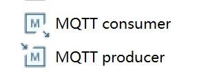

# 支持StarRocks Kettle Connector

## 一、项目介绍

| **项目名称**   | 支持 StarRocks Kettle Connector                              |
| -------------- | ------------------------------------------------------------ |
| **项目导师**   | **李鹏飞**                                                   |
| **导师邮箱**   | lipengfei@starrocks.com                                      |
| **技术领域**   | **Database、Java**                                           |
| **开源协议**   | **Apache License 2.0**                                       |
| **项目简述**   | **Kettle 是一款开源的 ETL 工具，采用 Java 编写，可以在 Windows、Linux、Unix上 运行，支持低代码、拖拽方式开发 ETL 数据管道，可对接包括传统数据库、文件、大数据平台、接口、流数据等数据源。** |
| **项目要求**   | **本项目为 StarRocks 支持 Kettle connector，支持通过 Kettle 将数据写入到 StarRocks。** |
| **技术要求**   | **熟悉 Java 语言，了解数据库基本操作**                       |
| **项目成果库** | https://github.com/StarRocks/starrocks                       |

## 二、项目背景

### 2.1 StarRocks

#### 2.1.1 StarRocks简介

StarRocks 是新一代极速全场景 MPP (Massively Parallel Processing) 数据库。StarRocks 的愿景是能够让用户的数据分析变得更加简单和敏捷。用户无需经过复杂的预处理，就可以用 StarRocks 来支持多种数据分析场景的极速分析。StarRocks 架构简洁，采用了全面向量化引擎，并配备全新设计的 CBO (Cost Based Optimizer) 优化器。StarRocks 能很好地支持实时数据分析，并能实现对实时更新数据的高效查询。StarRocks 兼容 MySQL 协议，支持标准 SQL 语法，易于对接使用，全系统无外部依赖，高可用，易于运维管理。

本项目为了满足更多用户的数据处理需求，需要实现更多种类数据的导入。Kettle融合了众多数据源正好满足项目需求，因此尝试实现Kettle连接StarRocks并将数据导入StarRocks中。

#### 2.1.2 数据导入

数据导入是指将原始数据按照业务需求进行清洗、转换、并加载到 StarRocks 中的过程，从而可以在 StarRocks 系统中进行极速统一的数据分析。

StarRocks 支持导入所有数据类型。个别数据类型的导入可能会存在一些限制，具体请参见[数据类型](https://docs.starrocks.io/zh-cn/latest/sql-reference/sql-statements/data-types/TINYINT)。

##### 导入模式

StarRocks 支持两种导入模式：同步导入和异步导入。

* 同步导入：同步导入是指创建导入作业以后，StarRocks 同步执行作业，并在作业执行完成以后返回导入结果。
* 异步导入：异步导入是指创建导入作业以后，StarRocks 直接返回作业创建结果。
  * 如果导入作业创建成功，StarRocks 会异步执行导入作业。但作业创建成功并不代表数据导入已经成功。需要通过语句或命令来查看导入作业的状态，并且根据导入作业的状态来判断数据导入是否成功。
  * 如果导入作业创建失败，可以根据失败信息，判断是否需要重试。

##### 导入方式

| 导入方式           | 协议  | 业务场景                                                     | 数据量（单作业）     | 数据源                                              | 数据格式                                                | 同步模式 |
| ------------------ | ----- | ------------------------------------------------------------ | -------------------- | --------------------------------------------------- | ------------------------------------------------------- | -------- |
| Stream Load        | HTTP  | 通过 HTTP 协议导入本地文件、或通过程序导入数据流。           | 10 GB 以内           | 本地文件，流式数据                                  | CSV，JSON                                               | 同步     |
| Broker Load        | MySQL | 从 HDFS 或外部云存储系统导入数据。                           | 数十到数百 GB        | HDFS，Amazon ，S3Google GCS，阿里云 OSS，腾讯云 COS | CSV，Parquet，ORC                                       | 异步     |
| Routine Load       | MySQL | 从 Apache Kafka® 实时地导入数据流。                          | 微批导入 MB 到 GB 级 | Kafka                                               | CSV，JSON                                               | 异步     |
| Spark Load         | MySQL | 通过 Apache Spark™ 集群初次从 HDFS 或 Hive 迁移导入大量数据。需要做全局数据字典来精确去重。 | 数十 GB 到 TB级别    | HDFS，Hive                                          | CSVORC（2.0 版本之后支持），Parquet（2.0 版本之后支持） | 异步     |
| INSERT INTO SELECT | MySQL | 外表导入。StarRocks 数据表之间的数据导入。                   | 跟内存相关           | StarRocks 表，外部表                                | StarRocks 表                                            | 同步     |
| INSERT INTO VALUES | MySQL | 单条批量小数据量插入。通过 JDBC 等接口导入。                 | 简单测试用           | 程序，ETL 工具                                      | SQL                                                     | 同步     |

### 2.2 Kettle

#### 2.2.1 Kettle简介

> **kettle-PDI**:Pentaho Data Integration

Kettle是一款开源的ETL工具，全称为“Kettle ETL”。ETL是指抽取（Extract）、转换（Transform）和加载（Load），是数据仓库建设中的一个重要环节。 Kettle提供了一套完整的ETL工作流程，包括数据抽取、数据转换和数据加载等步骤，支持多种数据源的连接和处理，如关系型数据库、NoSQL数据库、大数据存储、文件格式、Web服务等。

Kettle提供了可视化的图形界面，用户可以通过拖拽组件、配置参数等方式来构建数据处理流程，从而实现数据的抽取、清洗、转换和加载等操作。 Kettle提供了丰富的组件库，包括输入组件、输出组件、转换组件、过滤器、连接器等，用户可以根据自己的需求来选择合适的组件进行组合。

Kettle还支持多种数据处理方式，如增量抽取、全量抽取、数据合并、数据过滤、数据转换、数据分割、数据聚合等。 同时，Kettle还支持任务调度和监控，用户可以通过设置定时任务或事件触发任务等方式来执行数据处理任务，并可随时查看任务执行情况和日志信息。

##### Kettle特点

* 易用性： 有可视化设计器进行可视化操作，使用简单。
* 功能强大：不仅能进行数据传输，能同时进行数据清洗转换等操作。
* 支持多种源：支持各种数据库、FTP、文件、rest接口、Hadoop集群等源。
* 部署方便：独立部署，不依赖第三方产品。
* 适用场景： 数据量及增量不大，业务规则变化较快，要求可视化操作，对技术人员的技术门槛要求低。

#### 2.2.2 Kettle基本概念

##### **Kettle组成**

* Spoon：图形化工具，用于快速设计和维护复杂的ETL工作流。
* Kitchen：运行作业的命令行工具。
* Pan：运行转换的命令行工具。
* Carte：轻量级（大概1MB）Web服务器，用来远程执行转换或作业。一个运行有Carte进程的机器可以作为从服务器，从服务器是Kettle集群的一部分。

##### 功能概念

*  **Transformation：**Transformation（转换）是由一系列被称之为step（步骤）的逻辑工作的网络。转换本质上是数据流。
  * 转换的两个相关的主要组成部分是step（步骤）和hops（节点连接）。
  * 转换文件的扩展名是.ktr。
* **Steps：**　Steps（步骤）是转换的建筑模块，比如一个文本文件输入或者一个表输出就是一个步骤。在PDI中有140多个步骤，它们按不同功能进行分类，比如输入类、输出类、脚本类等。
* **Hops：**　Hops（节点连接）是数据的通道，用于连接两个步骤，使得元数据从一个步骤传递到另一个步骤。
* **Jobs：**Jobs（工作）是基于工作流模型的，协调数据源、执行过程和相关依赖性的ETL活动。
  * 工作由工作节点连接、工作实体和工作设置组成。
  * 工作文件的扩展名是.kjb。

#### 2.2.3 Kettle支持的数据源

##### 数据库

Kettle可以通过**JDBC、ODBC、OCI、JNDI**这四种方式连接众多数据库。

* Apache Derby
* AS/400
* Borland Interbase
* Calpont InfiniDB
* Cloudera Impala
* dBase II, IV or 5
* Exasol 4
* ExtenDB
* Firebird SQL
* Generic database
* Greenplum
* Gupta SQL Base
* H2
* Hadoop Hive
* Hadoop Hive 2
* Hypersonic
* IBM DB2
* Impala
* Infobright
* Informix
* Ingres
* Ingres VectorWise
* Intersystems Cache
* KingbaseES
* LucidDB
* MariaDB
* MaxDB (SAP DB)
* MonetDB
* MS Access
* MS SQL Server
* MS SQL Server (Native)
* MySQL
* Native Mondrian
* Neoview
* Netezza
* OpenERP Server
* Oracle
* Oracle RDB
* Palo MOLAP Server
* Pentaho Data Services
* PostgreSQL
* Redshift
* Remedy Action Request System
* SAP ERP System
* SparkSQL
* SQLite
* Sybase
* SybaselQ
* Teradata
* UniVerse database
* Vertica
* Vertica 5+

这些数据库可以通过表输入输出的方式导入和导出数据，如下图所示。

##### 文件

kettle支持如下文件格式的读出和写入：

* Access
* CSV
* Cube
* Excel
* 文本文件

##### Hadoop大数据处理

* HDFS
  - HDFS（Hadoop Distribute File System, Hadoop分布式文件系统），是Hadoop核心组成，是分布式存储服务。
  - 支持的文件存储格式：
    - Parquet：是Hadoop的一种列存储格式，提供了高效的编码和压缩方案。
    - SequenceFile：以二进制键值对的形式存储数据。
    - Avro：将数据定义和数据- -起存储在一条消息中， 其中数据定义以JSON格式存储，数据以二进制格式存储。
    - RCFile：以列格式保存每个行组数据。

- Cassandra(DB)
  - Apache Cassandra是一个开源的、分布式、无中心、弹性可扩展、高可用、容错、一致性可调、面向行的NoSQL数据库.
  - Cassandra以Json的格式存储数据。
- CouchDB
  - Apache CouchDB是一个开源的专门应用于web的NoSQL文档数据库
  - 通过HTTP使用web浏览器访问文档，使用JavaScript查询、合并和转换文档。
  - JSON 的文档格式收集和存储数据
- HBase
  - HBase是一个开源的非关系型分布式数据库，它是Apache软件基金会的Hadoop项目的一部分，运行于HDFS文件系统之上，为Hadoop提供类似于BigTable规模的服务。因此，它可以容错地存储海量稀疏的数据。
  - HBase中的所有数据文件都存储在Hadoop HDFS文件系统上，主要包括上述提出的两种文件类型：
    - HFile： HBase中KeyValue数据的存储格式，HFile是Hadoop的二进制格式文件，实际上StoreFile就是对HFile做了轻量级包装，即StoreFile底层就是HFile。
    - HLog File：HBase中WAL（Write Ahead Log） 的存储格式，物理上是Hadoop的Sequence File
- MapReduce
  - MapReduce是一种分布式计算框架 ，以一种可靠的，具有容错能力的方式并行地处理上TB级别的海量数据集。主要用于搜索领域，解决海量数据的计算问题。
  - MapReduce的数据存储在HDFS。
  - MapReduce API可以实现Mysql数据库的导入导出。
- MongoDB
  - MongoDB是一个基于分布式文件存储的NoSQL类型数据库.MongoDB是一款为web应用程序和互联网基础设施设计的数据库管理系统。
  - MongoDB提出的是文档、集合的概念，使用BSON（类JSON）作为其数据模型结构，其结构是面向对象的而不是二维表，存储一个用户在MongoDB中是这样子的。

* SSTable
  - Sorted String Table的简称，是Bigtable底层的数据存储格式。
  - SSTable 文件是用来存储一系列有序的 KeyValue 对的，Key 和 Value 都是任意长度的字节串， KeyValue 对根据固定比较规则有序地写入到文件中，文件内部分成一系列的Blocks(Block 不会太大，可自定义，默认4KB，常见的是 64KB )，同时具有必要的索引信息。
  - kettle中SSTable实现的是Cassandra SSTable，其文件类型并不是单一的文件，而是由多个文件如 Data.db、Index.db、Summary.db、Filter.db 等多个文件组成。
* Hive
  - Hive是建立在 Hadoop 上的数据仓库基础构架。它提供了一系列的工具，可以用来进行数据提取转化加载（ETL），这是一种可以存储、查询和分析存储在 Hadoop 中的大规模数据的机制。
  - Hive 查询操作过程严格遵守Hadoop MapReduce 的作业执行模型，Hive 将用户的HiveQL 语句通过解释器转换为MapReduce 作业提交到Hadoop 集群上，Hadoop 监控作业执行过程，然后返回作业执行结果给用户。
  - Hive同样可以和Spark结合，替换MapReduce，Hive on Spark的效率比on MR要高不少。
  - Hive数据会存储在HDFS。
    - kettle在向Hive导入数据时可以通过将HDFS的“Hadoop Copy Files”本地文件上传作业项稍加修改，将Destination File/Folder选择为hive表所在的HDFS目录就可将文件上传Hive。
    - Hive OCR列示存储格式。

Kettle中实现了上述库的接口和API的调用实现数据的迁移。

##### Kafka

Kafka是Apache旗下的一款分布式流媒体平台，Kafka是一种高吞吐量、持久性、分布式的发布订阅的消息队列系统。 它最初由LinkedIn(领英)公司发布，使用Scala语言编写，与2010年12月份开源，成为Apache的顶级子项目。 它主要用于处理消费者规模网站中的所有动作流数据。动作指(网页浏览、搜索和其它用户行动所产生的数据)。

- 高吞吐量：可以满足每秒百万级别消息的生产和消费。
- 持久性：有一套完善的消息存储机制，确保数据高效安全且持久化。
- 分布式：基于分布式的扩展；Kafka的数据都会复制到几台服务器上，当某台故障失效时，生产者和消费者转而使用其它的Kafka。

Kettle9.2.0版本后结合了Kafka数据的导入导出：

* **Kafka producer**：用于接受Kettle中传输的数据

* **Kafka consumer**：读取producer产生的数据生成日志或传入下一步

##### MQTT

MQTT（Message Queuing Telemetry Transport，消息队列遥测传输）是IBM开发的一个即时通讯协议， 它是一种轻量级的、基于代理的“发布/订阅”模式的消息传输协议。其具有协议简洁、小巧、可扩展性强、省流量、省电等优点， 而且已经有PHP，JAVA，Python，C，C#，Go等多个语言版本，基本可以使用在任何平台上，几乎可以把所有联网物品和外部连接起来， 所以特别适合用来当做物联网的通信协议。

Kettle同样实现了MQTT的生产者消费者，通过改变连接地址配置可以实现不同MQTT服务器的连接，实现消息的接受和分发。

##### Spark

Apache Spark 是一种开放源代码并行处理框架，支持使用内存中处理来提升大数据分析应用程序的性能。 大数据解决方案旨在处理对传统数据库来说太大或太复杂的数据。 Spark 处理内存中的大量数据，这比基于磁盘的替代方法要快得多。

Spark数据类型

* 文件格式
  * Text
  * JSON：采用SparkSQL处理Json文件
  * Sequence：针对key-value类型的RDD
  * Object：对象文件是将对象序列化后保存的文件，采用Java的序列化机制
* 文件系统
  * 本地文件
  * HDFS
  * MySQL
  * HBase

Kettle提供了spark-submit作业方式，实现了Spark任务的提交。

## 三、项目方案

### 3.1 StarRocks导入方式的选择

为了实现更为高效的数据导入，我们需要根据Kettle传输数据的方式以及数据的格式，来找到一种适合的StarRocks的数据导入方式。

#### 3.1.1 Kettle数据的传输

在Kettle中数据的流动是以每一个Step为节点，Step节点实现的是各种数据的输入、输出和处理。Kettle中实现的每一个Step都扩展了BaseStep类和StepInterface接口，这两个类会在实现细节中详细介绍。

~~~java
public class MySQLBulkLoader extends BaseStep implements StepInterface 
~~~

通过阅读BaseStep类的源码可以发现，Kettle中两个Step中的数据是每行每行的进行传输。可以通过调用BaseStep类中的putRow()和getRow()两方法实现Step中数据的输入和输出。

~~~java	
@Override
public void putRow( RowMetaInterface rowMeta, Object[] row ) throws KettleStepException {
  //对row元数据进行检查
  if ( rowMeta != null ) {
    if ( !allowEmptyFieldNamesAndTypes ) {
      for ( ValueMetaInterface vmi : rowMeta.getValueMetaList() ) {
        if ( StringUtils.isBlank( vmi.getName() ) ) {
          throw new KettleStepException( "Please set a field name for all field(s) that have 'null'." );
        }
        if ( vmi.getType() <= 0 ) {
          throw new KettleStepException( "Please set a value for the missing field(s) type." );
        }
      }
    }
  }
  //真正实现数据的传递
  getRowHandler().putRow( rowMeta, row );
}

@Override
public Object[] getRow() throws KettleException {
  //获取上Step传来的Row数据
  return getRowHandler().getRow();
}
~~~

通过getRow方法获得的是Object[]类型的数据，可以通过自己的需要将每行的数据组合成需要的数据格式。在写入数据时我们可以使用自主定义的分隔符来进行数据分割，最普遍的是以CSV数据格式进行传输。

~~~java
Object[] r = getRow();
// 对要写入的行数据进行整理，写入CSV类型数据
for ( int i = 0; i < data.keynrs.length; i++ ) {
  if ( i > 0 ) {
    // Write a separator
    // 写入分隔符
    data.fifoStream.write( data.separator );
  }
  int index = data.keynrs[i];
  //要填数据的类型元数据
  ValueMetaInterface valueMeta = rowMeta.getValueMeta( index );
  //valueData行中要填的数据
  Object valueData = r[index];
  if ( valueData == null ) {
    data.fifoStream.write( "NULL".getBytes() );
  } else {
    // 对不同类型的数据进行不同的处理
    switch ( valueMeta.getType() ) {
      case ValueMetaInterface.TYPE_STRING:
        data.fifoStream.write( data.quote );
        if ( valueMeta.isStorageBinaryString() //检查是否存储为二进制字符串
            && meta.getFieldFormatType()[i] == MySQLBulkLoaderM
          // We had a string, just dump it back.
          data.fifoStream.write( (byte[]) valueData );
        } else {
          String string = valueMeta.getString( valueData );
          if ( string != null ) {
            if ( meta.getFieldFormatType()[i] == MySQLBulkLoade
              string = Const.replace( string, meta.getEscapeCha
              string = Const.replace( string, meta.getEnclosure
            }
            data.fifoStream.write( string.getBytes() );
          }
        }
        data.fifoStream.write( data.quote );
        break;
      case ...
      ...
  }
}
~~~

#### 3.1.2 StarRocks数据导入

**通过上面的总结，我们可以尝试采取StarRocks中Stream Load的方式进行数据导入。我们可以采取在Kettle中将多行数据组合成一个文件，再通过Stream Load的方式实现数据的导入。这是一种较为高效的方式实现。**

~~~shell
curl -H "label:<label_name>" -H "db:<database_name>" -H "table:<table_name>"
    -T /path/to/data.csv
    -XPUT http://<fe_host>:<fe_http_port>/api/transaction/load
~~~

也可以采用INSERT语句进行数据的每行的导入，效率低。其需要像Kettle中其他数据库一样扩展BaseDatabaseMeta和接口类DatabasesInterface，实现数据库的基本sql协议的连接，实现相较于第一种方式复杂很多。

~~~mysql
INSERT INTO source_wiki_edit
WITH LABEL insert_load_wikipedia
VALUES
    ("2015-09-12 00:00:00","#en.wikipedia","AustinFF",0,0,0,0,0,21,5,0),
    ("2015-09-12 00:00:00","#ca.wikipedia","helloSR",0,1,0,1,0,3,23,0);
~~~

### 3.2 StarRocks-Bulk-Loader

Kettle是一种插件体系结构，Kettle分为了Kettle平台和各类插件。Kettle中提供了各类插件的扩展点包括step插件、job entry插件、Database插件、Partioner插件、debugging插件。在此我们主要实现的是Kettle 的Step插件。我们通过自己实现一个Step插件，用于从Kettle向StarRocks中导入数据，具体实现细节将在第四章详述。

Kettle中实现了众多数据库批量导入的插件，用于向数据库批量导入数据。

通过详细阅读源码发现可以对照这些数据库的实现方式，实现StarRocks的数据批量导入模块**StarRocks-Bulk-Loader**。

**StarRocks-Bulk-Loader**实现原理如下：

1. 根据3.1节的结论，选取Stream Load的方式进行数据的导入。Stream Load导入是使用curl进行网络传输，相较于其他数据库的批量导入减少了初始数据库建立连接的过程。**StarRocks-Bulk-Loader主要是通过执行组合好的curl语句进行数据的导入**。
2. Kettle中数据是以行为单位在Step之间传输，因此为了提高数据导入的效率采用批量传输的方法。不急于将Step获得的行数据立马导入StarRocks中，我们会将接收到的数据存储在一个文件中，当存储到一定行数时就会将文件中数据一次性导入到StarRocks中。考虑到数据传输的性能问题，如果数据量过大不能将所有数据一次性放入文件中，我们规定文件中每存储nr行数据，就需将文件发送并开启新的文件进行下一论数据导入。
3. 对于文件的存储数据格式，需要在获得每行数据后进行数据的组合，组合之后将其写入文件中。最方便的数据组织格式为CSV，同样也可以实现Json格式。

### 3.3 StarRocks Connector

Kettle中传统的数据库连接都使用了数据库插件来进行数据库的正确连接、执行SQL语句，同时也考虑现有数据的各种特殊功能和不同限制。与 MySQL 等数据库系统类似，StarRocks 支持通过 INSERT 语句导入数据。例如可以使用 INSERT INTO VALUES 语句直接向表中插入数据。

我们可以采用Kettle中表输入的方式使用组合INSERT语句方法进行数据的导入，实现StarRocks Connector方法。

**StarRocks Connector**方法实现原理：

1. StarRocks的INSERT使用的是MySQL协议进行数据传输，需要实现与mysql-connector-j类似的JDBC Driver实现Kettle与StarRocks数据库的连接。通过数据库的连接来传输SQL语句进行数据的导入。因为本项目中StarRocks使用的是Mysql数据库，因此尝试使用MySQL的JDBC Driver进行连接。
2. Kettle中需要继承BaseDatabaseMeta类，实现对StarRocks数据库的特殊设定，需要重写实现BaseDatabaseMeta类中的连接信息、SQL语句和功能标记。

StarRocks Connector方法使用INSERT语句进行数据的导入相对上一种方式效率会更低。**StarRocks Connector方式具有更强的扩展性，可以加入更多的SQL语句实现，可以实现更多的Kettle对于StarRocks数据库的操作。**

如果时间充裕可以尝试StarRocks-Bulk-Loader和StarRocks Connector将这两种方式全部实现，这两种方式对于StarRocks的实现部分都可以参考DataX中的StarRocks Writer 插件。

## 四、项目实现细节

## 五、项目开发计划