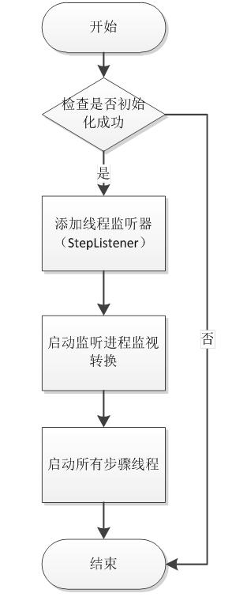

[TOC]

# 支持StarRocks Kettle Connector结项报告


## 一、项目信息

### 1.1 项目描述

| **项目名称**   | 支持 StarRocks Kettle Connector                              |
| -------------- | ------------------------------------------------------------ |
| **项目导师**   | **李鹏飞**                                                   |
| **导师邮箱**   | lipengfei@starrocks.com                                      |
| **技术领域**   | **Database、Java**                                           |
| **开源协议**   | **Apache License 2.0**                                       |
| **项目简述**   | **Kettle 是一款开源的 ETL 工具，采用 Java 编写，可以在 Windows、Linux、Unix上 运行，支持低代码、拖拽方式开发 ETL 数据管道，可对接包括传统数据库、文件、大数据平台、接口、流数据等数据源。** |
| **项目要求**   | **本项目为 StarRocks 支持 Kettle connector，支持通过 Kettle 将数据写入到 StarRocks。** |
| **技术要求**   | **熟悉 Java 语言，了解数据库基本操作**                       |
| **项目成果库** | https://github.com/StarRocks/starrocks                       |

### 1.2 开发时间

#### 1.2.1 项目开发第一阶段（07月01日-08月15日）

1. 仔细阅读Kettle文档中对于插件中方法重写的要求，以及在插件开发中所要用到的辅助类的使用如行处理、日志处理、错误处理等。
2. 完成Data和Meta类，规划在实现StarRocks数据导入的时候需要用到的参数和Step传输的信息。
3. 完成主要的StarRocks-Kettle-Connector类用于主要实现对上一Step传来行数据的处理，和数据的导入。
4. 完成Dialog类，实现数据导入操作的可视化编辑Step 元数据。

#### 1.2.2 项目开发第二阶段（08月16日-09月1日）

1. 对StarRocks-Kettle-Connector插件进行详细测试。
2. 解决中间发现的问题，思考改进的方式。

#### 1.2.3 项目开发第三阶段（09月1日-09月30日）

1. 将项目交到真实用户进行测试，根据测试反馈完善项目。
2. 项目总结撰写使用说明和结项报告。

## 二、项目介绍


### 2.1 StarRocks

StarRocks 是新一代极速全场景 MPP (Massively Parallel Processing) 数据库。StarRocks 的愿景是能够让用户的数据分析变得更加简单和敏捷。用户无需经过复杂的预处理，就可以用 StarRocks 来支持多种数据分析场景的极速分析。StarRocks 架构简洁，采用了全面向量化引擎，并配备全新设计的 CBO (Cost Based Optimizer) 优化器。StarRocks 能很好地支持实时数据分析，并能实现对实时更新数据的高效查询。StarRocks 兼容 MySQL 协议，支持标准 SQL 语法，易于对接使用，全系统无外部依赖，高可用，易于运维管理。

本项目为了满足更多用户的数据处理需求，需要实现更多种类数据的导入。Kettle融合了众多数据源正好满足项目需求，因此尝试实现Kettle连接StarRocks并将数据导入StarRocks中。

#### 2.1.1 Stream Load数据导入

数据导入是指将原始数据按照业务需求进行清洗、转换、并加载到 StarRocks 中的过程，从而可以在 StarRocks 系统中进行极速统一的数据分析。该项目主要采用的是StarRocks中的Stream Load的导入方式。

Stream Load 是一种基于 HTTP 协议的同步导入方式，支持将本地文件或数据流导入到 StarRocks 中。您提交导入作业以后，StarRocks 会同步地执行导入作业，并返回导入作业的结果信息。

#### 2.1.2 Stream Load事务接口

StarRocks 自 2.4 版本起提供 Stream Load 事务接口，事务接口支持通过兼容 HTTP 协议的工具或语言发起接口请求。该接口提供事务管理、数据写入、事务预提交、事务去重和超时管理等功能。项目将调用该事务接口实现数据的导入功能。

### 2.2 Kettle

> **kettle-PDI**:Pentaho Data Integration

Kettle是一款开源的ETL工具，全称为“Kettle ETL”。ETL是指抽取（Extract）、转换（Transform）和加载（Load），是数据仓库建设中的一个重要环节。 Kettle提供了一套完整的ETL工作流程，包括数据抽取、数据转换和数据加载等步骤，支持多种数据源的连接和处理，如关系型数据库、NoSQL数据库、大数据存储、文件格式、Web服务等。

Kettle提供了可视化的图形界面，用户可以通过拖拽组件、配置参数等方式来构建数据处理流程，从而实现数据的抽取、清洗、转换和加载等操作。 Kettle提供了丰富的组件库，包括输入组件、输出组件、转换组件、过滤器、连接器等，用户可以根据自己的需求来选择合适的组件进行组合。

Kettle还支持多种数据处理方式，如增量抽取、全量抽取、数据合并、数据过滤、数据转换、数据分割、数据聚合等。 同时，Kettle还支持任务调度和监控，用户可以通过设置定时任务或事件触发任务等方式来执行数据处理任务，并可随时查看任务执行情况和日志信息。

#### 2.2.1 Kettle特点

* 易用性： 有可视化设计器进行可视化操作，使用简单。
* 功能强大：不仅能进行数据传输，能同时进行数据清洗转换等操作。
* 支持多种源：支持各种数据库、FTP、文件、rest接口、Hadoop集群等源。
* 部署方便：独立部署，不依赖第三方产品。
* 适用场景： 数据量及增量不大，业务规则变化较快，要求可视化操作，对技术人员的技术门槛要求低。

#### 2.2.2 Kettle基本概念


##### **Kettle组成**

* Spoon：图形化工具，用于快速设计和维护复杂的ETL工作流。
* Kitchen：运行作业的命令行工具。
* Pan：运行转换的命令行工具。
* Carte：轻量级（大概1MB）Web服务器，用来远程执行转换或作业。一个运行有Carte进程的机器可以作为从服务器，从服务器是Kettle集群的一部分。

##### 功能概念

*  **Transformation：**Transformation（转换）是由一系列被称之为step（步骤）的逻辑工作的网络。转换本质上是数据流。
   * 转换的两个相关的主要组成部分是step（步骤）和hops（节点连接）。
   * 转换文件的扩展名是.ktr。
*  **Steps：**　Steps（步骤）是转换的建筑模块，比如一个文本文件输入或者一个表输出就是一个步骤。在PDI中有140多个步骤，它们按不同功能进行分类，比如输入类、输出类、脚本类等。
*  **Hops：**　Hops（节点连接）是数据的通道，用于连接两个步骤，使得元数据从一个步骤传递到另一个步骤。
*  **Jobs：**Jobs（工作）是基于工作流模型的，协调数据源、执行过程和相关依赖性的ETL活动。
   * 工作由工作节点连接、工作实体和工作设置组成。
   * 工作文件的扩展名是.kjb。

#### 2.2.3 Step之间交互通信

##### RowSet

`RowSet`的实现类，负责步骤之间的相互通信，`rowset`对象即是前一个`step`的成员也是后一个`step`的成员，访问是线程安全的。


`RowSet`类中包含源`step`，目标`step`和由源向目标发送的一个`rowMeta`和一组`data`。其中`data`数据是以行为单位的队列（queArray）。一个`RowSet`作为此源`ste`p的`outputrowsets`的一部分。同时作为目标`step`的`inputRowsets`一部分。**源`Step`每次向队列中写一行数据，目标`step`每次从队列中读取一行数据**。

##### 行元数据

所有的`data`均擦除为`object`对象。步骤与步骤之间以行为单位进行处理，自然需要知道每行的结构，即行元数据。行元数据至少需要包括类型、名称，当然还可能包括字段长度、精度等常见内容。

行元数据不仅在执行的时候需要，而且在转换设置的时候同样需要。每个步骤的行元数据都会保存在`.ktr`文件或者数据库里面，所以可以根据步骤名称从`TransMeta`对象中获取行元数据。

行元数据的`UML类`图结构如下所示，主要有单元格元数据组成行元数据。在现有的版本中，支持的数据类型有`String、Date、BigNumber、Boolean、SerializableType、Binary、Integer、Numberic`。


#### 2.2.4 Transformation转换机制介绍

StarRocks Kettle Connector主要实现的是一个Kettle的Transformation插件，通过对该插件的配置和调用来实现数据的导入，该部分将详细介绍转换机制的执行流程。

##### Trans执行

trans类的执行有`execute()`负责，主要包含两个步骤：转换执行前的准备工作和所有线程的开启。Trans每一个步骤都会对应一个独立的线程，线程之间通过`RowSet`进行通信交互。

~~~java
public void execute(String[] arguments) throws KettleException {
    prepareExecution(arguments);
    startThreads();
}
~~~

##### 执行准备(`prepareExecution`)

该步骤，主要完成对通信类的初始化，对步骤的包装初始化。最后启动各个步骤初始化线程，即调用各个步骤的`init()`方法。准备结束之后，步骤之间的通信机制完成了，各个步骤的初始化工作也完成了。具体的流程如下所示：


##### 转换处理执行(`startThreads`)

Trans转换执行引擎类，通过`startThreads()`启动步骤线程。为所有步骤添加监听器，在开启监听进程对所有线程进行监听。具体的步骤如下所示



##### 步骤执行过程

实现`StepInterface`的不同的`step`各个功能个不一样，但是它们之间也有一定的规律性。下面以`csv输入`和`StarRocks Kettle Connector`两个`step` 为例。


BaseStep封装了`getRow()`和`putRow()`方法，从上一个步骤获取数据和将数据输入到下一个步骤。基类`BaseStep`采取了统一的处理方式，调用子类`processRow`以行为单位处理。

`processRow`通用过程是：调用基类`BaseStep` 的`getRow( )`得到数据，对一行数据处理，处理之后调用基类`putRow( )`方法数据保存至`outputRowSets`（即`next step`的`inputRowSets`）.

### 2.3 StarRocks Kettle Connector

##### Why

目前，StarRocks兼容并支持DataX、Flink以及Spark这三种高效的数据处理框架，从而实现数据的有效写入到StarRocks中。然而，需要注意的是，这三种框架的操作均基于命令行或代码，这可能对非技术人员构成一定的挑战。因此，为了增加易用性并优化用户体验，我们正在扩展StarRocks的Kettle Connector，以实现直观的、可视化的数据导入操作，使得无论技术背景如何，用户都能够方便快捷地进行数据导入。

Kettle是一个流行的ETL工具，它提供了一种可视化的图形界面，用户可以通过拖拽组件、配置参数等方式来构建数据处理流程。这种直观的操作方式大大简化了数据处理和导入的过程，使得用户可以更加便捷地处理数据。此外，Kettle还提供了丰富的操作组件库，用户可以根据自己的需求选择合适的组件，实现各种复杂的数据处理任务。

通过扩展StarRocks对Kettle的连接功能，用户不仅可以实现更方便的数据导入，还可以利用Kettle的操作组件库，提供更便捷、更灵活的数据处理和导入方式。用户可以更加方便地从各种数据源读取数据，然后通过Kettle的数据处理流程，将处理后的数据导入到StarRocks。

##### What

StarRocks Kettle Connector实现了Kettle的一个插件，它用于在StarRocks和Kettle之间建立连接，以实现众多数据源数据向StarRocks导入和ETL（Extract, Transform, Load）功能。通过此插件，可以将Kettle的强大数据处理和转换功能与StarRocks的高性能数据存储和分析能力相结合，从而实现更加灵活和高效的数据处理流程。

使用StarRocks Kettle Connector的场景包括：

1. 数据集成：当需要从不同的数据源中抽取数据，进行数据清洗和转换，最后将数据加载到StarRocks中进行分析和查询时，可以使用此功能来实现数据集成和ETL。
2. 复杂数据处理：当数据处理流程比较复杂，需要多个数据转换步骤和数据源连接时，可以利用Kettle的可视化界面来设计和配置ETL工作流程，最后将数据记载到StarRocks，提高开发效率和灵活性。
3. 数据转换和整合：当需要对原始数据进行复杂的转换和整合，以满足特定的数据分析和查询需求时，可以使用Kettle的强大数据转换功能来实现。

通过StarRocks Kettle Connector，用户可以获得以下好处：

1. 便捷性：利用Kettle的可视化界面，可以以图形化方式设计和配置复杂的ETL工作流程，简化了从不同数据源向StarRocks的数据加载过程，降低学习成本。
2. 灵活性：通过与Kettle的连接，扩展了StarRocks的数据处理能力，使得用户可以根据自己的需求选择适合的工具和方式来进行数据处理。
3. 高性能：StarRocks作为一个高性能的数据存储和分析引擎，与Kettle的连接可以将高效的数据加载与复杂的数据转换和整合相结合，从而提高数据处理的性能。

## 三、 项目方案

### 3.1 StarRocks-Kettle-Connector

Kettle是一种插件体系结构，Kettle分为了Kettle平台和各类插件。Kettle中提供了各类插件的扩展点包括step插件、job entry插件、Database插件、Partioner插件、debugging插件。在此我们主要实现的是Kettle 的Step插件。我们通过自己实现一个Step插件，用于从Kettle向StarRocks中导入数据。

**StarRocks-Kettle-Connector**实现原理如下：

1. StarRocks中我们选取Stream Load的方式进行数据的导入。我们调用StarRocks的Stream Load API进行事务类型的数据导入实现。**StarRocks-Kettle-Connector**主要是通过组织序列化好数据将其传入调用的API。
2. Kettle中数据是以行为单位在Step之间传输，因此为了提高数据导入的效率采用批量传输的方法。不急于将Step获得的行数据立马导入StarRocks中，我们会将接收到的数据存储，当存储到一定字节数或当到达预设刷新时间时时就会将文件中数据一次性导入到StarRocks中。
3. 对于文件的存储数据格式，需要在获得每行数据后进行数据的组合，组合之后将其写入文件中。我们采用了`CSV`和`JSON`两种格式的数据导入。

### 3.2  Stream Load API

`Stream Load `事务接口支持通过兼容 HTTP 协议的工具或语言发起接口请求。该接口提供事务管理、数据写入、事务预提交、事务去重和超时管理等功能。

##### 事务管理

- `/api/transaction/begin`：开启一个新事务。
- `/api/transaction/commit`：提交当前事务，持久化变更。
- `/api/transaction/rollback`：回滚当前事务，回滚变更。

##### 事务预提交

* `/api/transaction/prepare `：用于预提交当前事务，临时持久化变更。预提交一个事务后，可以继续提交或者回滚该事务。

##### 数据写入

* `/api/transaction/load`： 用于写入数据。可以在同一个事务中多次调用该接口来写入数据。

### 3.3  Kettle Plugins

StarRocks-Kettle-Connector方法需要我们实现一个Step插件。step在 Kettle数据流中实现数据处理任务， 它对数据行流进行操作。Step专为输入、处理或输出而设计。输入步骤从外部数据源（如文件或数据库）提取数据行。处理步骤处理数据行、执行字段计算和流操作，例如联接或筛选。 输出步骤将处理后的数据写回存储、文件或数据库。

step plugin通过实现四个不同的 Java 接口与 Kettle 集成。每个接口代表由Kettle Step执行的一组职责。 每个接口都有一个基类，该基类实现接口的大部分，以简化插件开发。

所有步骤接口和相应的基类都在 org.pentaho.di.trans.step 包中。

| Java Interface      | Base Class                                  | StarRocks-Kettle-Connector Plugin | Main Responsibilities                                        |
| ------------------- | ------------------------------------------- | --------------------------------- | ------------------------------------------------------------ |
| StepMetaInterface   | BaseStepMeta                                | StarRocksKettleConnectorMeta      | * 存储step设置信息 * 验证step设置信息 * 序列化step设置信息 * 提供获取step类的方法 * 执行行布局更改 |
| StepDialogInterface | org.pentaho.di.ui.trans.step.BaseStepDialog | StarRocksKettleConnectorDialog    | * step属性信息配置窗口                                       |
| StepInterface       | BaseStep                                    | StarRocksKettleConnector          | * initialization * row processing * clean-up                 |
| StepDataInterface   | BaseStepData                                | StarRocksKettleConnectorData      | * 为数据处理提高数据存储                                     |

一个Step plugins至少需要实现如上四个接口:

- org.pentaho.di.trans.step.StepMetaInterface：元数据的处理，加载存储设置的xml，校验，主要是对一个Step的定义的基本数据。
- org.pentaho.di.trans.step. StepDataInterface:数据处理涉及的具体数据，以及对数据的状态的设置和回收。
- org.pentaho.di.trans.step. StepInterface：负责数据处理，转换和流转。这里面主要由processRow()方法来处理。
- org.pentaho.di.trans.step. StepDialogInterface：提供GUI/dialog，编辑Step的元数据。

##### StarRocksKettleConnector

~~~java
public class StarRocksKettleConnector extends BaseStep implements StepInterface {
~~~

StarRocksKettleConnector类中主要继承了如下两类。

| **Java Interface** | [org.pentaho.di.trans.step.StepInterface](http://javadoc.pentaho.com/kettle530/kettle-engine-5.3.0.0-javadoc/org/pentaho/di/trans/step/StepInterface.html) |
| ------------------ | ------------------------------------------------------------ |
| **Base class**     | [org.pentaho.di.trans.step.BaseStep](http://javadoc.pentaho.com/kettle530/kettle-engine-5.3.0.0-javadoc/org/pentaho/di/trans/step/BaseStep.html) |

实现类可以依赖基类，并且只有三个重要的方法来实现它自己。这三种方法在转换执行期间实现step生命周期： initialization, row processing, and clean-up。


在初始化期间，Kettle调用一次Step的 init()方法。初始化所有Step后，Kettle会反复调用 processRow（），直到step发出信号，表示它已完成处理所有行。完成行处理后，Kettle调用 dispose()。

1. Step Initialization

   每个Step都有机会执行一次性初始化任务，例如打开文件或建立数据库连接。对于从 BaseStep 派生的任何Step，必须调用 super.init（） 以确保行为正确。如果Step正确初始化，该方法返回 true，如果存在初始化错误，则返回 false。Kettle将中止转换的执行，以防任何Step在初始化时返回 false。

2. Row processing

Row processing过程中主要执行的`processRow()`函数，其主要实现数据的行处理、数据的导入工作。

`StepMetaInterface、StepDataInterface`接口都需要在定义插件时实现:

- `StepMetaInterface`：主要处理流数据和字段信息
- `StepDataInterface`：主要是和输出环境有关的信息

```java
@Override
public boolean processRow( StepMetaInterface smi, StepDataInterface sdi ) throws KettleException {}
```

3. Step clean-up

转换完成后，Kettle 会在所有Step中调用` dispose()`。需要采取措施来释放在 init（） 或后续行处理期间分配的资源。实现应清除 StepDataInterfaceObject 的所有字段，并确保所有打开的文件或连接都已正确关闭。对于从 BaseStep 派生的任何步骤，必须调用 super.dispose（） 以确保正确的释放。

##### StarRocksKettleConnectorMeta

~~~java
public class StarRocksKettleConnectorMeta extends BaseStepMeta implements StarRocksMeta
public interface StarRocksMeta extends StepMetaInterface
~~~

StepMetaInterface 接口是插件实现的主要 Java 接口，它主要用于Kettle中Step之间的通信，传递各Step之间的数据信息。

| Java Interface | [org.pentaho.di.trans.step.StepMetaInterface](https://javadoc.pentaho.com/kettle530/kettle-engine-5.3.0.0-javadoc/org/pentaho/di/trans/step/StepMetaInterface.html) |
| -------------- | ------------------------------------------------------------ |
| Base class     | [org.pentaho.di.trans.step.BaseStepMeta](https://javadoc.pentaho.com/kettle530/kettle-engine-5.3.0.0-javadoc/org/pentaho/di/trans/step/BaseStepMeta.html) |

1. Step配置的传递跟踪

实现类使用具有相应` get `和 `set` 方法的私有字段跟踪`Step`设置。 实现 `StepDialogInterface `的对话框类使用这些方法将用户提供的配置复制到对话框中和从对话框中复制出来。这些接口方法还用于设置的保存。每次创建新`step`时都会调用此方法，并将Step配置分配或设置为合理的默认值。创建新`step`时，`Kettle`客户端 `Spoon` 将使用此处设置的值。这是确保将步骤设置初始化为非空值。

2. 序列化Step配置

`Kettle `插件将其设置序列化为 `XML` 和` Kettle`存储库，实现了`Step`配置数据的存储和读取。

~~~java
public String getXML()
public void loadXML()
public void saveRep( Repository rep, IMetaStore metaStore, ObjectId id_transformation, ObjectId id_step )
public void readRep( Repository rep, IMetaStore metaStore, ObjectId id_step, List<DatabaseMeta> databases )
~~~

3. Step验证

`Kettle`客户端支持`Validate Transformation`功能，该功能会触发所有步骤的自检。`Kettle` 调用`canvas`上每个`Step`的` check（）` 方法，允许每个`Step`验证其设置。

> `StarRocks Kettle Connector`会对如下进行测试：
>
> * 检测`StarRocks`数据库的连通性。
> * 检测是否存在填写的库表以及是否存在对应的列名。
> * 检测上游数据传下来的字段名称是否对应。
> * 检测部分导入的字段名称是否存在于数据库中。
> * 检测`Kettle`数据类型和`StarRocks`的数据类型是否对应。

4. Ketttle插件系统接口

实现 StepMetaInterface 的类必须使用 Step Java annotation进行注释。提供以下注释属性：

| **Attribute**       | **Description**                                              |
| ------------------- | ------------------------------------------------------------ |
| id                  | step的全局唯一 ID                                            |
| image               | step的 png 图标图像的资源位置                                |
| name                | step的简短标签                                               |
| description         | step的详细描述                                               |
| categoryDescription | step应显示在 Kettle 步骤树中的类别。例如输入、输出、转换等。 |
| i18nPackageName     | 如果在注释属性中提供了 i18nPackageName 属性，那么名称、描述和类别描述的值将解释为相对于给定包中包含的消息包的 i18n 键。可以在扩展格式 i18n： key 中提供密钥，以指定与 i18nPackageName 属性中给出的软件包不同的包。 |

~~~java
@Step(id = "StarRocksKettleConnector", name = "BaseStep.TypeLongDesc.StarRocksKettleConnector",
        description = "BaseStep.TypeTooltipDesc.StarRocksKettleConnector",
        categoryDescription = "i18n:org.pentaho.di.trans.step:BaseStep.Category.Bulk",
        image = "StarRocks.svg",
        documentationUrl = "https://docs.starrocks.io/zh-cn/latest/introduction/StarRocks_intro",
        i18nPackageName = "org.pentaho.di.trans.steps.starrockskettleconnector")
@InjectionSupported(localizationPrefix = "StarRocksKettleConnector.Injection.", groups = {"FIELDS"})
public class StarRocksKettleConnectorMeta extends BaseStepMeta implements StarRocksMeta
~~~

##### StarRocksKettleConnectorData

~~~java
public class StarRocksKettleConnectorData extends BaseStepData implements StepDataInterface
~~~

实现 `StepInterface` 的类不会在其任何字段中存储处理状态。 实现 `StepDataInterface` 的附加类用于存储处理状态，包括状态标志、`StreamLoadManager`、数据导入格式、列字段以其对应`StarRocks`数据类型以及各列的数据库参数等。 `StepDataInterface` 的实现声明行处理期间使用的字段并添加访问器函数。 

| **Java Interface** | [org.pentaho.di.trans.step.StepDataInterface](http://javadoc.pentaho.com/kettle530/kettle-engine-5.3.0.0-javadoc/org/pentaho/di/trans/step/StepDataInterface.html) |
| ------------------ | ------------------------------------------------------------ |
| **Base class**     | [org.pentaho.di.trans.step.BaseStepData](http://javadoc.pentaho.com/kettle530/kettle-engine-5.3.0.0-javadoc/org/pentaho/di/trans/step/BaseStepData.html) |

##### StarRocksKettleConnectorDialog

~~~java
@PluginDialog(id = "StarRocksKettleConnector", image = "StarRocks.svg", pluginType = PluginDialog.PluginType.STEP,
        documentationUrl = "https://docs.starrocks.io/zh-cn/latest/introduction/StarRocks_intro")
public class StarRocksKettleConnectorDialog extends BaseStepDialog implements StepDialogInterfacepublic class StarRocksKettleConnectorDialog extends BaseStepDialog implements StepDialogInterface
~~~

`StepDialogInterface` 是实现插件设置对话框的 `Java` 接口。实现该接口的`dialog class` 负责构造和打开`step`的设置对话框。

| **Java Interface** | [org.pentaho.di.trans.step.StepDialogInterface](http://javadoc.pentaho.com/kettle530/kettle-engine-5.3.0.0-javadoc/org/pentaho/di/trans/step/StepDialogInterface.html) |
| ------------------ | ------------------------------------------------------------ |
| **Base class**     | [org.pentaho.di.ui.trans.step.BaseStepDialog](http://javadoc.pentaho.com/kettle530/kettle-ui-swt-5.3.0.0-javadoc/org/pentaho/di/ui/trans/step/BaseStepDialog.html) |

每当在`Kettle`客户端`Spoon`中打开`step`设置时，系统都会实例化传入`StepMetaInterface`对象的对话框类，并在对话框上调用`open（）`。 `SWT` 是 `Kettle`客户端的本机窗口环境，是用于实现步骤对话框的框架。`StepMetaInterface` 对象有一个内部的 `Changed` 标志，可以使用 `hasChanged（）` 和 `setChanged（）` 访问该标志。` Kettle`客户端根据 `Changed `标志确定转换是否具有未保存的更改，因此对话框必须正确设置标志。

## 四、 项目功能

### 4.1 数据导入

#### 简介

StarRocks Kettle Connector插件实现了向StarRocks数据库中导入数据的基础功能。它可以通过Kettle的不同Step的组合实现从不同的数据源向StarRocks的导入数据。相比于其它导入方式该插件提供了更加直观的、可视化的数据导入操作，用户可以通过拖拽组件、配置参数等方式来构建数据处理流程。

#### 导入格式

- CSV
- JSON

> Kettle可以从多种源获取不同多种类型的数据，但在使用插件导入时会转换成上述两种数据格式。

#### 参数说明

其中StarRocks kettle Connector插件参数配置如下：

| 参数                                            | 是否必填 | 默认值                     | 数据类型 | 描述                                                         |
| ----------------------------------------------- | -------- | -------------------------- | -------- | ------------------------------------------------------------ |
| 步骤名称-Step name                              | 是       | StarRocks Kettle Connector | String   | 该步骤名称                                                   |
| Http Url                                        | 是       | 无                         | String   | FE 的 HTTP Server 连接地址。格式为 `<fe_host1>:<fe_http_port1>;<fe_host2>:<fe_http_port2>`，可以提供多个地址，使用英文分号 (;) 分隔。例如 `192.168.xxx.xxx:8030;192.168.xxx.xxx:8030`。 |
| JDBC Url                                        | 是       | 无                         | String   | FE 的 MySQL Server 连接地址。格式为 `jdbc:mysql://<fe_host>:<fe_query_port>`。 |
| 数据库-DataBase Name                            | 是       | 无                         | String   | StarRocks 目标数据库的名称。                                 |
| 目标表-Table Name                               | 是       | 无                         | String   | StarRocks 目标数据表的名称。                                 |
| 用户名-User                                     | 是       | 无                         | String   | 用于访问 StarRocks 集群的用户名。该账号需具备 StarRocks 目标数据表的写权限。有关用户权限的说明，请参见[用户权限](https://docs.starrocks.io/zh-cn/latest/administration/User_privilege)。 |
| 密码-Password                                   | 否       | 无                         | String   | 用于访问 StarRocks 集群的用户密码。若没有密码则不用填写。    |
| 格式-Format                                     | 是       | CSV                        | String   | Stream Load 导入时的数据格式。取值为 `CSV` 或者 `JSON`。     |
| 列分割符-Column Sepatator                       | 否       | \t                         | String   | 用于指定源数据文件中的列分隔符。如果不指定该参数，则默认为 `\t`，即 Tab。必须确保这里指定的列分隔符与源数据文件中的列分隔符一致。该参数当选择CSV格式的时候必须填写。 **说明** StarRocks 支持设置长度最大不超过 50 个字节的 UTF-8 编码字符串作为列分隔符，包括常见的逗号 `,`、`Tab` 和 `Pipe ()` |
| Json Paths                                      | 否       | 无                         | String   | 用于指定待导入的字段的名称。仅在使用匹配模式导入 JSON 数据时需要指定该参数。当格式选择JSON时填写该参数。参见[导入 JSON 数据时配置列映射关系](https://docs.starrocks.io/zh-cn/latest/sql-reference/sql-statements/data-manipulation/STREAM LOAD#导入-json-数据时配置列映射关系). |
| 一次导入最大字节-Max Bytes                      | 否       | 94371840(90M)              | String   | 数据攒批的大小，达到该阈值后将数据通过 Stream Load 批量写入 StarRocks。取值范围：[64MB, 10GB]。 |
| 刷新频率-Scanning Frequency                     | 否       | 50                         | String   | 数据刷新的时间，每隔多长时间进行一次数据刷新写入。参数单位为毫秒，取值大于等于50毫秒。 |
| 导入作业最大容错率-Max Filter Ratio             | 否       | 0                          | String   | 用于指定导入作业的最大容错率，即导入作业能够容忍的因数据质量不合格而过滤掉的数据行所占的最大比例。取值范围：0~1。默认值：0。更多说明，请参见 [STREAM LOAD](https://docs.starrocks.io/zh-cn/latest/sql-reference/sql-statements/data-manipulation/STREAM LOAD#opt_properties)。 |
| StarRocks连接超时时间-Connect Timeout           | 否       | 1000                       | String   | 连接 `Http-url` 的超时时间。取值范围：[100, 60000]。         |
| Stream Load载入数据超时时间-Stream Load Timeout | 否       | 600                        | String   | Stream Load 超时时间，单位为秒。                             |
| Stream Load 属性-Stream Load Properties         | 否       | 无                         | String   | Stream Load 的参数，控制导入行为，支持的参数和说明，请参见 [STREAM LOAD](https://docs.starrocks.io/zh-cn/latest/sql-reference/sql-statements/data-manipulation/STREAM LOAD)。 参数的名称和值需要用`:`隔开，各参数之间用`;`隔开。例如：`key1:value1;key2:value2` |
| 部分导入-Partial Update                         | 否       | 否                         |          | StarRocks v2.2 起，主键模型表支持部分更新，可以选择只更新部分指定的列。若勾选实现部分导入需要在“部分导入行”中填写要导入的列名。 |
| 部分导入行-Partial Update Columns               | 否       | 无                         | String   | 需要部分更新的列名。需要填写所要写入的目标表中对应的列名。各列名之间要以英文逗号隔开`,`，例如：`col1,col2,col3` |
| 是否支持更新和删除-Enable Upsert Delete         | 否       | 无                         |          | StarRocks 目前支持 `UPSERT` 和 `DELETE`操作，不支持一次作业区分`UPSERT`和`DELETE`，只能对一次导入单独实现`UPSERT`和`DELETE`。 **UPSERT**: 该操作用于插入或更新数据。如果数据已存在（基于主键/唯一键），它将更新该数据；如果数据不存在，它将插入新数据。 **DELETE**: 该操作用于删除符合条件的数据记录。需要指定删除的条件，满足该条件的所有记录都将被删除。 |
| Upsert or Delete                                | 否       | 无                         | String   | 当勾选“是否支持更新和删除”时需要选择是执行UPSERT或DELETE操作。若未选择则不执行更新或删除操作。 |
| 表字段-Table field                              | 否       | 无                         | String   | StarRocks目标表中各列的名称。需要与流字段一一对应。          |
| 流字段-Stream field                             | 否       | 无                         | String   | 上一步骤传输过来的数据列名称。从上一步骤传递的数据列名称和类型必须与StarRocks目标表的数据格式和大小完全匹配。 |

#### **Kettle 与 StarRocks 的数据类型映射关系**

| Kettle           | StarRocks                                                    |
| ---------------- | ------------------------------------------------------------ |
| String           | CHAR、STRING、VARCHAR、JSON                                  |
| Date             | DATE、DATETIME                                               |
| Boolean          | BOOLEAN                                                      |
| Integer          | TINYINT 、SMALLINT 、INT 、BIGINT                            |
| Number           | DOUBLE、FLOAT                                                |
| BigNumber        | LARGEINT、[DECIMAL](https://docs.starrocks.io/zh-cn/latest/sql-reference/sql-statements/data-types/DECIMAL) |
| Binary           | 暂不支持                                                     |
| Timestamp        | DATETIME、DATE                                               |
| Internet Address | STRING                                                       |
| serializable     | 暂不支持                                                     |

#### 注意事项

- 插件支持StarRocks 版本2.4及以上，通过Stream Load SDK的事务导入模式进行数据的导入。但目前并不支持exactly-once和at-least-once，不能实现错误数据的跳过和错误数据的记录。若导入失败需要重新配置导入。
- 插件未实现数据库的自动创建功能，需要用户根据需要首先进行数据库的创建。

### 4.2 CSV、JSON格式导入

> 插件导入只支持CSV和JSON两种导入方式。

#### CSV

- 默认使用csv格式进行导入，用户必须要在参数中配置列分割符不能为空，分割符在参数配置中默认为`\t`.

#### JSON

- 若选择JSON格式进行导入，若加载字段中表字段和流字段对应正确则可不配置`Json Path`参数。
- 还未支持列映射和列计算功能，不能通过配置`Json Path`的映射来实现列的组合和计算。若需要改计算功能则需要使用Kettle的数据处理和整理等功能。

### 4.3 导入参数配置

- 一次导入最大字节：数据攒批的大小，达到该阈值后将数据通过 Stream Load 批量写入 StarRocks。取值范围：[64MB, 10GB]。
- 刷新频率：数据刷新的时间，每隔多长时间进行一次数据刷新写入。参数单位为毫秒，取值大于等于50毫秒。
- 导入作业最大容错率：用于指定导入作业的最大容错率，即导入作业能够容忍的因数据质量不合格而过滤掉的数据行所占的最大比例。取值范围：0~1。默认值：0。更多说明，请参见 [STREAM LOAD](https://docs.starrocks.io/zh-cn/latest/sql-reference/sql-statements/data-manipulation/STREAM LOAD#opt_properties)。
- StarRocks连接超时时间：连接`http-url`的超时时间。取值范围：[100, 60000]。
- Stream Load载入数据超时时间:Stream Load 超时时间，单位为秒。

### 4.4 部分行导入

#### 简介

StarRocks v2.2 起，主键模型表支持部分更新，可以选择只更新部分指定的列。该插件实现了数据的部分行的导入。用户需要配置是否需要部分导入行以及需要填写所要写入的目标表中对应的列名。各列名之间要以英文逗号隔开`,`，例如：`col1,col2,col3`。

#### 注意事项

- 在配置导入列名称时需要与StarRocks中的列名称相同。
- 在使用Kettle获取源数据时需要和要导入的列数据相同，若获取的源数据列数多余要部分导入的数据，则需要Kettle中加入过滤步骤。

### 4.5 UPSERT 和 DELETE 

#### 简介

插件支持StarRocks 的主键模型的 UPSERT 和 DELETE 操作，可以实现数据在导入过程中进行数据的更新或是对应数据的删除功能。

**UPSERT**: 该操作用于插入或更新数据。如果数据已存在（基于主键/唯一键），它将更新该数据；如果数据不存在，它将插入新数据。 **DELETE**: 该操作用于删除符合条件的数据记录。需要指定删除的条件，满足该条件的所有记录都将被删除。

#### 注意事项

- 必须确保待导入的数据文件中每一行的列数都相同。
- 所更新的列必须包含主键列。
- 插件在一个任务中不能同时实现更新和删除的功能，只能分开执行。

## 五、 功能测试

### 5.1 CSV数据格式导入测试

#### **准备工作**

1. 在本地文件系统中创建一个 `CSV` 格式的数据文件 `example1.csv`。文件一共包含三列，分别代表用户 ID、用户姓名和用户得分，如下所示：

```Plaintext
1,Lily,23
2,Rose,23
3,Alice,24
4,Julia,25
```

2. 在数据库 `kettle_test` 中创建一张名为 `student` 的主键模型表。表包含 `id`、`name` 和 `score` 三列，主键为 `id` 列，如下所示：

```SQL
CREATE TABLE student
(
    id int(11) NOT NULL COMMENT "用户 ID",
    name varchar(65533) NULL COMMENT "用户姓名",
    score int(11) NOT NULL COMMENT "用户得分"
)
ENGINE=OLAP
PRIMARY KEY(id)
DISTRIBUTED BY HASH(id);
```

#### **使用Kettle读取csv文件数据**

1. 填写文件信息，并将列分割符改成`,`与`CSV`文件中一样。当CSV文件中没有列头行时取消列头行的勾选。


2. 获取字段信息

> 点击**获取字段**，得到`CSV`中的字段信息和类型。
>
> 若CSV文件中没有包含头行信息，则**名称**列将会显示`Field_xxx`，为了后续步骤区分字段名称可以自行命名。
>
> 字段类型Kettle会自动识别，如果需要更改可直接下拉菜单更改类型。


3. 数据预览

当配置完信息后，可点击最后的**预览**按钮预览需要导入的数据。


#### 向StarRocks中导入数据

1. 添加`StarRocks Kettle Connector`插件，将**CSV文件输入**步骤输出的数据导入`StarRocks Kettle Connector`。


2. 如下图所示配置`StarRocks Kettle Connector`插件参数。


> **说明**

> 您可以通过 [SHOW FRONTENDS](https://docs.starrocks.io/zh-cn/latest/sql-reference/sql-statements/Administration/SHOW%20FRONTENDS) 命令查看 FE 节点的 IP 地址和 HTTP 端口号。

此处**列分割符**与上一步**CSV文件输入**中的分隔符并无关联可随意指定。当连接StarRocks时不需**密码**时填写为空即可。

最下面表格中，**表字段**为目标StarRocks数据库表字段，**流字段**为上一步骤中传来的字段名称。若两者对应关系出现错误，需要更改**表字段**使其与流字段对应，不要改变流字段的顺序。可以直接在表字段名称上下拉菜单更改，也可点击右侧**编辑映射**。


3. 点击开始按钮执行导入作业

点击左上的开始按钮则开始转换，转换成功如下图所示。


4. 查询导入结果

```SQL
StarRocks > select * from student;
+------+-------+-------+
| id   | name  | score |
+------+-------+-------+
|    3 | Alice |    24 |
|    1 | Lily  |    23 |
|    2 | Rose  |    23 |
|    4 | Julia |    25 |
+------+-------+-------+
4 rows in set (0.01 sec)
```

### 5.2 `JSON`数据格式导入测试

#### 数据准备

1. 在本地文件系统中创建一个 `JSON `格式的数据文件 `example2.json`。文件一共包含两个字段，分别代表城市名称和城市 ID，如下所示：

```JSON
{"name": "北京", "id": 1}
```

2. 在数据库 `kettle_test` 中创建一张名为 `city` 的主键模型表。表包含 `id` 和 `city` 两列，主键为 `id` 列，如下所示：

```SQL
CREATE TABLE city
(
    id int(11) NOT NULL COMMENT "城市 ID",
     city varchar(65533) NULL COMMENT "城市名称"
)
ENGINE=OLAP
PRIMARY KEY(id)
DISTRIBUTED BY HASH(id);
```

#### 使用`Kettle`读取`JSON`文件数据

1. 在`Kettle`中添加`Json Input`插件，并配置信息。


在**文件或路径**中添加`example2.json`文件路径，点击添加即可在选中的文件中看到**文件或路径**中填写的路径。

在**字段**中选择`Select fields`，并选择要导入的字段信息。与`CSV`相同要根据具体的数据与`StarRocks`库中的数据类型相对应更改**类型字段**。


#### 向StarRocks中导入数据

1. 配置StarRocks参数


> 目前暂不支持列计算

其余配置与`CSV`基本相同，需要更改**格式**与`Json Path`参数。其中`Json Path`顺序需要和表字段相同或不填写。

2. 启动任务查询结果

```SQL
StarRocks > select * from city;
+------+--------+
| id   | city   |
+------+--------+
|    1 | 北京   |
+------+--------+
1 row in set (0.00 sec)
```

### 5.3 部分数据导入测试

自 StarRocks v2.2 起，主键模型表支持部分更新 (Partial Update)，您可以选择只更新部分指定的列。这里以 `CSV `格式的数据文件为例进行说明。

#### 数据准备

在本地文件系统创建一个` CSV `格式的数据文件 `example3.csv`。文件包含两列，分别代表用户 ID 和用户姓名，如下所示：

```SQL
6,Rose
7,Appolo
```

#### 准备StarRocks表

使用上一步创建的数据库 `kettle_test` 中名为 `student` 的主键模型表。表包含 `id`、`name` 和 `score` 三列，分别代表用户 ID、用户名称和用户得分，主键为 `id` 列，其中数据如下所示：

```SQL
StarRocks > select * from student;
+------+-------+-------+
| id   | name  | score |
+------+-------+-------+
|    3 | Alice |    24 |
|    5 | Jeson |     0 |
|    1 | Lily  |    90 |
|    4 | Julia |    25 |
+------+-------+-------+
4 rows in set (0.00 sec)
```

#### 导入数据

通过导入，把 `example3.csv` 里的两列数据更新到 `student` 表的 `id` 和 `name` 两列。

需要勾选**部分导入**，其中**部分导入行**可填写也可为空。


#### 查询数据

导入完成后，查询 `student` 表的数据，如下所示：

```SQL
StarRocks > select * from student;
+------+--------+-------+
| id   | name   | score |
+------+--------+-------+
|    1 | Lily   |    90 |
|    4 | Julia  |    25 |
|    7 | Appolo |     0 |
|    3 | Alice  |    24 |
|    5 | Jeson  |     0 |
|    6 | Rose   |     0 |
+------+--------+-------+
6 rows in set (0.00 sec)
```

从查询结果可以看到，`example3.csv` 文件中 `id` 为 `6`和`7` 的数据已经更新到 `student` 表中，并且 `example3.csv` 文件中 `id` 为 `6` 和 `7` 的数据已经插入到 `student` 表中。

### 5.4 UPSERT导入数据测试

#### 数据准备

在本地文件系统创建一个 `CSV`格式的数据文件 `example1.csv`。文件包含三列，分别代表用户 ID、用户姓名和用户得分，如下所示：

```SQL
1,Lily,90
5,Jeson,0
```

#### 准备 StarRocks 表。

在数据库 `kettle_test` 中创建一张名为 `table1` 的主键模型表。表包含 `id`、`name` 和 `score` 三列，分别代表用户 ID、用户名称和用户得分，主键为 `id` 列，如下所示：

```SQL
CREATE TABLE student
(
    id int(11) NOT NULL COMMENT "用户 ID",
    name varchar(65533) NOT NULL COMMENT "用户姓名",
    score int(11) NOT NULL COMMENT "用户得分"
)
ENGINE=OLAP
PRIMARY KEY(id)
DISTRIBUTED BY HASH(id);
```

向数据库中插入数据：

```SQL
StarRocks > select * from student;
+------+-------+-------+
| id   | name  | score |
+------+-------+-------+
|    1 | Lily  |    23 |
|    2 | Rose  |    23 |
|    4 | Julia |    25 |
|    3 | Alice |    24 |
+------+-------+-------+
4 rows in set (0.01 sec)
```

#### UPSERT导入数据

通过导入，把 `example1.csv` 文件中 `id` 为 `1` 的数据更新到 `student` 表中，并且把 `example1.csv` 文件中 `id` 为 `5` 的数据插入到 `student` 表中。

配置信息如下图所示，首先要勾选**是否支持更新和删除**并在`Upsert or Delete`选中`UPSERT`。


#### 查询数据

导入完成后，查询`student`表的数据，如下所示：

```SQL
StarRocks > select * from student;
+------+-------+-------+
| id   | name  | score |
+------+-------+-------+
|    3 | Alice |    24 |
|    2 | Rose  |    23 |
|    4 | Julia |    25 |
|    1 | Lily  |    90 |
|    5 | Jeson |     0 |
+------+-------+-------+
5 rows in set (0.00 sec)
```

从查询结果可以看到，`exaple1.csv`文件中`id`为`1`的数据已经更新`score`值，`id`为`5`的数据被插入到数据库。

### 5.5 DELETE导入数据测试

#### 数据准备

在本地文件系统创建一个 `CSV `格式的数据文件 `example2.csv`。文件包含三列，分别代表用户 ID、用户姓名和用户得分，如下所示：

```SQL
2,Rose,23
```

#### 准备StarRocks表

使用上一步创建的数据库 `kettle_test` 中名为 `student` 的主键模型表。表包含 `id`、`name` 和 `score` 三列，分别代表用户 ID、用户名称和用户得分，主键为 `id` 列，其中数据如下所示：

```SQL
StarRocks > select * from student;
+------+-------+-------+
| id   | name  | score |
+------+-------+-------+
|    3 | Alice |    24 |
|    2 | Rose  |    23 |
|    4 | Julia |    25 |
|    1 | Lily  |    90 |
|    5 | Jeson |     0 |
+------+-------+-------+
5 rows in set (0.00 sec)
```

#### 导入数据

通过导入，把 `example2.csv` 文件中 `id` 为 `2` 的数据从 `student` 表中删除。


#### 查询数据

导入完成后，查询 `table2` 表的数据，如下所示：

```SQL
StarRocks > select * from student;
+------+-------+-------+
| id   | name  | score |
+------+-------+-------+
|    3 | Alice |    24 |
|    5 | Jeson |     0 |
|    1 | Lily  |    90 |
|    4 | Julia |    25 |
+------+-------+-------+
4 rows in set (0.00 sec)
```

从查询结果可以看到，`example2.csv`文件中`id`为`2`的数据已经从`student`表中删除。

### 5.6 所有数据类型导入测试

#### 数据准备

在本地文件系统创建一个 `CSV `格式的数据文件 `example4.csv`。如下所示：

```SQL
id,recruit_date,region_num,num_plate,tel,password,name,profile,hobby,leave_time,channel,income,account,ispass
1,2022-01-01,-50,-2500,-2000000000,12345678901234567890,John Doe,Software Engineer,Reading,2022-01-01 08:00:00,1.23,1234.5678,1000.1234,true
2,2022-01-02,-40,-2501,-2000000001,12345678901234567891,Jane Smith,Data Scientist,Writing,2022-01-02 09:00:00,2.34,2345.6789,1100.1234,false
3,2022-01-03,-30,-2502,-2000000002,12345678901234567892,Robert Brown,Web Developer,Cycling,2022-01-03 10:00:00,3.45,3456.7890,1200.1234,true
4,2022-01-04,-20,-2503,-2000000003,12345678901234567893,Emily Johnson,Database Admin,Swimming,2022-01-04 11:00:00,4.56,4567.8901,1300.1234,false
5,2022-01-05,-10,-2504,-2000000004,12345678901234567894,Michael Lee,Network Engineer,Hiking,2022-01-05 12:00:00,5.67,5678.9012,1400.1234,true
6,2022-01-06,0,-2505,-2000000005,12345678901234567895,Sarah Taylor,Security Analyst,Photography,2022-01-06 13:00:00,6.78,6789.0123,1500.1234,false
7,2022-01-07,10,-2506,-2000000006,12345678901234567896,William Davis,Systems Analyst,Dancing,2022-01-07 14:00:00,7.89,7890.1234,1600.1234,true
8,2022-01-08,20,-2507,-2000000007,12345678901234567897,Jessica Martinez,UX Designer,Painting,2022-01-08 15:00:00,8.90,8901.2345,1700.1234,false
9,2022-01-09,30,-2508,-2000000008,12345678901234567898,David Wilson,Product Manager,Music,2022-01-09 16:00:00,9.01,9012.3456,1800.1234,true
10,2022-01-10,40,-2509,-2000000009,12345678901234567899,Mary White,HR Specialist,Traveling,2022-01-10 17:00:00,10.12,1012.4567,1900.1234,false
```

#### 准备StarRocks表

在数据库 `kettle_test` 中创建一张名为 `detailDemo` 的主键模型表。主键为 `id` 列，如下所示：

```SQL
use kettle_test;
CREATE TABLE IF NOT EXISTS detailDemo (
    id            BIGINT         COMMENT "range [-2^63 + 1 ~ 2^63 - 1]",
    recruit_date  DATE           NOT NULL COMMENT "YYYY-MM-DD",
    region_num    TINYINT        COMMENT "range [-128, 127]",
    num_plate     SMALLINT       COMMENT "range [-32768, 32767] ",
    tel           INT            COMMENT "range [-2147483648, 2147483647]",
    password      LARGEINT       COMMENT "range [-2^127 + 1 ~ 2^127 - 1]",
    name          CHAR(20)       NOT NULL COMMENT "range char(m),m in (1-255)",
    profile       VARCHAR(500)   NOT NULL COMMENT "upper limit value 1048576 bytes",
    hobby         STRING         NOT NULL COMMENT "upper limit value 65533 bytes",
    leave_time    DATETIME       COMMENT "YYYY-MM-DD HH:MM:SS",
    channel       FLOAT          COMMENT "4 bytes",
    income        DOUBLE         COMMENT "8 bytes",
    account       DECIMAL(12,4)  COMMENT "",
    ispass        BOOLEAN        COMMENT "true/false"
)ENGINE=OLAP
PRIMARY KEY(id)
DISTRIBUTED BY HASH(id);
```

#### 配置Kettle对应类型

根据上述数据类型对应表更改，导入数据的数据类型。

| id           | Integer   |
| ------------ | --------- |
| recruit_date | Date      |
| region_num   | Integer   |
| num_plate    | Integer   |
| tel          | Integer   |
| password     | BigNumber |
| name         | String    |
| profile      | String    |
| hobby        | String    |
| leave_time   | Timestamp |
| channel      | Number    |
| income       | Number    |
| account      | BigNumber |
| ispass       | Boolean   |


#### 导入数据

StarRocks参数设置同[导入CSV格式的数据](# 导入CSV格式的数据)配置相同。

导入完成后，查询 `detailDemo` 表的数据，如下所示：

```SQL
StarRocks > select * from detailDemo;
+------+--------------+------------+-----------+-------------+----------------------+------------------+-------------------+-------------+---------------------+---------+-----------+-----------+--------+
| id   | recruit_date | region_num | num_plate | tel         | password             | name             | profile           | hobby       | leave_time          | channel | income    | account   | ispass |
+------+--------------+------------+-----------+-------------+----------------------+------------------+-------------------+-------------+---------------------+---------+-----------+-----------+--------+
|    1 | 2022-01-01   |        -50 |     -2500 | -2000000000 | 12345678901234567890 | John Doe         | Software Engineer | Reading     | 2022-01-01 08:00:00 |    1.23 | 1234.5678 | 1000.1234 |      1 |
|    6 | 2022-01-06   |          0 |     -2505 | -2000000005 | 12345678901234567895 | Sarah Taylor     | Security Analyst  | Photography | 2022-01-06 13:00:00 |    6.78 | 6789.0123 | 1500.1234 |      0 |
|    8 | 2022-01-08   |         20 |     -2507 | -2000000007 | 12345678901234567897 | Jessica Martinez | UX Designer       | Painting    | 2022-01-08 15:00:00 |     8.9 | 8901.2345 | 1700.1234 |      0 |
|    7 | 2022-01-07   |         10 |     -2506 | -2000000006 | 12345678901234567896 | William Davis    | Systems Analyst   | Dancing     | 2022-01-07 14:00:00 |    7.89 | 7890.1234 | 1600.1234 |      1 |
|    9 | 2022-01-09   |         30 |     -2508 | -2000000008 | 12345678901234567898 | David Wilson     | Product Manager   | Music       | 2022-01-09 16:00:00 |    9.01 | 9012.3456 | 1800.1234 |      1 |
|   10 | 2022-01-10   |         40 |     -2509 | -2000000009 | 12345678901234567899 | Mary White       | HR Specialist     | Traveling   | 2022-01-10 17:00:00 |   10.12 | 1012.4567 | 1900.1234 |      0 |
|    4 | 2022-01-04   |        -20 |     -2503 | -2000000003 | 12345678901234567893 | Emily Johnson    | Database Admin    | Swimming    | 2022-01-04 11:00:00 |    4.56 | 4567.8901 | 1300.1234 |      0 |
|    2 | 2022-01-02   |        -40 |     -2501 | -2000000001 | 12345678901234567891 | Jane Smith       | Data Scientist    | Writing     | 2022-01-02 09:00:00 |    2.34 | 2345.6789 | 1100.1234 |      0 |
|    3 | 2022-01-03   |        -30 |     -2502 | -2000000002 | 12345678901234567892 | Robert Brown     | Web Developer     | Cycling     | 2022-01-03 10:00:00 |    3.45 |  3456.789 | 1200.1234 |      1 |
|    5 | 2022-01-05   |        -10 |     -2504 | -2000000004 | 12345678901234567894 | Michael Lee      | Network Engineer  | Hiking      | 2022-01-05 12:00:00 |    5.67 | 5678.9012 | 1400.1234 |      1 |
+------+--------------+------------+-----------+-------------+----------------------+------------------+-------------------+-------------+---------------------+---------+-----------+-----------+--------+
10 rows in set (0.01 sec)
```

### 5.7 单元测试

1. 对插件参数存储进行测试，测试参数的存储和读取功能。
2. 测试插件的数据类型映射功能，测试Kettle的各种数据类型到StarRocks数据类型的映射转换。
3. 测试插件的配置检测功能，Kettle在配置完Step参数会对参数的正确性进行检测。

## 六、 遇到问题


## 七、 后续工作

* `Kettle`自动创建数据库：目前向`StarRocks`导入数据时必须先创建好数据库，后续实现根据`Kettle`步骤中上游数据类型进行`StarRocks`数据库的自动创建功能。